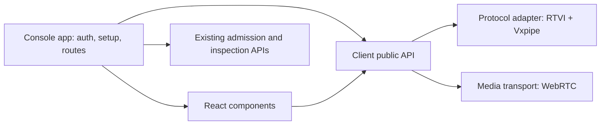

# Developer debug console and first-use setup

Status: proposed production design, 2026-09-16. A private-package Storybook prototype is available;
production protocol, setup and route integration remain unimplemented.
The user requested an extractable client-JS/React debug console first, followed by operator login
and administration, platform API access, a demo tenant, provider credentials, example definitions
and a Getting Started home.

## Decision and delivery order

1. [Call debug console](milestones/call-debug-console.md): run and understand a real call using
   existing tenant admission, RTVI and Vxpipe extensions.
2. [Operator login and admin dashboard](milestones/operator-login-and-admin-dashboard.md): issue a
   local login challenge, then browse every tenant, definition and call in a Storybook-first React app.
3. [Platform bootstrap and demo tenant](milestones/platform-bootstrap-and-demo-tenant.md): add
   the platform authority currently missing, then resumable demo-tenant setup through existing workflows.
4. [Getting Started and example calls](milestones/getting-started-and-example-calls.md): present
   those operations at `/`, install a small example catalog, and launch the same debug console.

The console comes first because every example needs a usable place to run. Its first slice uses
existing tenant credentials and published routes; it does not wait for platform authentication.
These source-development milestones precede container delivery. Packaging and retention remain
subject to their existing review hold. Existing incomplete live-carrier gates remain separate.

## Current evidence and actual gaps

| Existing source | Reuse / gap |
| --- | --- |
| [HomePage](../apps/vxpipe_console/lib/vxpipe/console/home_page.ex) | `/` already serves a small Vxpipe directory, not Phoenix's generated welcome. Replace this directory with the conditional developer home. |
| [React App](../apps/vxpipe_console/assets/src/App.tsx) | `/pipecat-console` wraps Voice UI Kit `ConsoleTemplate`. It resets to room creation on disconnect, losing the visible run. Keep working SDK/transport integration and build a Vxpipe-owned presentation/state model. |
| [Transfer client](../apps/vxpipe_console/assets/src/transferConnection.ts) | Human acceptance already uses the separate `vxpipe` data channel. Reuse this path and its authority; do not pretend it is an RTVI message or add another transfer implementation. |
| [RTVI codec](../apps/vxpipe_gateway/lib/vxpipe/gateway/rtvi/codec.ex) | The server advertises RTVI 2.1.0, emits ordinary transcripts/output, and carries versioned `vxpipe.turn`/`vxpipe.transfer` server messages. Ordinary bot output lacks participant identity, and RTVI has no standard call-variable message. Add the reviewed correlated participant projection and authorized `vxpipe.variables` snapshot envelope. |
| [Tenant principal](../apps/vxpipe_calls/lib/vxpipe/calls/principal.ex) | Existing API keys are tenant-bound with independent `admin`/`calls` scopes. A platform key is a separate programmatic authority contract. Neither key type authenticates the operator UI. |
| [Call inspection](milestones/call-inspection-and-debugging.md) | Authorized live/persisted facts, variable snapshots, pagination and gap reporting already exist. Reuse them; a debug page is not a new archive or privileged inspection channel for participants. |
| [SampleCall](../apps/vxpipe_console/lib/vxpipe/console/sample_call.ex) | Startup saves/publishes a definition and issues an in-memory sample key. The new persistent setup must replace this provisioning path for managed examples instead of running both. |
| [Provider inventory](existing-provider-credentials.md) | Google, Deepgram, Zenmux, Telnyx and Twilio are supported. First voice setup uses Google plus Deepgram; STT/TTS share a Deepgram binding. No new provider/auth modes are required. |

`PRODUCT.md` contains older implementation-status prose. Current source and completed milestones
are the authority for this plan; changing unrelated product/design metadata is outside this checkpoint.

## Experience and visual direction

Audience: a developer checking that a definition works, then asking who spoke, what happened,
and why a call is waiting or failed. Visitor mode: **Operate**. Success is a first completed call
with understandable evidence and a clear next action.

Inherit [Operator's Bench](../DESIGN.md): quiet neutral surfaces, precise dividers, readable sans
text, mono identifiers, restrained role/status color and light/dark support. Improve hierarchy and
spacing within that identity. These are proposed compositions; a rendered implementation must
be reviewed before visual approval. No new brand or design-system project is required.

### Debug console

Proposed route: `/debug`, with a stable authorized run view at `/debug/calls/:call_id`.
Only public identifiers belong in URLs. `/pipecat-console` can redirect once its supported workflow
has a replacement; the existing transfer desk remains usable during the cutover.

```text
Vxpipe                                 Getting started | Console
                                      Connected  02:14 [Leave call]
[Mic toggle] [Input device ▾]      [Speaker toggle] [Output device ▾]
──────────────────────────────────────────────────────────────────
PARTICIPANTS       Conversation | Variables | Metrics
You                Assistant                          ... 00:10
Assistant          Of course. Let's find a time that works for you.
                   [Messages] [Logs] [Events] [Tool calls] [Reset]
                   [Spoken text, when timing is supported]
                   ──────────────────────────────────────────────
                   [Type a message…                       ] [Send]
```

Conversation is the default focus. Event details are secondary and collapsible; the definition
is read-only in this milestone. Leave preserves the run view. A separate, explicitly authorized
end-call action may be shown only if backed by an existing supported command; never relabel a
local disconnect as ending the whole room. A completed call offers **Run again** (a fresh call)
and **Inspect history**, not automatic session replay. Starting the fresh call clears browser-local
console state such as filters, drafts, disclosures and tab selection.

| Component | Responsibility and important behavior |
| --- | --- |
| Call header | Input/output device groups and one right-aligned primary action share the toolbar; call state and duration sit below that action. Separate preparing, connecting, media connected, waiting for capabilities, ready, ended and failed. |
| Participant rail | Identity, role, presence, connection method and known readiness/speaking facts. Planned, present and left are different; a role color never substitutes for a name. WebRTC or telephony audio is connection state, not a participant capability. |
| Conversation timeline | Speaker-attributed text, interim/final transcript, streaming agent output, concise activity events, tool calls and optional raw RTVI logs. Icon filters default to messages/events/tool calls with raw logs off; Reset restores that selection. Keep observed order and authoritative identity. Store event instants in UTC, display the viewer's local clock time, and disclose the full local zone and UTC instant on hover/focus. |
| Chat composer | Text input in the same call as realtime voice; microphone controls stay in the call toolbar. Enter sends, Shift+Enter inserts a line, IME composition does not send accidentally. Typed input can receive spoken replies; text use does not require microphone permission. |
| Spoken-text view | Highlight the current word or segment only when supported timing/alignment can identify it. Streaming generated text remains visible alongside audio. Interruption clears active highlighting without erasing generated text. |
| Variables panel | Read-only, sectioned authorized call-variable snapshot with global/section revisions. Core owns protocol decoding and ordering; React never requests broader visibility. |
| Metrics panel | Available room, room-capability, participant and participant-capability latency/usage/statistics with source and units. A message-time control groups authoritative measurements for the whole turn and for available LLM, input guardrail, output guardrail, TTS and STT steps. Missing scopes are omitted. |
| Transfer progress | Source/destination, attempt, phase and blockers from existing events. Completed join/leave/acceptance facts appear inline in the conversation. Surface human acceptance controls only in the authorized destination seat. |
| Device controls | Explicit microphone consent, input/output selection where the browser supports it, microphone and speaker mute, level/activity and connection state. A muted or permission-denied microphone does not block a text-capable call; denial disables its mic controls and explains that text remains available. Only a route that explicitly requires audio input may block Call, with the reason shown. Unsupported output selection uses the system device with an explanation. Inspecting a call never starts capture or monitoring. |
| Raw logs and selected-event inspector | Raw items in the Conversation timeline contain only sent/received RTVI events, including Vxpipe extensions. Filter by direction and available participant/turn/attempt identity; inspect safe details. Bounded retention, pause-follow and visible trimming. |
| Run result | Keep the terminal reason and available evidence after disconnect; link to existing durable inspection. No promise to persist browser-only diagnostics. |

At desktop widths, use a slim participant column, dominant conversation and optional detail pane.
On narrow screens use a compact participant row, Conversation / Variables / Metrics tabs and stacked device groups, without
page-wide horizontal scrolling. Validate 360, 768 and 1440 px; include keyboard use, long names,
2/6 participants, reduced motion, light/dark themes and empty/loading/failure states. Do not animate
every transcript token or announce every event to a screen reader. Paused scrolling stays paused.
Reuse existing primitives where they fit; shared components should follow demonstrated reuse.

### Text, voice and currently spoken text

The user explicitly requires chat history/composer, metrics, logs and device controls, with typed
or realtime voice input and simultaneous streamed agent text/audio output. Treat these as core
requirements, not optional inspector embellishments.

- Both input methods use the same participant and call. Voice capture is continuous only while
  explicitly enabled; switching the input control does not create another room or participant.
  Typing remains usable with microphone access denied. Typed messages go through the current
  send-text command and receive audio when spoken replies are enabled/available.
- Preserve the engine's existing turn/interruption policy when text and voice overlap. One
  submit yields one command; a failed/unknown send is not silently retried. Disable controls with
  a reason when the connection cannot accept input, and keep the draft on a recoverable failure.
- Render text incrementally as it arrives while audio plays. Do not wait for TTS completion to
  reveal generated text, or label all generated text as already spoken. A final chat message can
  include text that was never heard because the agent was interrupted.
- Make alignment capability explicit: word, segment, or unavailable. Use actual provider/runtime
  timing correlated to the correct output/turn and available playback clock. The current codec
  has segment-level spoken progress; that is not evidence of word timing or exact remote audibility.
  When only server emission/progress is known, label it accordingly. If current playback cannot
  be established, use a speaking indicator/confirmed progress instead of a fabricated word cursor.
- No reading-speed estimate, timer per character, new TTS provider or forced provider upgrade.
  Ignore stale alignment after interruption, cancellation, reconnection or agent handoff. Test
  supported alignment and its honest fallback with controlled timing fixtures.
- Metrics reuse existing measurements/inspection and bounded browser transport statistics.
  Show unavailable values honestly, stop collection on leave, and do not add a billing estimator,
  benchmark suite, observability backend or system-wide log collector to this console milestone.
- Raw log timeline items are strictly the RTVI event stream. Do not mix in application/server logs, browser console
  output, transport lifecycle diagnostics, private inspection records or the separate transfer
  sideband. Those may inform their existing status/progress views, but are not log entries.
  Preserve direction, observed order and available message identifiers, including repeated wire
  events; do not hide duplicate traffic merely because normalized chat state deduplicates it.

## Client and React package boundaries

The user confirmed two npm packages now: `@vxpipe/core` for framework-neutral client behavior,
and `@vxpipe/react` for UI components. They live in root `packages/` npm workspaces and remain
private during prototyping. Storybook belongs to the React package. Publication and production
integration remain separate work; package extraction must not depend on Phoenix code.

Confirmed organization (adapter directories remain planned):

```text
packages/core/src/         → @vxpipe/core
  index.ts                public client, adapter contracts and normalized types
  core/                   lifecycle, subscriptions, state, command correlation
  protocols/rtvi/         current RTVI + Vxpipe extension mapping
  transports/webrtc/      current Small WebRTC media/connection integration
packages/react/src/        → @vxpipe/react
  index.ts                public provider/hooks and components
  components/             conversation timeline, composer, variables, metrics, devices
  styles/                 semantic tokens, base rules and exceptional CSS only
packages/react/stories/    → fixture client and app-specific prototype compositions
apps/vxpipe_console/       → production Console application; integration remains planned
  setup, auth, examples, routing, admission/inspection API adapters
```



| Layer | Owns | Must not depend on |
| --- | --- | --- |
| Client core/public API | Framework-neutral snapshots/subscriptions, lifecycle, commands, capabilities, normalized chat/participants/metrics, protocol-event records and spoken-progress state | React, Phoenix, Console routes, tenant bootstrap or component styling |
| Protocol adapter | RTVI negotiation/envelopes and Vxpipe extension validation/attribution; normalization into client events | React components or DOM rendering |
| Media transport adapter | Connection/media lifecycle, device capability/control, streams/playback observations and transport statistics | Tenant/demo provisioning or UI controls |
| React package boundary | Provider/hooks, chat/composer, participants, metrics/logs, device controls, audio-output rendering and theme | RTVI envelope decoding, direct RTCPeerConnection use, Pipecat-specific hooks/types, Console routes or setup/auth fetches |
| Console app | Current API/session exchange, admission and inspection callbacks, tenant selection, demo/setup/catalog, routes and configuration | Private client/React internals |

RTVI is the application protocol and WebRTC is the initial media transport. Both are replaceable
behind explicit contracts; the current pair is the only real integration required now. Reuse
Pipecat client-js and Small WebRTC inside adapters. If its SDK owns protocol/transport lifecycle
jointly, keep that integration together behind both contracts rather than rebuilding signaling.
Unsupported adapter/capability combinations fail clearly. A fake adapter pair is enough to prove
substitution; do not implement another production protocol or transport for this milestone.

The public client boundary offers a small lifecycle/interaction contract: connect/disconnect,
read a current snapshot, subscribe/unsubscribe, send text, microphone/output control and available
device selection. Public capabilities describe text/audio, output-device choice, participant
projection and spoken alignment support. Public data is framework- and protocol-neutral; shared
types live with the client exports, not in an application-level shared directory. Do not expose
Pipecat objects, raw connection internals or tenant/provider keys as the React contract.
The event viewer consumes client-owned records with protocol, type, direction, observation time,
available correlation IDs and safe display details. The RTVI adapter supplies these records today;
React renders them without decoding RTVI or requiring a general application logging interface.

The Console supplies admission and authorized inspection through callbacks/adapters. Reusable
code never hard-codes `/sample`, `/debug`, platform bootstrap or tenant endpoints. Ephemeral
admission credentials remain private to connection establishment and are excluded from snapshots,
logs and browser persistence. Client lifecycle owns cleanup even after React unmounts; no duplicate
microphone stream or subscription after remount. UI components consume the public client and
controlled inputs/callbacks, with styles/themes that do not need Phoenix layouts/global app CSS.

Verify the import graph: client has no React/app imports; React uses client public exports only
and has no protocol/media-adapter imports; app composes both. Test the client without React, the
components against a fake public client, and the actual RTVI/WebRTC integration separately. This
is a package boundary now, not a publishing or general plugin-registry project.

The [Storybook prototype](../packages/README.md) demonstrates the component contract with synthetic
data. The user selected dark by default, with preview states in Storybook Controls. The canvas
omits the redundant debug-console heading, prototype banner, tenant labels on the call page,
protocol/transport badge, revision subtitle, session divider and bottom call-ID/audio-text bar.
Before a call starts, show “No call active” while keeping the configured participant roster visible
with inactive styling. Those preferences guide implementation.
This does not prove real media, wire interoperability, platform authentication or durable setup.

## Protocol and authority contracts

Use the installed Pipecat client and Small WebRTC transport behind the client adapters rather
than forking the SDK or embedding a second voice runtime. Its
[custom server-message envelope](https://docs.pipecat.ai/client/rtvi-standard) supports the existing
Vxpipe extension mapping. Pipecat's [React SDK](https://docs.pipecat.ai/api-reference/client/react/overview)
is useful incumbent evidence, but reusable Vxpipe React components must consume Vxpipe's public
client interface, not Pipecat-specific hooks. Verify exact APIs against the repository lockfile;
this plan does not upgrade packages or require the latest remote SDK.

- Keep existing standard RTVI messages interoperable. Vxpipe turn/transfer envelopes retain
  their names and `v: 1` decoding; unknown extension versions do not break an ordinary call.
- Normalize standard RTVI and Vxpipe extensions into a small client UI model, retaining source,
  call/incarnation and available event/participant/turn/attempt identifiers. Keep authorized
  inspection data outside the RTVI Logs stream.
  Do not deduplicate distinct events by timestamp or text. Deduplicate correlated copies by
  their real identifiers; when no shared identity exists, show their distinct sources.
- First inventory gaps. Add only the bounded participant snapshot and event-to-participant
  correlation needed for this UI through a documented, versioned Gateway projection. Specify
  baseline/revision behavior, privacy filtering and resynchronization before implementation.
  Do not invent wire names in the UI or infer a roster from the last few transcript messages.
- Participant-visible RTVI remains restricted to that participant's permissions. Private
  variables/tool evidence comes through existing tenant-authorized Calls inspection, clearly
  separated from the participant feed. A join token is never an operator/platform credential.
- Separate transfer-sideband parsing from RTVI parsing. The destination's existing admission,
  acceptance-ready acknowledgement and attempt binding remain authoritative.
- Bound the RTVI event viewer (initial target: 500 events, 50 rendered at once) and show trimming.
  Existing authorized history remains a separate link. Pause-follow does not stop media or server work.
  Do not record audio or persist/export raw protocol payloads by default.
- A lost connection never reuses a consumed session or replays commands. Refresh can reopen
  authorized inspection of a run; joining again requires fresh, valid admission. If the current
  lifecycle offers no rejoin, offer a new run. Do not create a reconnection subsystem here.
- UI preparation is not authority to start duplicate calls: disable duplicate submission and
  retain any existing preparation identity. A lost response is an unknown outcome; reconcile
  authorized call status before another deliberate start. Do not blindly recreate a room or
  reuse a token. A general request-retry/idempotency subsystem is outside this UI milestone.

RTVI source verification on 2026-09-16 found public documentation with historical version prose.
The installed gateway's 2.1.0 handshake and tested message shapes govern compatibility here;
remote documentation is supporting guidance, not a reason to migrate the protocol version.

## First-use flow

The user confirmed that `/` should retain setup tracking and sample links, and that the same
image should default to production behavior with an explicit demo-mode switch.

Use **`VXPIPE_DEMO=1`** as the proposed variable spelling. Unset, blank or `0` means off; `1` means
on. Reject other non-empty values with a safe configuration error. Read it only in
`config/runtime.exs`; document optional `# VXPIPE_DEMO=1` in visible `env.sample` at implementation.
There is no automatic demo default in development and no `DEMO` alias to keep synchronized.

| Runtime state | `/` and demo behavior |
| --- | --- |
| Demo off (default) | Minimal Vxpipe production home; no setup checklist, demo catalog, tenant metadata or automatic provisioning. Demo-specific writes/admission return disabled/unavailable. |
| Demo on, unauthenticated | Bootstrap/sign-in guidance only; no tenant/credential metadata or mutation authority. |
| Demo on, authenticated, partial setup | Live setup checklist and example requirements. Missing items have fix actions; only individually ready examples offer Try. |
| Demo on, authenticated, configured | The same checklist remains visible, alongside ready sample links. No permanent wizard-complete flag and no automatic redirect. |
| Demo on, resource unavailable | Preserve known progress, label the unavailable check and block dependent actions. Unknown is not missing and never causes a second demo tenant. |

One production-built artifact can implement these states: the flag changes route/features at
runtime, not `MIX_ENV`, build assets, database selection, authentication, TLS or credential
protection. Flipping it off preserves stored tenants/credentials/definitions and does not end
already admitted calls; it disables new demo setup/launch actions. Normal authenticated platform/
tenant APIs, reusable Gateway operation and separately configured inspection/diagnostics keep their
own access contracts. Demo mode does not auto-enable those diagnostic surfaces or grant access.
The future container milestone proves the same image in both modes; no new image is built here.

1. **Operator access.** A trusted operator runs `mix vxpipe.login`, opens the short-lived URL and
   enters the separately printed eight-digit code. A successful exchange creates a bounded operator
   browser session. Platform and tenant API keys remain programmatic credentials and are never used
   to sign in. No API key enters URLs, HTML configuration, local storage or protocol events.
2. **Demo workspace.** One deliberate action creates or adopts the configured demo tenant and
   persists its binding. Repeat requests, tabs and restarts converge on that tenant. An existing
   `VXPIPE_DEV_TENANT` requires explicit adoption, not an unrelated second demo tenant.
3. **Provider setup.** Show three requirements: speech recognition (STT), speech synthesis (TTS)
   and model (LLM). Group inputs by provider: one Deepgram credential can satisfy both speech
   requirements, plus Google for the first LLM example; Zenmux remains an existing supported
   alternative. Keep provider/model choices in definitions and keys in encrypted tenant records.
   Saving proves local readiness, not upstream validity; only a successful request verifies that.
4. **Install examples.** Explicit, retry-safe installation of versioned checked-in definitions.
   Never overwrite an edited definition or silently change a published revision. Report a
   per-example result; refresh/retry resumes safely after partial completion.
5. **Try an example.** Choose an example, see its participants/purpose/requirements, then open
   the same debug console preselected to its published route. **Start call** is the deliberate
   admission/microphone action; merely browsing an example does not incur provider work.

```text
Vxpipe                         Getting Started                      Open debug

Your first call
Platform access ✓   Demo tenant ✓   Speech + model · next   Examples · waiting
[Set up providers]       Resume exactly where setup stopped

Try a call
Voice conversation          Agent handoff             Human handoff
You → Assistant             You → Reception → Expert  You → Agent → Support
[Set up to try]              [View requirements]       [View requirements]
```

Use a focused setup checklist and one next action, then a small ordered example gallery.
Each example has a meaningful title, one sentence, participant summary, requirements and a clear
ready/blocked/unknown state with a fix link. Compute readiness from that demo tenant's active
credential metadata, saved service requirements and exact published definition/route. Re-evaluate
it on authorized reads and revalidate on launch; stale browser state cannot bypass admission. Show no invented metrics, decorative dashboards, or generic
placeholder cards. Preserve entered non-secret fields after errors; clear secret fields after
submission. Show exactly which saved provider binding covers which capabilities.

The initial catalog is deliberately three examples: voice conversation, an agent-to-agent handoff,
and human acceptance using the existing support seat. Keep tools local/allowlisted and use existing
providers. No phone account, bucket, external MCP server or extra provider is mandatory for a first
call. S3-backed features and carrier examples remain optional future catalog additions. Credential-free
fixtures remain useful for automated tests; they are not presented as a real speech-provider test.

## Ownership, alternatives and open design work

Console owns the Phoenix-rendered login exchange, React administration and Getting Started pages,
operator session and application orchestration. Every user-facing page except login/auth is React
and is built from small Storybook components through complete mocked page compositions before
production integration. Its isolated
client and React source boundaries own reusable connection behavior and UI components respectively. Gateway owns authenticated
HTTP/protocol translation and versioned projections. Calls owns platform/tenant workflows and
ports; Persistence owns digest/encrypted storage and transactions. Engine remains protocol-neutral.
Browser client/UI package boundaries do not change these server application ownership rules.
A platform principal is explicit and separate from a tenant principal and the operator browser
grant: only named platform
operations may choose a target tenant, then delegate to existing tenant workflows. Do not add a
wildcard tenant or accept platform keys at ordinary participant endpoints.

Rejected alternatives: another generic SDK console (cannot express Vxpipe attribution/state), a
new transport or Python server (duplicates working boundaries), rebuilding call inspection,
anonymous first-visitor platform ownership, API-key UI login, automatic provisioning on every page load, one key
field per capability, and a visual definition editor or comprehensive tenant-management product.
No provider/auth expansion, third-party credential rotation, new call-flow engine, billing UI,
SSO/RBAC framework, arbitrary tool execution, package publication, a second real protocol/transport,
or container packaging work is included.

The root-page behavior and production-default/demo-opt-in requirement are confirmed. The
`VXPIPE_DEMO` spelling is this plan's concrete proposal. During implementation, review a rendered
console composition within the existing design system. Exact new projection fields are a design
gate in the debug-console milestone; these choices do not block writing or reviewing this plan.

## Design review and verification

Local review checked source ownership, current RTVI/sideband differences, tenant versus platform
principals, existing inspection reuse, RTVI-only event logs, future client/React extraction,
idempotent setup and dependency order. The debug console can
ship before platform bootstrap; Getting Started depends on both. Each milestone below has its own
runnable checkpoints and failure/browser checks. Planning alone completes none of them.

## React styling and shadcn distribution

The [React component styling decision](react-component-styling.md) replaces the prototype's
package-wide handwritten stylesheet with Tailwind v4 utilities colocated in component TSX and a
small semantic-token stylesheet. The [official registry model](https://ui.shadcn.com/docs/registry)
supports custom components, dependencies, variables and CSS additions alongside the npm workspace.
Keep `@vxpipe/core` framework-neutral and generate npm and registry distributions from the same
React source. No third UI package or separate implementation is needed.

The device selectors now use an exported, shadcn-style compositional
[Select](https://ui.shadcn.com/docs/components/select) backed by Radix UI. This replaces the
browser-owned native popup with package-owned trigger, popup, option, selected and focus states
in light and dark themes. Migrate it with the rest of the prototype before expanding the component
set. A public shadcn registry remains separate distribution work: first verify installation into a
clean Tailwind v4 consumer and verify npm imports/precompiled CSS independently. Public registry
hosting and npm publication remain separate release work.

The accepted call toolbar has right-aligned call actions above a device row. Each device group
is a mute icon beside a bordered dropdown; input and output groups have distinct spacing.
Streaming message headers place the participant name first, then flexible space, sequential
bouncing dots and the timestamp. Reduced-motion users receive static dots.
