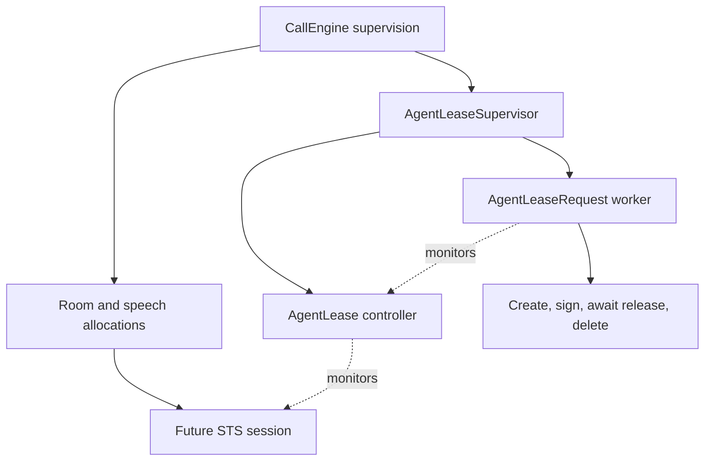

# ElevenLabs remote agent ownership

Status: Local ownership checkpoint, 2026-09-30. The native protocol and temporary
agent provisioning probe pass. This adds asynchronous ownership beneath the
CallEngine application; room-capable STS is still unimplemented. See
[provider expansion](milestones/provider-expansion-and-ai-gateway.md) and the
[hosted protocol evidence](../labnotes/20260930-1120-elevenlabs-agent-protocol.md).

## Ownership decision

A remotely created agent outlives its local process. Creating it inside an
allocation-owned request task would kill the task and lose its deletion operation
when that allocation is retired. Cleanup must therefore have an independent
owner which monitors the producing session.

`AgentLeaseSupervisor` owns temporary `AgentLease` controllers and
`AgentLeaseRequest` workers. It is explicitly named beneath CallEngine and starts
before the room supervisor, so ordinary application shutdown retires rooms first.
It starts empty and performs no credential lookup or network operation at boot.
The supervisor stays outside the speech allocation it will serve.

The controller returns promptly from local initialization and starts its request
worker through the owning DynamicSupervisor. HTTP create/sign/delete run in
that worker, leaving the controller responsive to release and owner death.
The worker retains the bounded `AgentAPI.with_agent` operation until deletion
finishes. It monitors the controller, so controller death also retires the
operation rather than losing it with the allocation.

The session in this diagram is the intended consumer, not an implemented STS
provider. Existing speech authority, output credit and room policy remain owned
by their current boundaries.

## Local contracts

- Readiness delivers a private signed connection only after preparation. It is
  resource readiness, not native conversation acknowledgement or speech readiness.
- Release is restricted to the owner and returns a bounded retirement
  acknowledgement. It does not prove deletion. Repeated release of a retired
  controller is harmless.
- Owner death during creation or active use requests retirement. A late signed
  connection cannot reopen a closing controller. Deletion still waits for the
  bounded API operation to return the resource it created.
- A terminal success is emitted only after the API verifies HTTP 204 deletion.
  Creation, request and cleanup failure remain distinct from successful release.
- The request worker traps its supervising parent's exit only to finish the
  explicit API operation. Graceful shutdown is handled by the active lifecycle,
  not `terminate/2`. Its 65-second shutdown budget allows three bounded API stages
  with connect/receive limits; active lease waiting is interrupted immediately.
- Terminal request telemetry contains only the controller PID and a fixed
  outcome, with no key, signed URL, provider ID, prompt, transcript or raw error.
  It remains observable even when the controller/owner has died. `owner_lost`
  means ownership retirement, including controller or supervisor loss.
- Controller inspection exposes only phase; private request data is cleared from
  its state once the worker starts. No environment reads, retries or capability
  registration are introduced.

## Rejected alternatives

- Run create/sign synchronously in the STS session: this would block bounded
  input, policy and cancellation operations during HTTP preparation.
- Put the cleanup task beneath the allocation: hard allocation teardown would
  kill the only remaining remote-resource owner.
- Delete only from `terminate/2`: hard process death bypasses that callback;
  correctness instead uses monitors and independently supervised work.
- Treat a release call as cleanup proof: a deletion can fail after retirement is
  acknowledged. The terminal receipt and safe telemetry preserve that distinction.
- Kill the worker immediately on application shutdown: the red shutdown case
  proves that this skips deletion of an already prepared resource.

## Evidence and remaining acceptance

Local tests cover prompt preparation, delayed readiness, owner death before/after
creation, cleanup rejection, graceful shutdown, controller death, repeated release,
and the installed supervisor executing the real API helper against a synthetic
HTTP Plug. Application tests verify explicit naming and room/resource shutdown
order. The combined codec/API/socket/lease/application lane passes 37 checks.
No live provider request is needed for these local ownership contracts.

This is not durable external-resource reconciliation. A killed request worker,
lost VM or ambiguous create response can still lose the remote resource identity.
Resolve that failure policy and recovery evidence before production provisioning
acceptance; do not claim an unreconciled remote resource was deleted. This worker
also does not delete hosted conversation records or imply zero retention.

The remaining integration must derive agents/tools from the compiled call spec,
bind scoped credentials, establish native readiness and turn authority, route
room-authorized tools, submit credited output, fence interruption/permission loss,
settle history and report truthful usage. Scoped publication, rendered Console
acceptance, selected runtime live evidence and root/Lean gates remain required.

### Local design review

- [x] Keep remote deletion outside the allocation that can be killed.
- [x] Separate resource readiness, retirement acknowledgement and checked cleanup.
- [x] Review supervisor ordering and controller/request failure boundaries.
- [x] Verify private state and payload-free terminal observations locally.
- [ ] Establish durable resource identity/reconciliation and request-worker failure policy.
- [ ] Integrate the consumer and prove room/tool/history/usage acceptance.

This review is separate from implemented STS capability acceptance.
