# Gemini Live session lifecycle

Decision reviewed before implementation, 2026-10-08. Call Engine's Google STS
adapter owns context compression and socket rotation inside one speech allocation.
The user approved a hosted 15–20 minute acceptance run independently of telephony.

## Provider limits and setup

Google distinguishes the conversation's context window from a WebSocket's
lifetime. Its [session-management guide](https://ai.google.dev/gemini-api/docs/live-api/session-management)
documents a fifteen-minute audio context limit without compression, connections
lasting around ten minutes, advance `goAway.timeLeft` notifications, and session
resumption using server handles. Enable `contextWindowCompression.slidingWindow`
in every initial and resumed setup, using Google's default thresholds. Compression
is server-side and does not require pausing the agent or sending local history.

Keep `sessionResumption` enabled. A replacement sends the same validated private
configuration with the latest safe handle; it cannot send input until
`setupComplete`. See the [Live API reference](https://ai.google.dev/api/live).

## Pending rotation and actual switch

Remove the seven-minute renewal and nine-and-a-half-minute expiry. A healthy
socket has no local age limit. `goAway` requests rotation and supplies its absolute
remaining deadline. Repeated notifications can shorten that deadline, never extend
it. Ordinary caller audio and activity boundaries continue on the current socket
while the adapter waits for a safe checkpoint. Refusing that input would starve
the model and prevent the very exchange needed to reach idle.

Rotation requires completed caller input, model completion, settled playback,
no pending tools or responses, no ambiguity, and a valid private handle. The
hosted endpoint omits `interactionStatus` from `turnComplete`; decode omission
distinctly from explicit unspecified status. For same-allocation resumption,
completion without status suffices: the API reference says generation then
requires further client input. Explicit `IN_PROGRESS`, unspecified and deprecated
status still block rotation. A **new input origin** continues requiring explicit
`IDLE`; this omission rule never relaxes policy/context cutover.

Retain the latest session token across input and completed exchanges. A
non-resumable update revokes it. Local fences independently prevent unsafe use;
the hosted context probe confirms that an initial token restores a subsequently
remembered word. Exactly zero PCM reaches the wire but does not invalidate idle
checkpoint: digital silence cannot initiate caller speech. Every nonzero sample
retains the unresolved-input guards; no amplitude threshold or guessed VAD is used.

At that boundary, send WebSocket close without `audioStreamEnd`. The transport
receives peer acknowledgement, closes its connection explicitly and stops. Wait
for both acknowledgement and monitored termination before opening a replacement
under the owning supervisor. Keep the existing five-second total retirement/
connection/setup budget, capped by the provider's remaining deadline. During this
actual switch, retain at most one ordered, unsent input command and its submitting
owner monitor. The shared input slot applies backpressure. After setup acknowledgement,
send that command once and reply to its submitter. Owner loss discards it. Already
accepted old input, generated speech and tool operations are never replayed.

Google can briefly reject resumed setup with code `1008` and the specific reason
that the session is already connected to an existing client. Classify only that
reason privately as `:session_active`; never retain or publish raw close text.
After the rejected socket terminates, retry the same handle in response to that
negative acknowledgement. Keep the original deadline and held input unchanged.
Other policy errors, failed setup and deadline exhaustion fail explicitly. There
is no sleep, fresh conversation, whole-call retry or timeout extension.

```mermaid
stateDiagram-v2
    Running --> Pending: goAway
    Pending --> Retiring: local work settled and valid token
    Retiring --> Connecting: close acknowledged and old socket DOWN
    Connecting --> Connecting: session_active rejection and socket DOWN
    Connecting --> Running: setupComplete; release unsent input once
    Pending --> Failed: provider deadline
    Retiring --> Failed: original reconnect deadline
    Connecting --> Failed: other rejection or original deadline
```



Successful setup emits `[:vxpipe, :providers, :google, :sts, :resumed]`, with
`count: 1` and a reason (`:go_away` or `:connection_lost`). No handle, credential,
conversation text or authorized identity is included.

## Repairing ambiguity

An unqualified late model end or handle cannot resolve overlapping ownership.
Keep those guards. A genuinely new exchange can repair earlier ambiguity when
it begins with the old caller, response and tools settled and model completion
with idle or omitted status.
Remember this boundary when PCM precedes provider onset. An interrupted old
exchange's unresolved model-content flag may remain at candidate start; it cannot
authorize rotation or context cutover.

Only completion of the new attributable exchange clears ambiguity: caller end and
final, fresh model content, model completion with idle or omitted status, and
settled output. A competing caller whose final is deliberately discarded cannot
repair it. The latest token remains usable unless revoked. This does not claim
independently correlated overlap or
interrupted provider-history reconciliation.

## Failure and rejected alternatives

If the provider deadline expires, replacement setup fails, or a connection ends
without a safe usable handle, fail the allocation explicitly. The provider
contract does not implement history reconstruction; silently starting a fresh
conversation would lose context. Retain that failure policy rather than inventing
replay. The separate consumed-message checkpoint audit in
[STS context restoration](sts-context-restoration.md#implemented-handle-handoff)
remains open.

Rejected: fixed lifetime timers, refusing input during pending rotation, longer
setup/reply timeouts, unbounded microphone buffering, historical audio replay,
fresh-session fallback, and local context compaction. None addresses the provider's
two distinct lifecycle limits while preserving the existing allocation contracts.

## Verification

Ten focused tests first failed for missing compression, pending-input refusal,
actual-switch refusal, obsolete lifetime timers and latched ambiguity. Two additional
silence-checkpoint tests failed before the silence rule was implemented. Further
wire-based reds cover omitted status, periodic tokens, retirement, acknowledgement
before termination and the precise active-session rejection. Existing stale-idle,
caller-final, revocation, playback and private-status guards remain covered.

The hosted long lane streams a recorded greeting every fifteen seconds and 16 kHz
microphone frames continuously, including silence between utterances. It consumes
credited 24 kHz output, settles each reply, requires replies throughout eighteen
minutes and at least one successful resumed connection. If Google has not already
rotated, inject one `goAway` notification at seven minutes: provider expiry timing
is not a project-owned test input. The token, replacement socket and continuing
conversation are real Google resources. The result explicitly reports the
controlled trigger. Each reply retains
a twenty-second bound. It is tagged only `live_long` and
`live_long_google_gemini_live_hosted`; default tests and ordinary Gemini/provider
selections exclude it. Run explicitly:

```sh
bin/livetests run --only live_long_google_gemini_live_hosted \
  apps/vxpipe_call_engine/test/integration/gemini_live_hosted_long_test.exs
```

The short `live_gemini_resumption` selector in the same file confirms real context
retention across a controlled notification: the resumed model must remember a
word sent before connection replacement. It also inherits `live_long` exclusion
and no ordinary provider tag. Temporary wire diagnostics are removed.

The eighteen-minute hosted lane passes in 1080.7 seconds, seed 485926: 72 received
replies, 50,776 microphone frames, and one successful resumed connection. It
controls the notification at 420 seconds and observes real replacement setup at
421 seconds. Replies continue through eighteen minutes. This does not establish
that Google naturally issued its expiry notification during this run.

Live and final gate evidence is recorded in
[the milestone](milestones/gemini-live-provider-acceptance.md#hosted-session-longevity-2026-10-08)
and [the labnote](../labnotes/20261008-0220-gemini-session-longevity.md).
Direct PCM consumption proves receipt, not remote carrier playback. Long telephony
acceptance remains a separate gate.
