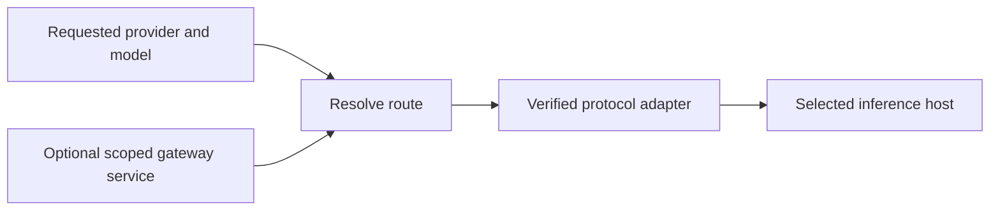

# AI gateway routing

Status: Design exploration only. Implementation deferred by the user on
2026-09-30. Cloudflare AI Gateway, Vercel AI Gateway and future gateways must
be considered together before selecting an implementation contract.

Prerequisites: [Provider integration packages](provider-integration-packages.md),
[Tenant provider credentials](tenant-provider-credentials-and-platform-configuration.md),
and [Provider expansion](provider-expansion-and-ai-gateway.md).
Design sources: [Platform and tenant services](../platform-and-tenant-services.md),
[Speech session ownership](../speech-session-ownership.md).

## Decision and rationale

An upstream provider owns model validation and protocol behavior. A gateway owns
request routing and gateway authentication. Treating each gateway as another
provider with a maintained map of upstream providers/models mixes those concerns
and duplicates provider integration knowledge. A call should retain upstream
provider/model identity while selecting a separate optional gateway route.

This direction does not yet approve a public schema, routing module, database
migration, or advertised gateway capability. The unfinished Cloudflare-as-provider
experiment has been removed from runtime, UI and the live test lane.

Rejected direction: a Cloudflare provider which maintains its own upstream/model
catalog and dispatches to other providers. Also reject duplicating Deepgram Flux
protocol handling inside a gateway implementation. Existing provider session
semantics must remain authoritative wherever a gateway preserves their protocol.

## Route types and provider identity

The route contract must distinguish the requested model, the selected inference
host and the client-facing wire protocol. These can differ when a gateway offers
one compatible API across model families. Preserve requested identity and record
the actual host/model when the gateway returns verified routing evidence.

Conceptually, a capability selects its model and an optional scoped gateway
service. The route resolves authentication and a supported transport contract;
the matching protocol adapter executes the request. This is a design direction,
not an approved Call Spec field or module API.

This diagram describes responsibilities, not a new runtime dependency or public API.

| Route | Documented behavior | Design implication |
| --- | --- | --- |
| Cloudflare provider-native Deepgram | Its documented endpoint replaces the Deepgram base URL and accepts an upstream Deepgram token. | Candidate for reusing the Deepgram protocol adapter after route-specific conformance. |
| Cloudflare Workers AI Deepgram | Cloudflare offers hosted Deepgram models through a Workers AI route. | Separate inference host/authentication; do not assume it is identical to the direct-provider route. |
| Vercel compatible LLM API | Its Chat Completions API accepts model-family slugs across providers. | Select a compatible protocol adapter independently of the requested model family. |

The first two rows follow Cloudflare's
[Deepgram route](https://developers.cloudflare.com/ai-gateway/usage/providers/deepgram/)
and [realtime API](https://developers.cloudflare.com/ai-gateway/usage/websockets-api/realtime-api/).
The third follows Vercel's
[compatible API](https://vercel.com/docs/ai-gateway/sdks-and-apis/openai-chat-completions).
The design implications are inferences; none is locally implemented or accepted.

A gateway may offer provider selection and fallback rather than a transparent
proxy. Vercel documents dynamic provider routing, allowlists and request-scoped
BYOK, with possible fallback to system credentials. Those behaviors need an
explicit Vxpipe policy and usage identity; an operator's tenant credential override
must not accidentally become permission for a different billed credential.
[Provider routing](https://vercel.com/docs/ai-gateway/models-and-providers/provider-options),
[BYOK](https://vercel.com/docs/ai-gateway/authentication-and-byok/byok).

Maintain small, verified route compatibility contracts where required. Reuse
existing model metadata or gateway discovery for model availability; do not
duplicate an upstream provider/model catalog inside every gateway module.

## Exploration review

- [x] Separate gateway selection from upstream model identity and protocol ownership.
- [x] Identify native proxy, compatible API and hosted inference as distinct routes.
- [x] Record Cloudflare/Vercel authentication and fallback differences from primary docs.
- [ ] Approve tenant isolation, credential fallback and usage attribution policies.
- [ ] Approve one runnable route and its public contract after conformance evidence.

This is a local exploration review, separate from implementation acceptance.

## Questions to resolve before implementation

- [ ] Define independent gateway identity, tenant/platform scope, override and
  fallback behavior; choose how a call selects an optional route.
- [ ] Distinguish gateway credentials from upstream credentials and BYOK;
  determine which identities are required for each supported route.
- [ ] Separate transparent proxy routes from hosted model offerings. Cloudflare
  Workers AI is a hosted inference product, not proof of proxy equivalence.
- [ ] Compare Cloudflare and Vercel REST/streaming and speech WebSocket support;
  unsupported combinations must fail at admission without a billable attempt.
- [ ] Define endpoint/header construction, credential privacy and transport
  injection boundaries without public arbitrary URLs or authentication hooks.
- [ ] Specify upstream model identity, gateway identity, usage provenance and
  costs without double counting or attributing model usage to the wrong provider.
- [ ] Specify retries, cancellation, backpressure, interruption, startup errors
  and ownership across direct and routed requests.
- [ ] Decide whether capabilities come from verified route contracts rather than
  copied gateway model catalogs; plan compatibility evolution.
- [ ] Review dependency direction and migration implications separately from
  implementation progress.

## Future runnable slice and acceptance

- [ ] Approve one minimal route and its public/scoped credential contract.
- [ ] Implement an optional gateway route while preserving direct-provider behavior.
- [ ] Prove provider protocol reuse and admission rejection of unsupported routes.
- [ ] Verify tenant isolation, authentication, redaction, cancellation and usage.
- [ ] Add explicit bounded gateway live tests excluded from the default suite.
- [ ] Inspect setup/routing UI in a rendered browser and pass repository gates.

No implementation or completed acceptance is claimed. Experimental Cloudflare
LLM inference succeeded; an experimental Workers AI Flux stream closed after
receiving audio. Those observations do not establish a supported gateway route.
No further gateway requests are part of the current provider milestone.
