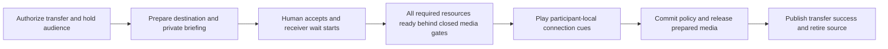

# Transfer readiness and participant wait sounds

Status: implementation in progress (2026-09-15). Human web handoff, AI handoff and initial caller
waiting are accepted delivery slices. Human acceptance includes native configuration/audio,
complete readiness, policy reconciliation, private-resource cleanup, recovery and existing rendered
sample evidence. AI acceptance includes independent model/voice/tool/MCP readiness, default/URL/nil
waits, ordered greeting, privacy and resource retention. Initial waiting includes native audio and
deterministic phone lifecycle acceptance. Local phone handoff acceptance passes; live carrier
audibility and changing/multiple listeners remain open.
Latest verification: all five root gates pass; 1,435 tests, zero failures and 16 integration
exclusions (seed 235296, concurrency four, module preloading and serialized test-file compilation).
The expanded native preparation/cue membership case and 61 focused engine checks pass. The earlier
ordinary human-only routing failure did not recur in this full run; its cause remains unproven.
Eight checkpoint tasks remain.
Full milestone acceptance remains open.
Start with the [delivery checkpoints](#implementation-checkpoints) and
[curated implementation evidence](#implementation-evidence).
Prerequisites: [Call lifecycle and opening audio](opening-audio-and-call-lifecycle.md),
[Agent transfers](agent-transfers.md), [Live mixing and media policy](live-mixing-and-media-policy.md),
[Human web transfers](human-web-transfers.md), [Common phone transfers](telnyx-calls.md),
and [Usage observations](usage-and-billing-observations.md).
Design sources: [approved transfer contract](../../labnotes/20260905-0405-call-definition-design.md#transfer-success-and-failure--approved-g8-baseline),
[opening playback contract](../opening-audio-contract.md),
[incremental policy application](../incremental-media-policy.md), and the user's 2026-09-13
request for complete readiness, independent wait playback, and an audible connection cue.

## Runnable outcome

A caller hears a private wait sound while the call becomes ready. During a transfer, each
remaining listener hears their own wait sound. The human destination hears the private briefing,
accepts, and hears their own receiver wait sound while capabilities become ready. Once all
capabilities required by the resulting room are ready, waiting listeners hear a short connection
beep. Only after those cues finish may conversational audio open and transfer success be reported.

The same assets can be shared in memory, but playback positions are independent. Starting one
participant's nine-second loop must not seek or restart anyone else's loop. This applies to web,
phone, human destinations, agent destinations, and rooms with more than two participants.

## Current gap

The original defect was completion before destination STT/main media were ready. The committed
groundwork now supplies independent players, shared ordered output, capability readiness and
private preparation. The missing work is completing and verifying their use in ordinary calls.

| Area | Current boundary | Next required result |
| --- | --- | --- |
| Human web transfer | Accepted: complete readiness, private waits/briefing/cues, policy reconciliation, resource retention, bidirectional media/transcripts and bounded recovery pass. A reproduced output-clear race no longer turns unchanged output into fatal unavailability during recovery. | Retain this acceptance while completing the remaining slices. |
| Phone transfer | Local Telnyx/Twilio default/URL/nil waits, delayed destination STT, withheld/replayed cue marks, bidirectional decoded audio/transcripts, privacy and spoken source recovery pass on retained media. | Verify live carrier wait/cue/clear/recovery audibility; actual adapters driven by synthetic sockets do not establish physical playout. |
| AI transfer | Accepted: independent model, voice, MCP initialization and local-tool readiness gates, default/URL/nil waits, ordered cue/greeting, private held input and retained resources. Failure recovers spoken source conversation; fresh activations work on re-entry. | Retain this acceptance while completing phone and changing-listener slices. |
| Initial call | Native default/URL/nil startup, independent file/text openings, delayed participant/room resources and one greeting pass. Late readiness starts a skipped wait or resumes its existing cursor. Deterministic Telnyx/Twilio failures end the exact provider leg before or after media attachment. | Slice accepted; retain these checks while completing transfer slices. |
| Multiple listeners and failures | A native five-participant handoff verifies independent seven/three-second cursors, multiple monitor sinks and retained resources. A monitor leaves and re-enters before acceptance, during accepted preparation and during an unfinished cue. Changed cues return to waiting and replay before conversation. | Finish repeated human/AI transfers with changing membership, remaining failure/cancellation acceptance and the full root gates. |

The earlier component checkpoint `c4fea8c` passed 1,274 tests. The preceding policy-preparation
checkpoint passed all five root gates with 1,306 tests, zero failures and 15 exclusions;
`mix test --max-cases 4`
limits concurrent fixture setup on the shared host. Full milestone acceptance remains unfinished.

## Call-definition changes

Add one call-level `wait_sounds` object. Each configured value is an absolute audio-file URL or
null (`nil` in Elixir). Omission selects the built-in default for that scenario. Configuration is
per call; playback state is still independent for every participant. No second configuration layer
or participant-level settings are needed for this proposal. Keep `transfers` as the existing
allowlist and the shared attempt timeout in `transfer_policy`. Readiness is an engine invariant,
not an optional `wait_until_ready` setting.

| Slot | Listener and trigger | Built-in default |
| --- | --- | --- |
| `call_setup` | Entry caller, once its output connection can play audio, while initial room/capability setup is incomplete | `phone-ring` |
| `transfer_to_agent` | Existing audience, including the caller, when the transfer destination is an AI agent | `cafe-bossa` |
| `transfer_to_human` | Existing audience, including the caller, when the transfer destination is a human | `phone-ring` |
| `transfer_joining` | Incoming human destination, immediately after accepted transfer control, until readiness permits the connection cue | `cafe-bossa` |

The transfer defaults above reflect the user's follow-up: AI-to-AI uses café-bossa; AI-to-human
uses phone-ring for the caller/audience and café-bossa for the receiving human. The implementation authorization also accepts phone-ring for initial caller setup. The audible connection beep is a separate mandatory handoff action, not a wait
sound; setting a wait slot to null does not disable readiness gates or the beep.

Definition syntax in schema `20260914.01` (playback orchestration is still being implemented):

```json
{
  "schema_version": "20260914.01",
  "name": "Support with participant wait sounds",
  "entry_caller": "caller",
  "entry_receiver": "reception",
  "defaults": {
    "capabilities": {
      "speech_to_text": "deepgram-flux-stt",
      "model_inference": "gemini-flash-lite",
      "text_to_speech": "deepgram-flux-voice"
    }
  },
  "wait_sounds": {
    "call_setup": null,
    "transfer_to_agent": "https://media.example.com/cafe-bossa.wav",
    "transfer_to_human": "https://media.example.com/phone-ring.wav",
    "transfer_joining": "https://media.example.com/receiver-wait.wav"
  },
  "participants": {
    "caller": {
      "type": "human",
      "connection": {"service": "web", "mode": "receive", "admission": "start_call"}
    },
    "reception": {
      "type": "agent",
      "prompt": "Help the caller and transfer to human support when requested.",
      "first_message": {"mode": "wait_for_input"},
      "transfers": ["human-support"]
    },
    "human-support": {
      "type": "human",
      "description": "Human support specialist",
      "connection": {"service": "web", "mode": "receive", "admission": "transfer"}
    }
  },
  "transfer_policy": {"attempt_timeout_ms": 30000}
}
```

This example deliberately silences initial caller waiting and uses fetched files for transfers.
Omit `wait_sounds` entirely to use the defaults; URLs above are illustrative, not built-in asset IDs.

### Resolution and validation

| Authored value | Meaning |
| --- | --- |
| No `wait_sounds`, or `{}` | Use every built-in default |
| A slot is omitted | Use only that slot's built-in default |
| A slot is a valid supported HTTP(S) file URL | Fetch, validate, prepare and play that file for that scenario |
| A slot is null / `nil` | Play no wait sound for that scenario; other slots still use their values/defaults |
| `wait_sounds` itself is null / `nil` | Disable all four wait sounds |

- Preserve missing versus explicitly null during parsing/serialization; use presence-aware
  resolution rather than treating both as the same absent value. Reject booleans, bare asset
  names, local/file/data URLs, unknown slots, objects in place of a URL, and malformed values at
  their exact definition paths. There is no public asset registry to configure for a URL.
- The built-in defaults resolve privately to the packaged local WAVs, with no HTTP request.
  Configured URLs use the existing bounded audio fetch/address policy, response limits and cache
  primitives. Support the existing PCM WAV format plus the supplied stereo PCM16/48 kHz format;
  normalize stereo once into the canonical mono playback format. A valid URL with an unreadable,
  unsupported or oversized file is an explicit asset-preparation failure, not fallback to a default.
- Fetch and prepare all configured wait assets during call preparation, before dependent runtime
  setup/transfer phases need immediate playback. Keep network/decode work out of RoomAuthority,
  Gateway receive loops and the pure definition compiler. Reuse cached bytes for all listeners;
  do not refetch on every loop or participant start. Cold preparation may delay admission, but must
  never claim a custom sound is available or silently play a different sound.
- Pin URL/source selection in the compiled plan and pin content digest, format, duration and
  normalization settings when preparing that call's assets. Active calls keep those prepared bytes
  even if the remote file changes; a later call may fetch a new version under cache revalidation.
  Keep URLs with private query parameters out of public events/logs; use safe asset handles there.
- Wait/cue playback is for connected human listeners, never an agent's STT/model. Agent transfers
  still wait for all agent capabilities and play audience sounds/cues to the humans being reconnected.
  An authorized receive-only monitor never gains microphone permission from this feature.
- The mandatory built-in connection cue is finite and validated for audibility. Failed cue playback
  cannot silently open the bridge. Cue customization is not part of `wait_sounds`.
- Introduce a new schema revision and explicit compatibility parsing for current `20260913.01`
  definitions. Old JSON still rejects unknown fields; new calls resolve its omitted sounds to the
  approved defaults. Existing saved revisions/history remain immutable, and running calls retain
  their pinned plan. Cover stored-definition loading and plan serialization in the migration.

## Readiness contract

Build the required resource set from the **prospective post-transfer plan and effective policy**:
every remaining participant, the incoming destination, and enabled room-level resources. Do not
require departing-source capabilities to exist after handoff, unselected providers to start, or
policy-forbidden processing to become ready. Retain the source for bounded recovery until commit.

Each resource reports `preparing`, `ready`, or `failed`, with its room incarnation, participant or
room scope, attempt, instance generation, effective configuration signature, and relevant policy
interval. A process PID or successful `start_child` alone is not readiness. Disabled/not-demanded
resources are explicitly absent from the required set. An enabled capability without a readiness
adapter is unsupported and must not be silently treated as ready.

| Resource | Required readiness evidence |
| --- | --- |
| Any selected STT provider | Configured session/transport initialized, provider's supported connection acknowledgement received, correct codec and ingress bound; microphone input still gated |
| Any selected TTS provider | Voice/model/configuration resolved, provider initialization complete, output route prepared; no greeting or generated speech admitted yet |
| Model inference / agent runtime | Correct activation and context installed, client initialized, dependencies and tool bindings ready, runtime can accept its next request |
| Local/remote tools and MCP | Local bindings validated; enabled remote integrations initialized with required discovery/capability negotiation complete; no dummy tool invocation |
| Participant media | Negotiated live connection and prepared input/output codec/pacing paths, bound to the exact participant and generation |
| Room mixer, transcript router, Variables and other enabled room services | Owning processes acknowledge operational readiness and the candidate configuration/policy; required subscriptions/queues are bound |
| Recording, archive and observation paths | Enabled local producer/consumer interfaces are initialized and can accept bounded work under the candidate policy; preserve existing asynchronous storage contracts |
| Wait/cue playback | Selected assets validated/cached and the listener's private output path is usable |

Readiness means operational readiness according to each adapter's contract, not a guarantee that
its next external request cannot fail. Stateless HTTP providers acknowledge validated initialization
and usable clients; do not invent a provider handshake or generate a billable utterance to claim
readiness. Remote recording persistence is not a synchronous admission dependency: a locally ready
bounded asynchronous writer retains its existing outage/gap contract. A known failed required
local resource cannot pass the barrier.

Compare desired resources/configuration to running instances. Keep unchanged STT/TTS/model/tool
sessions, codecs, room services and their ready generations. Prepare only additions/replacements;
remove only resources no longer required. A wait/hold transition changes delivery gates, not the
media privacy policy and not every service generation. Real permission changes still invalidate
the affected intervals and queues, as required by incremental policy enforcement.

## Participant-local playback and isolation

- Call Engine owns lifecycle and per-listener playback. Gateway owns negotiated codecs, transport
  delivery and playback acknowledgements. Use engine application `priv` assets so embedded,
  WebRTC and phone clients share the same feature; it is not a Phoenix static-file feature.
- One supervised player/cursor per participant and wait episode. The episode is scoped to the
  incarnation, participant, connection generation, phase and transfer attempt. Each starts at zero,
  loops independently and owns bounded queued frames. Re-entry/new attempts start a new episode;
  a replacement connection restarts only that participant's playback. Multiple authorized output
  sinks for one participant follow that participant's cursor.
- Share decoded asset bytes, never timers, cursor state or a room broadcast of the wait waveform.
  For a ten-second configured fixture, one participant can be at seven seconds while another is
  at three. The supplied default files happen to be nine seconds long.
- Introduce a participant output arbiter before encoding/pacing: select opening/briefing, wait,
  cue, or permitted room audio. Keep one ordered output timeline across these sources. Changing
  source must not restart the codec or RTP clock. Bound queued audio and acknowledge clear/drain;
  never enqueue an infinite loop or race separate private/room writers on one transport track.
- Local sounds and private briefing bypass room mixing, STT/model input, other listeners,
  monitoring and call recordings. Trace only safe phase/asset IDs and durations. A listener may
  acoustically feed its speaker into its microphone; use normal endpoint echo cancellation and
  keep its input gate closed throughout waiting/cue playback.
- Holding gates microphone delivery, conversational room output and model turn admission without
  stopping healthy capabilities. Discard blocked audio; never replay it after release. Previously
  admitted, permitted transcripts may finish, but cannot trigger new held conversation output.
- For a five-participant room where participant 5 initiates transfer, participants 1–4 each enter
  their own audience wait. Do not hard-code `caller_participant_id` as the only audience. Exclude
  the departing source and incoming destination from this audience set. Membership changes update
  only affected listeners; joining mid-attempt starts that listener's own loop.
- Existing listeners are privately held during the transfer, including with respect to one another.
  Source responsibility remains available for recovery, but the old spoken blocking-hold response
  and late source acknowledgements must not compete with wait playback.

## Initial call sequence

1. Pin the definition and establish the minimal room/participant identity plus caller output path.
   Refactor startup so expensive capability initialization does not precede all usable caller media.
   In the browser, this begins after the caller grants media access/connects; a page that has not
   established audio cannot yet hear a server sound. Phone legs follow the same early output gate.
2. Start that caller's `call_setup` wait at zero and initialize required room/participant resources
   asynchronously. Preserve exactly-once admission and the existing start/readiness/duration clocks.
3. If configured opening audio is ready, suspend waiting, clear its queued tail, and play the opening
   announcement privately to completion. If capabilities are still preparing afterwards, resume the
   caller's own suspended wait cursor. Never overlap wait sound with the announcement or greeting.
4. Once opening playback and all initial readiness requirements finish, clear waiting and release
   normal conversation/first-message behavior. The transfer connection cue is not an extra initial
   greeting or substitute for opening audio. Startup failure ends the attempt and its player.

## Transfer sequence and completion barrier



1. Authorize the existing catalog-bound request and start its one total attempt timer. Gate the
   audience's conversational input/output and start each audience wait immediately, selecting
   `transfer_to_agent` or `transfer_to_human` from the destination's type. Rejecting an
   unauthorized request does not put anyone on hold. Prepare destination configuration/resources
   asynchronously under supervision; keep room authority and Gateway message loops responsive.
2. A human destination connects privately and hears its briefing/notice. **Approved acceptance
   change:** expose acceptance only after required briefing playback completes. Authenticate that
   acceptance window server-side for web and phone. Premature controls do not accept or end the
   attempt; they do not reset the deadline. This replaces today's permitted early-accept latch and
   ensures receiver waiting begins immediately after acceptance without masking a required notice.
3. On accepted control, start `transfer_joining` at that listener's zero position. Complete
   preparation of its configured capabilities and held media paths. Preparing STT before main
   admission requires a narrowly authorized attempt-bound binding; it grants no microphone input,
   room audio, transcripts, recording, or unrestricted history during preparation.
4. Prepare the final resource/policy configuration behind closed gates. Reuse unchanged ready
   instances; prepare actual replacements separately. Enforcer preparation must support installing
   those ready instances at commit instead of performing fresh network startup in the commit call.
   Keep current privacy restrictions on any existing admitted traffic until authoritative commit;
   candidate readiness never grants candidate media permissions.
5. Wait for the complete required resource set, including still-participating listeners and room
   capabilities. No tool success, `transfer.completed`, `transfer.active`, or mutual audio yet.
   Agent destinations skip human briefing/acceptance/receiver playback but use the same readiness
   and audience wait barrier, with no destination greeting/model output before release.
6. Stop/clear each listener's wait frames and play the mandatory connection cue once per listener.
   The approved cue audience is every held human listener, including the incoming human, even when
   their wait slot is null. Use the generated 250 ms, 1 kHz beep with 5 ms edge ramps and a -6 dBFS
   peak, above the supplied wait assets' level. Each output path
   must acknowledge ordered completion, not merely successful enqueue. Wait for all applicable
   listener cues before releasing any conversational output.
7. Revalidate the exact attempt, deadline, membership, resource generations and readiness. Commit
   participant/control/privacy changes and install the prepared media configuration while gates
   remain closed. Verify the resulting policy still matches the ready resource set. Any readiness
   loss or relevant policy change invalidates the pending release; prepare again within the same
   deadline and replay the cue before a later release. Unrelated revisions preserve ready instances.
8. Issue the fenced media-release command. Drop old output generations, open only policy-permitted
   paths, and await acknowledgements. Then publish one engine completion/tool result and one
   consistent adapter `transfer.active` projection, retire the old source subtree, and stop players.
   A terminal failure during partial gate release closes the affected conversation fail-closed;
   it must not report a clean successful or recoverable handoff after uncertain media admission.

For WebRTC, keep cue packets ahead of room packets on the same ordered output timeline, through
the output arbiter and final playout/drain acknowledgement. Where a phone adapter supplies playback
marks, use its exact mapped acknowledgement. A timer for the asset's nominal length is insufficient.
Server acknowledgement proves ordered delivery/drain, not physical loudspeaker volume; rendered
browser and phone acceptance checks must also confirm the cue is audible and precedes speech.

The existing 30-second default total transfer budget includes acceptance, preparation, readiness,
cues and bridge acknowledgement; loops and retries never extend it. Keep its existing 1–120-second
configuration range. All waiting time counts toward whole-call duration and suspends caller-idle
nags. On rejection/failure/expiry, cancel only the exact attempt, discard destination preparation,
clear wait/cue tails and restore the source when permitted using the existing single restoration
budget. Restoration must also satisfy readiness and ordered local cue completion before opening
held conversation. End when no valid conversation can be recovered. Never redial automatically.

## Implementation checkpoints

Deliver the following runnable slices in order. Each checkpoint contains its own behavior,
failure handling, diagnostics, verification and coherent commit. Reuse the committed groundwork;
change a resource adapter only when a required behavior or reproduced failure in the current
slice demands it. There is no separate infrastructure-completion phase.

| Delivery checkpoint | Runnable result | Depends on | Status |
| --- | --- | --- | --- |
| [Human web handoff](#checkpoint-human-web-handoff) | Desktop caller transfers to the mobile transfer desk, hears waits/cues, then exchanges audio and transcripts; failure restores or ends the call correctly. | Existing committed preparation/playback | Accepted: native flow/failure checks, existing rendered sample and root gates pass |
| [AI handoff](#checkpoint-ai-handoff) | Caller hears the AI-transfer wait and cue, then talks to the ready destination agent. | Human handoff coordination | Accepted: native readiness/configuration/privacy, recovery and root gates pass |
| [Initial caller waiting](#checkpoint-initial-caller-waiting) | Caller hears setup waiting, optional opening audio and exactly one correctly ordered first-message action. | Established hold/readiness/output lifecycle | Accepted: native configuration/audio and deterministic phone lifecycle checks pass |
| [Phone handoff parity](#checkpoint-phone-handoff-parity) | Web/phone and phone/phone callers complete the same waits, briefing, acceptance, cues and human conversation. | Human handoff and initial-call coordination | Local acceptance and root gates pass; live carrier audibility open |
| [Changing and multiple listeners](#checkpoint-changing-and-multiple-listeners) | Five-participant calls and repeated transfers retain independent waits and correct media/privacy as connections change. | Completed transfer paths | Native five-participant monitor addition/reconnection and independent cursors pass; broader changing-audience acceptance open |

A checkpoint stays open until its runnable acceptance and applicable
[common gates](index.md#common-implementation-and-verification-gates) pass. Fix regressions in
existing supported paths within the checkpoint that introduces them. The user requested continuing
coherent implementation commits as progress is verified; a delivery checkpoint may contain several
such commits and remains open until its complete acceptance passes. Keep Console edits limited to
the existing transfer controls and status; `vxpipe-docs` belongs to another agent. Record unavailable
external verification explicitly; do not label a local simulation as
live-provider proof. Continue independent work if an external check is blocked, preserving the
unfinished checkbox and exact missing evidence.

Remaining work after human web, AI handoff, initial waiting and local phone acceptance: **8 tasks**
in this section—live phone audibility 1, changing/multiple listeners 5, and final audit 2.
The open acceptance/summary boxes elsewhere restate these requirements;
they are not additional independent tasks. These tasks vary in size and do not imply a completion
percentage. Two delivery slices still have acceptance work remaining.

### Checkpoint: human web handoff

**Runnable outcome:** start a call in `/pipecat-console`, request human support, connect `/transfer`
on a second device, hear its private briefing, accept, hear the local waits/cues, then talk in both
directions with permitted transcripts. A delayed or failed capability produces a useful preparing
or recovery state rather than a false completion or unexplained return to the create-room screen.

Carry forward the existing `HumanMediaHandoff`/`HandoffGate` integration. The normal-handoff check
uses default waits and rejects caller text before the destination connects. Recovery checks exercise
destination and phase loss, retained media and a fresh caller turn. Native audio, engine failure
checks, existing rendered sample evidence and the current root gates complete this checkpoint.

Implementation tasks:

- [x] Gate all existing audience input/output/model turns at authorized transfer start and begin
  `transfer_to_human` immediately. Suspend caller-idle handling while preserving the whole-call
  clock; suppress competing source speech and discard held microphone frames without replay.
- [x] Enforce briefing completion before authenticated acceptance on both server control paths.
  Keep early/duplicate controls harmless and start `transfer_joining` immediately upon valid
  acceptance. The original total attempt deadline covers every stage.
- [x] Finish ordinary acceptance through whole-room preparation, ordered wait clearing, every
  listener's cue, exact policy adoption, acknowledged release and one consistent completion.
  Retain source resources until completion and retain unaffected capability/codec instances.
- [x] Finish rejection, expiry, disconnect and preparation/cue failure cleanup. Recover the source
  within the existing restoration budget, with readiness and cue before release; close when
  recovery is impossible or partial release leaves uncertain media admission. Never redial.
  Release acknowledgements now revalidate policy/bindings and exact resource generations. Engine
  cases close on changed policy/generation, explicit release error and policy change before final
  coordinator completion. Deadline, phase loss and required destination STT loss during release
  now produce terminal failure without recovery or redial. An already handled recovery cancellation
  defeats a queued successful worker result. Native caller/desk cases receive failure through RTVI
  and close without activation; engine archive facts retain the bounded failure cause.
  Native checks also cover disconnect and voice failure during briefing, plus real total-attempt
  expiry during briefing and acceptance. Each releases the admission once, stops the old phase,
  avoids activation and recovers the same caller/media actors with cue, spoken response and
  another turn. A native output-clear interleaving now reproduces the recorded fatal `unavailable`
  recovery result: the observer treated a status transition as changed resource identity. It now
  preserves the identity check and reports current readiness. The fixed native case delivers cue
  and spoken recovery, another caller turn and a subsequent accepted transfer on the same peer.
  The cleanup audit and current root gates pass. See the
  [early recovery labnote](../../labnotes/20260915-0441-human-recovery-boundaries.md) and
  [causal reproduction and acceptance audit](../../labnotes/20260915-0526-recovery-failure-tracing.md).
- [x] Resolve existing engine connection-fixture failures and the configured phone
  `unsupported_audio` failure without a production readiness bypass or deadline increase.
- [x] Remove prepared private resources that the resulting policy does not demand.
  Initial and repeated private STT allocation now check the prospective policy. If demand disappears
  before acceptance or while readiness collection is pending, the private speech pair is removed
  while Gateway retains its connection and room-media actors; the WebRTC handoff completes. An
  unrelated membership revision retains the original STT transport. Reconciliation reuses the same
  collector, preparation owner, media generation and deadline. A stale candidate during cue playback
  now drains privately, re-prepares and plays a fresh cue before release. Changed bindings or a
  stale-candidate rejection at the coordinator's final commit check also retry under the same phase
  and deadline. Stale initial graphs now retain partial preparation leases while recapturing the
  candidate: removal of demand stops only the speech pair, and an unrelated revision retains the
  same prepared STT transport, room services, worker and audience wait scope. Policy revisions after
  adoption now reconcile against the installed policy before any release and drain a fresh cue.
  Engine and native cases cover removed speech demand, unrelated policy and changed still-required
  STT, retaining unaffected room/media actors and the original deadline. Completed private briefing
  TTS now stops after acknowledged playback, before acceptance; its delayed notifications cannot
  cancel the transfer. A late completion received after recovery discarded the preparation used
  to crash the room; the matcher now treats that retired request as unrelated. Engine timeout/phase-loss
  cases pause actual recovery cue drain, deliver late playback/unavailable/monitor events, and
  finish recovery with the same source TTS; see the
  [retired-event regression](../../labnotes/20260915-0453-retired-briefing-events.md).
  Recording denial now removes private destination writers and excludes all writer dependencies
  from candidate and installed readiness. An unrelated revision retains the same writer and
  recording stream. Two native cases apply these revisions by readmitting a connected listener:
  both keep the worker/deadline, room/source bindings and existing speech/media actors, then
  deliver that listener's cue before conversation. Denial completes with writer readiness still
  withheld and records no conversation. The resource-ownership review finds no other private
  web-human capability allocation; model/tool/MCP preparation belongs to the AI checkpoint.
  The complete changing-audience, re-entry and phone acceptance tasks remain open. See the
  [recording-demand evidence and review](../../labnotes/20260915-0505-recording-demand-reconciliation.md).
- [x] Connect the existing Console status and ledger to actual preparation blockers and cue/release
  progress. Keep briefing/acceptance/active ordering and the readable button. Publish only closed
  capability categories and elapsed time; reject stale attempts and late updates after activation.
  The existing diagnostics reporter aggregates returned audience/prepare/release/recover worker
  durations without call identity or provider payloads. A disconnected browser peer now shows
  “Connection interrupted” with the existing Disconnect action; reconnect restores the previous
  transfer phase and acceptance remains unavailable during interruption.
- [x] Complete caller/destination failure and recovery detail, separate briefing/acceptance/cue
  timings, forced-worker termination observations, and remaining queue/drop diagnostics. The
  destination may already be closed during source recovery; its progress UI alone is insufficient.
  Existing caller RTVI and destination progress now carry a bounded failure reason. Recovery
  progress is sent before private-destination cleanup, and restored callers retain that reason.
  Timeout and required-STT failure during release report distinct terminal reasons. Briefing,
  acceptance and per-listener cue durations now end at actual control/playback boundaries,
  including acceptance timeout and phase loss. Surviving owners count confirmed worker
  cancellation and unexpected exit. Sampled player slot depth/capacity and rejected/discarded
  output submissions reach finite Console aggregates, sanitized before queue admission. All
  five root gates pass: 1,401 tests, zero failures and 16 integration exclusions. See the
  [reason-delivery labnote](../../labnotes/20260915-0359-human-transfer-diagnostics.md) and
  [lifecycle observations](../../labnotes/20260915-0417-transfer-lifecycle-observations.md).

Acceptance and commit tasks:

- [x] Exercise defaults, a fetched URL, per-slot nil and whole-object nil through ordinary WebRTC
  transfer acceptance. Decode distinct wait/cue/conversation signals on the peers, retain readiness
  gating with nil waits, and receive partial/final support transcripts in the caller. Private audio
  and held support microphone input produce no STT input or individual-track recording chunks;
  post-release conversation produces both. The custom fetch is controlled at the fetcher boundary.
- [x] Complete live URL retrieval, ordered wait-tail clearing and model-history isolation through
  native caller/destination peers. The opt-in integration case fetches a synthetic WAV over public
  HTTPS using the production fetcher and an empty cache. Both peers receive the configured wait,
  then cue and conversation with no detected wait/cue tail after the transition. Recovery model
  requests retain caller content and exclude the played private notice, held input and wait URL.
  This proves received audio, not physical speaker audibility; no UI changes are involved.
- [x] Hold human transfer completion until mandatory cue drain, including with nil wait sounds.
  Cue-player loss and prepared destination STT loss during drain recover the retained source;
  an output that also cannot finish the recovery cue closes the call within the existing budgets.
- [x] Pause initial graph preparation and revise relevant/unrelated policy. Refresh the candidate
  without replacing the prepared STT transport or room services when unaffected; stop the private
  speech pair when demand disappears. Keep the same worker, audience wait scope and deadline,
  then complete the cue and activation.
- [x] Delay required destination, remaining-participant and room capabilities independently, then
  inject loss across the remaining preparation/adoption/release stages. Observe no premature success and
  unchanged healthy instances; verify held text/audio cannot interrupt or replay after release.
  Destination STT, a remaining human recognizer and room recording now independently hold the
  native three-peer handoff as its final blocker. Their ordinary success/retention and held-input
  checks pass. Required destination STT remains tracked after adoption until release completes;
  losing it then closes the call with failed progress instead of bypassing transfer cancellation.
  Nine three-peer cases now inject loss of each required resource during preparation, adoption
  and release. Destination loss before adoption restores the recorded source conversation;
  fatal losses close every peer without activation/completion or replacement speech. Release
  failures are injected after the destination output gate opens. Healthy retained listeners
  resume their cues, conversational audio, recognizer and recordings after successful recovery.
- [x] Run the owning engine/Gateway/Console checks, including the existing web/phone transfer
  regressions, and all five root gates. Record exact results for the implementation being committed.
- [x] Exercise the actual rendered desktop caller and mobile-sized desk with live model/Deepgram
  services and default waits. Observe preparation/cue/activation, browser-decoded audio in both
  directions and partial/final support transcripts. Disconnect before acceptance and verify spoken
  source recovery plus another spoken caller turn on the same WebRTC connection.
- [x] Complete controlled independent readiness delays and custom/nil configurations through
  native peers. Nine ordinary handoffs cover default/custom/live-URL/per-slot nil/whole-object nil
  waits; the destination recognizer, another human recognizer and room writer each become the
  final blocker with custom/nil waits. All three peers receive cues before conversation. Held
  microphone input is discarded, subsequent speech reaches both recognizers/recordings, and
  unaffected room/media bindings remain installed. The existing real Morse round trip also runs
  in the root suite; controlled providers supply the precise readiness delays.
- [x] Release failed private destination admissions without deleting history or permitting token
  replay/concurrent admission. A fresh rendered desk completes another transfer in the same call,
  retaining the original caller peer and exchanging audio and final transcripts.
- [x] Commit the usable human-web slice with its implementation, focused tests, sample behavior,
  milestone status and labnote evidence. Then begin the AI slice.

### Checkpoint: AI handoff

**Runnable outcome:** the caller requests an allowlisted AI destination, hears `transfer_to_agent`
(default café-bossa), hears the cue, then converses with that agent using the retained call context.
A destination that cannot become ready returns control through bounded source recovery.

Implementation tasks:

- [x] Reuse the human slice's hold/readiness/cue/adopt/release sequence, skipping human briefing,
  acceptance and joining playback. Keep the existing allowlist, Variables, history modes and
  total transfer deadline; introduce no alternate transfer configuration.
- [x] Prepare the destination activation, model/tool/MCP bindings and demanded STT/TTS/output
  before release. Prevent destination greeting, model requests and late source speech from
  crossing the held interval. Preserve every unaffected participant and room capability.
  The shared prospective inventory gates agent destinations. Native model/voice delays and failures,
  independently delayed scoped MCP initialization and the local registry's readiness reply pass.
  Local bindings are compiled normally; readiness never invokes a dummy tool. Existing deadline
  and fresh-activation re-entry checks pass. Caller STT/media, room services and prepared tool/MCP
  resource identities survive handoff; only the departing source retires.
- [x] Apply first-message behavior once after release/completion. Discard failed destination
  preparation and recover or end under the same failure contract as human transfers.
- [x] Expose the destination and actual preparing/failure phase through RTVI and the existing
  sample event ledger so the transition is reproducible from an ordinary caller session.
  The caller receives `vxpipe.transfer` v1 in the existing RTVI `server-message` envelope:
  attempt ID, destination key, closed phase/blocker categories and elapsed milliseconds. Its
  existing SDK handles the server-message extension without a new UI component. Preparation,
  cue/release, completion and recovery are verified through native peers.

Acceptance and commit tasks:

- [x] Exercise independent model initialization and TTS readiness delays through a native caller.
  Receive waiting audio and reject held text at both stages, then receive the cue and greeting.
  Failed model preparation recovers a spoken source response and another caller turn through the
  same output/room-media actors, without replacing the healthy source TTS.
- [x] Complete native independent tool/MCP delays, URL/nil waiting and exactly-once greeting
  and completion evidence. Four configurations cover default, URL, per-slot nil and whole-object
  nil waits. Held microphone/text and late source speech are excluded from STT, recordings and
  destination history. The delivered greeting and admitted caller history survive. A model-issued
  MCP invocation works after release without recreating the prepared binding.
- [x] Verify received wait/cue/greeting order through native WebRTC audio. Inspect rendered states
  only if UI changes are necessary. Pass focused agent-transfer checks and all five root gates,
  update evidence and commit the slice. Four new native cases and 22 focused engine cases pass;
  the final root suite passes 1,415 tests with zero failures and 16 integration exclusions.
  No production or UI change was needed for this acceptance checkpoint. See the
  [AI readiness labnote](../../labnotes/20260915-0602-ai-handoff-readiness.md).

### Checkpoint: initial caller waiting

**Runnable outcome:** on a deliberately slow new call, a connected caller hears `call_setup`
(default phone-ring), hears any configured opening announcement privately, and enters conversation
only when opening playback and all required initial capabilities are ready.

Implementation tasks:

- [x] Establish the minimal caller identity and usable web/phone output before expensive resource
  initialization. Start the caller's independent wait and initialize required resources
  asynchronously using the existing readiness contracts and owning supervisors.
  Early web media passes independent model-construction/TTS delays. Deterministic Telnyx/Twilio
  callers also receive waiting before model construction finishes and while STT remains unready.
- [x] Give file and text opening playback priority: pause waiting, clear its tail, finish opening,
  then resume the same cursor only if setup still needs time. Preserve the opening's own TTS
  profile, pre-recording isolation and existing supported initial receiver types.
  Native WebRTC decodes wait → opening → wait with model construction blocked, for a fetched file
  and the opening's own voice. An engine PCM check confirms the next segment of the same cursor;
  existing human-receiver, cache, input and recording isolation checks pass. Evidence:
  [independent opening checkpoint](../../labnotes/20260914-2319-independent-opening-audio.md).
- [x] Release microphone/model/first-message behavior only after complete initial readiness and
  opening completion. Preserve exactly-once admission and all startup, idle and whole-call clocks.
  Initial setup does not add the transfer connection cue.
  Opening completion now rechecks all collected resources after acknowledged wait pause/clear,
  validates the inventory/policy and compares the current room binding before release. Pending or
  stale readiness resumes the same cursor and re-prepares under the original deadline. Focused
  cases cover readiness loss, changed media generation and policy revision while retaining healthy
  participant/room instances; see the
  [release-readiness labnote](../../labnotes/20260915-0000-startup-release-readiness.md).
- [x] End failed/disconnected/timed-out startup cleanly, including its player and preparation
  workers. Report safe setup timing and the real readiness blocker through existing diagnostics.
  Silent caller detach/process loss now cancels preparation; a killed wait player fails startup.
  Explicit detach clears queued waiting; silent startup survives removal of one caller connection
  when another remains.
  Original readiness/maximum-duration timers stop pending model, opening and wait workers, and
  late readiness cannot reopen an expired lifecycle. Native failure checks receive one peerLeft
  before connection teardown. Setup telemetry now reports current closed blocker categories and
  one terminal lifecycle duration/outcome, including blocked model failure, caller disconnect and
  original deadlines. Native STT/TTS acknowledgements and late media-readiness loss exercise the
  actual blocker path. The existing diagnostics reporter strips private data before queueing and
  aggregates setup outcomes and blockers. See the
  [diagnostics labnote](../../labnotes/20260915-0022-startup-readiness-diagnostics.md) and the
  [startup cleanup labnote](../../labnotes/20260914-2340-startup-failure-cleanup.md).
  Deterministic phone failure/clock acceptance now passes as recorded below.

Acceptance and commit tasks:

- [x] Demonstrate delayed room and participant setup with and without file/text openings, using
  defaults, a URL and nil. Verify cursor resume, no overlapping audio, no recording/transcription
  of private audio, no early microphone admission and exactly-once first-message behavior.
  Ten native cases cover default/URL/per-slot nil/whole-object nil startup, file/text opening
  priority, held input, a delayed room recording writer, retained STT/TTS, later conversation and
  one fixed greeting even after repeated client-ready. Opening text is absent from model history.
  Engine checks cover exact cursor continuity and private full-mix/individual recording exclusion.
  A final readiness loss now starts waiting even if the initial fast path skipped creating a player.
  The startup URL fetcher is controlled; live retrieval is verified by the human-handoff integration case.
- [x] Verify startup failure/clock behavior in web and deterministic phone paths. Confirm
  opening/wait ordering from native caller audio. Inspect Chrome only for UI changes. Pass
  focused and all five root gates, document the runnable result and commit the slice.
  Eighteen Telnyx/Twilio harness checks cover their existing transfer flows plus initial success,
  delayed STT, model failure, readiness/max-duration expiry and silent disconnect. Failures before
  and after media attachment submit one exact provider hangup and retire the local leg/socket.
  All five root gates pass. See [initial acceptance](../../labnotes/20260915-0101-initial-wait-acceptance.md)
  and the required [incoming-leg fix](../../labnotes/20260915-0121-incoming-leg-lifetime.md).

### Checkpoint: phone handoff parity

**Runnable outcome:** incoming Telnyx/Twilio and web callers transfer to a phone human, who hears
the private briefing and presses 1 after it completes. Each listener hears its own wait/cue;
conversation and permitted transcripts follow only after all required media is ready.

This expands acceptance of the common flow. It does not postpone repairing phone regressions
introduced by earlier checkpoints or create a second provider-specific handoff coordinator.

Implementation tasks:

- [x] Exercise the real common telephony session/codec/STT boundary for configured supported
  formats in both providers. Reuse the same private preparation and adoption protocol as web;
  retain native timelines and unaffected providers across holding and release.
- [x] Complete phone acceptance-window, clear, fresh playback-mark and drain integration under
  the single deadline. Duplicate/out-of-order marks must not complete a new cue or release speech.
- [x] Carry the same failure, disconnect, bounded recovery, privacy and diagnostic behavior through
  web/phone and phone/phone calls; retain the existing signed-event and admission boundaries.

Acceptance and commit tasks:

- [x] Run deterministic incoming/outgoing Telnyx/Twilio flows with selected STT, delayed readiness,
  default/URL/nil waits, finite cue backpressure, invalid early acceptance and provider disconnect.
  Assert actual audio/transcripts after release and no private audio in recordings.
- [ ] In the tagged, explicitly authorized provider lane, verify audible cue-before-conversation,
  clearing and recovered conversation. Record the provider/path and evidence, or the exact external
  blocker; playback marks alone do not prove physical audibility.
- [x] Pass relevant phone/engine checks and all five root gates, update evidence and commit the
  runnable slice. Keep any unavailable live-provider acceptance visibly open.

Local evidence: 50 Gateway checks and three owning phone-room checks pass. Signed incoming
Telnyx Opus (16 kHz) and Twilio PCMU (8 kHz) flows each cover default/URL/nil handoffs, delayed
destination STT, cue backpressure, replayed marks, retained resources and opposite-recipient
transcripts. Destination loss during preparation or cue drain restores source speech and a later
caller turn. Existing outbound web-profile admission, early/wrong-source acceptance and actual
attempt expiry checks remain green. All five root gates pass with 1,423 tests, zero failures and
16 exclusions. This checkpoint adds verification fixtures, with no production or UI changes.
The [phone checkpoint labnote](../../labnotes/20260915-0622-phone-handoff-parity.md) records the
fixture corrections, exact codec/control boundary and regression evidence.

External blocker: live provider enable flags, carrier credentials, approved test numbers and public
callback/media URLs are absent from the test environment. Both guarded provider tests skip before
placing a call. Those API tests establish control submission only; completing the open item also
requires received wait/cue/clear/recovery audio evidence on the authorized carrier path. Continue
changing-listener work independently while this item remains open.

### Checkpoint: changing and multiple listeners

**Runnable outcome:** a five-participant call transfers its active agent while every remaining
human hears an independent wait. A listener joining, leaving or replacing a connection affects
only that listener's episode; subsequent transfers and allowed conversation continue correctly.

Verified progress: the native call starts with four listeners and an AI. A non-entry human requests
support; an existing human admitted as a monitor adds a second receive-only connection while
support STT remains unready. Two players pause at exactly seven and three seconds of one shared
ten-second URL asset, keep their positions through attachment and resume on their original
instances. The added sink shares its participant's cursor; every listening connection receives
cue before conversation. Room/connection bindings and the attempt deadline remain unchanged.
The owning player check also replaces a sink, rejects stale attempt/generation requests and
ignores retired acknowledgements. The native client now closes its first monitor data channel,
observes server connection termination, continues hearing the wait on its second connection and
adds a replacement on the same player. Both surviving and replacement connections receive the
cue before conversation, under the original attempt/deadline and retained room/media bindings.

Connection loss reproduced two additional lifecycle failures: connection enforcers were permanently
critical to the room, and subscriber loss cancelled the entire pending mixer preparation. Enforcers
now follow their exact connection owner; mixer reconciliation retains unrelated subscriptions and
their lease while requiring the refreshed request to remove or replace missing selections. A dead
subscriber still requested cannot become ready. A looping player drops only a lost sink when another
remains; final-sink loss and finite-cue failure retain their existing failure behavior. See the
[reconnection labnote](../../labnotes/20260915-0730-transfer-listener-reconnection.md) and
[policy ownership decision](../incremental-media-policy.md#connection-owned-enforcers).

The native regression also freezes the handoff worker during attachment and requires immediate
connection/output hold. RoomAuthority sends a room-monitor-fenced pending notification before
transport events can be handled; web/phone owners close the new gate, then the worker installs
the actual attempt scope. Waiting players are keyed by participant and reconcile only their sinks.
This avoids both an unheld attachment window and a second cursor for the same human. No provider
or UI restart is involved. Monitor admission, rather than SDP alone, determines the absence of
microphone permission in this case. The [changing-listener labnote](../../labnotes/20260915-0656-changing-transfer-listeners.md)
records the red cases, fixture corrections and remaining acceptance boundaries. Keep the compound
tasks below open until their membership/removal/re-entry requirements also pass.
The 75-test owning engine group and 13 mixer checks pass. The original native module and all five
root gates pass; the umbrella reports 1,433 tests, zero failures and 16 exclusions (seed 235296,
concurrency four). The full Gateway lane has 410 tests, including the actual reconnection case.

The same native call now admits a late monitor before destination briefing/acceptance and decodes
its private waiting audio. Removing its participant supervisor retires its connection and player;
re-entry starts a fresh cursor while all original players survive. The call then completes its
existing seven/three-second cursors, connection replacement and cue-before-conversation assertions.
The phase coalesces attachment/removal notifications and refreshes only the waiting audience through
its existing supervised worker. One acceptance arriving during refresh waits for its result; linked
worker loss uses the established attempt failure path. Two focused acceptance-race checks pass.
The [pre-acceptance listener labnote](../../labnotes/20260915-0815-preacceptance-listener-changes.md)
records the native regression, telemetry compatibility correction and verification boundaries.
That checkpoint's umbrella run had 1,435 tests and one ordinary human-only audio-routing failure.
The case passed alone but failed in its six-test owning module, including once before the
restrictive participant joined. Four subsequent diagnostic module runs passed without capturing
a failure. Temporary diagnostics were removed; no ordinary routing behavior or deadline changed.
The [routing investigation](../../labnotes/20260915-0907-native-audio-routing.md) records the
unproven hypotheses and evidence. The preparation/cue checkpoint below supersedes that root result.

Native membership acceptance now also removes and readmits that monitor while accepted support
STT remains unready and during the first acknowledged frame of its connection cue. Departure
reconciles away only an unneeded player; the brief membership-to-attachment gap remains preparing
within the original deadline. A changed cue audience cancels old cue players, clears current live
outputs, refreshes preparation and replays cues. The caller receives cue → wait → cue → conversation;
other connections also require a new cue after any renewed wait. Ordinary handoffs retain the
stricter single-sequence assertion. Original room services and surviving connection bindings remain
after final release. The final native case and 61 owning engine checks pass. The
[preparation/cue labnote](../../labnotes/20260915-0913-preparing-listener-changes.md) records the
regressions and fixture refinement. All five root gates now pass: 1,435 tests, zero failures and
16 exclusions, including 653 engine and 410 Gateway checks. The prior ordinary routing failure
did not recur; this passing run does not establish its cause. Broader audience reconciliation
still needs the listener-arrival boundary during blocked initial destination construction, and
repeated-transfer/failure acceptance remains open.

Implementation tasks:

- [ ] Reconcile the actual whole-room audience and all required resources on membership or
  connection changes. Support receive-only monitors and multiple authorized sinks per human
  without creating microphone permission or sharing another participant's cursor.
- [ ] Fence each episode by incarnation, attempt, participant and connection generation. Preserve
  unaffected resources/cursors; refresh relevant preparation and replay cues when required by
  readiness loss or a changed candidate, within the original deadline.
- [ ] Complete repeated transfer, receiver re-entry, disconnect and partial-release cleanup across
  the established human and AI paths. Retain bounded queues and exact-attempt cancellation.

Acceptance and commit tasks:

- [x] Demonstrate the five-participant hold and two listeners at seven/three seconds of one shared
  ten-second fixture in a running call. Replace a connection and add/remove a listener during
  waiting/cue; verify independent playback, multiple-sink ordering and unchanged service identities.
  The same native call covers pre-acceptance, accepted-preparation and interrupted-cue re-entry,
  followed by cue-ordered conversation. Other slice tasks and full umbrella acceptance remain open.
- [ ] Exercise stale readiness, relevant/unrelated policy revisions and repeated human/AI transfers
  with audio/transcript/recording assertions. Include a controlled partial-release failure and
  safe phase/queue diagnostics. Inspect any changed sample UI in rendered Chrome.
- [ ] Pass focused and all five root gates, update evidence and commit the runnable slice.

### Final milestone audit

- [ ] Reconcile every item in [automated and manual acceptance](#automated-and-manual-acceptance)
  with evidence from its owning slice; execute only missing checks or checks invalidated by later
  changes. Diagnostics, recovery and browser verification belong to each slice, not this final audit.
- [ ] Confirm all checkpoint commits, current root gates and required audible/provider evidence.
  Update the milestone and its index together only when the full approved outcome is verified.

Expected ownership remains unchanged: `CallDefinition`/`DefinitionCompiler`/`ResolvedCallPlan` own
schema; `PlanStartup` and participant-transfer modules own orchestration; readiness and playback
components own their respective state; Gateway owns media ordering and transport acknowledgements;
Calls owns prepared admission/persistence; Console owns human-facing phases. Provider startup and
media pacing stay outside RoomAuthority. No new generic orchestration framework is required by
this delivery plan.

## Automated and manual acceptance

- [ ] JSON/Elixir parity, omitted defaults versus explicit null, destination-type defaults and
  per-slot independence pass. Reject non-URL configured values. Cover URL fetch/format/size failure,
  bounded preparation, cache reuse, immutable active-call bytes, tenant scoping, schema compatibility
  and digest resolution at their owning boundaries. Null disables only the selected waiting sound,
  never readiness gates or the mandatory cue; whole-object null disables all waits.
- [ ] Two listeners share one immutable ten-second fixture but are at seven and three seconds;
  stopping/restarting/reconnecting one does not alter the other. Default nine-second assets loop
  continuously with bounded queues and no repeat-boundary fade/silence introduced by the player.
- [ ] A five-participant transfer holds all four audience listeners with independent cursors using
  the call's configured URL or default selected for the destination type.
  Joins/leaves, receive-only monitors, receiver re-entry and exact-attempt cleanup are covered.
- [ ] Before acceptance, destination microphone/room/transcript access is denied. After acceptance,
  delay each enabled capability in turn: receiver wait continues, no human hears room conversation,
  source remains recoverable and no success event is emitted. Cover a remaining participant and
  a room-level resource, not only destination STT or one provider.
- [ ] A capability child exists but provider readiness is delayed: the barrier remains closed.
  Missing/failed/old-generation/foreign-attempt acknowledgements cannot satisfy it. A policy-denied
  unselected resource is not started just to pass readiness.
- [ ] Unrelated membership/policy revisions and hold phases retain the exact STT/TTS/model/tool,
  codec and room-service instances. Relevant changes affect only their required resources/queues.
- [ ] Wait sounds, cues and briefing never enter STT, model history, other listeners or recordings.
  Held microphone frames are discarded and never replayed. Old source output cannot cross release.
- [ ] Delay cue completion: no room audio or success. Verify final cue frame precedes first room
  frame on every released sink, including under backpressure, and no wait tail follows the cue.
  Failure/readiness loss during the cue prevents release and exercises bounded recovery.
- [x] Initial slow room setup produces caller wait audio; opening playback takes priority; wait
  resumes only if still necessary; first greeting occurs once after all startup gates finish.
- [ ] Deadline at every phase, duplicate/early acceptance, stale readiness, disconnect, asset/player
  failure, policy rejection and partial release leave no false completion, leaked media or orphan
  player/connector. Idle and whole-call duration clocks retain their defined behavior.
- [ ] Safe telemetry exposes phase durations, readiness blockers by capability kind, timeout/failure,
  and player queue pressure without transcript/audio bytes, secrets or provider error payloads.
- [ ] In rendered Chrome, use `/pipecat-console` plus mobile-sized `/transfer`: hear distinct local
  waits, accept only after briefing, observe preparing, hear the cue, then exchange audio and
  transcripts. Delay actual readiness deliberately so fast providers cannot hide missing states.
- [ ] Repeat through deterministic web/phone and phone/phone adapter fixtures. Verify real phone
  cue-before-conversation and audio clearing in the tagged, explicitly authorized provider lane;
  record any external blocker rather than claiming phone playout from a WebRTC-only result.

## Alternatives and implications

- A room-mixed wait track shares a playhead and leaks to other listeners/recording; reject it.
- Browser-only playback cannot cover phone/embedded participants or authoritative cue completion;
  use server-owned participant playback and transport-specific evidence.
- Reporting success at acceptance or checking only Deepgram's PID leaves the original readiness
  gap. Require all enabled resources and the final media-release acknowledgement.
- Restarting everything on hold or policy revision violates incremental capability lifetime;
  keep delivery gates separate and retain unchanged instances.
- Increasing phase deadlines hides incomplete ordering and extends calls unpredictably; keep one
  bounded attempt clock and expose which required stage is still preparing.
- This extends the current contracts; it does not mark historical implemented milestones incomplete.
  The user authorized this runtime and the revised acceptance window on 2026-09-14. No new
  named-transfer graph, arbitrary dialing, provider-specific definition format or indefinite hold
  behavior is needed.

## Planning evidence and design review

- [x] Inspect current definition/compiler, startup readiness, human commit/promotion, private player,
  output completion and the linked policy/lifecycle/transfer contracts.
- [x] Copy the two requested assets to the engine's `priv/audio/wait_sounds/` directory. Exact
  source/destination equality and WAV metadata are verified in the [asset README](../../apps/vxpipe_call_engine/priv/audio/wait_sounds/README.md).
- [x] Locally review coverage of all resource scopes, multi-participant audience, independent
  cursors, pre-room output, opening/briefing ordering, early acceptance, policy races, output
  ordering, rollback, deadlines, schema migration and prerequisite order. Record this design
  review separately from runtime progress in the [planning labnote](../../labnotes/20260913-2307-transfer-readiness-sounds.md).
- [x] User authorizes implementation of this milestone, including schema/defaults, acceptance window and cue audience (2026-09-14).
- [ ] Runtime acceptance and common implementation gates pass.

The original planning checks covered documents and copied assets only. Implementation evidence
is recorded below; no complete runtime/browser/provider acceptance is claimed yet.

### Vertical delivery review

- [x] Replace component-first delivery with runnable checkpoints and explicit dependencies, tasks,
  failure cases, verification and commits. Review performed locally on 2026-09-14; this is a
  delivery-plan review, not an independent runtime acceptance review.
- [x] Reconcile existing work against commits, source and retained test logs. Separate committed
  preparation from uncommitted lifecycle integration and replace stale chronological status with
  the current evidence ledger. Keep historical details in the implementation labnote.
- [x] Map configuration, isolation, complete readiness, unchanged-resource retention, cue ordering,
  clocks, recovery and diagnostics into each applicable slice. Assign initial opening integration,
  phone playout and changing audiences explicit runnable checkpoints. Retain the full acceptance
  checklist and the packaging/retention hold in the index.
- [x] Reject another prerequisite-only sequence and a final testing-only phase. Existing phone
  regressions must be fixed in the first slice; broader phone acceptance remains separately visible.
  A blocked external check does not become a passed checkbox or prevent independent progress.

No new runtime contract or configuration field is introduced by this restructuring. The acceptance
window and cue audience were already authorized; their wording now reflects that approval.
Detailed review and verification are recorded in the
[checkpoint labnote](../../labnotes/20260914-0032-transfer-readiness-implementation.md#phone-diagnosis-and-vertical-delivery-review).

### Native verification review

The user's revised objective makes native WebRTC/RTVI checks the primary verification path and
avoids unnecessary UI work. Updated the remaining web acceptance tasks accordingly; this changes
the verification method, not readiness, privacy, deadline or playback contracts. Existing local
speech providers and peers are sufficient for deterministic audio checks, while controlled
providers retain precise delay/failure injection. Phone-provider interoperability remains a
separate lane. Physical speaker audibility is not implied by peer-decoded audio.
The AI acceptance checklist records independent model/TTS verification and the completed
tool/configuration/privacy matrix. These use existing provider fixtures and do not introduce a
new runtime contract or change checkpoint prerequisites.

### Initial preparation retry review

The existing incremental-retention requirement also applies before the first complete graph exists.
Keep partial leases available to the same handoff owner while it refreshes a stale candidate; each
resource still validates its actual policy diff. Reusing the existing leases avoids restarting an
unaffected provider. The general preparation caller retains immediate cleanup on failure. New owner
processes, broader failure retries and longer deadlines were rejected; the existing owner/deadline
protocol is sufficient. This closes an initial graph gap without changing milestone order or scope.
See [incremental media policy](../incremental-media-policy.md) for the decision and implications.

## Implementation evidence

This account records successive component and delivery checkpoints. Current completion is tracked
in the delivery checklist above; earlier counts and acceptance limits describe their own checkpoint.
The [implementation labnote](../../labnotes/20260914-0032-transfer-readiness-implementation.md)
retains the chronological red/green results, failed approaches and intermediate worktree snapshots.

### Committed components available to the slices

| Work delivered | Representative commits | Evidence and practical limit |
| --- | --- | --- |
| Typed call-level sound slots; missing/default/URL/nil semantics; `transfer_joining`; schema `20260914.01` with explicit `20260913.01` compatibility; immutable normalized assets and generated cue | `6dd801f`, `66b6033` | Compiler, asset, admission and stored-plan reconstruction checks passed. A manifest deduplicates payloads by digest; new preparation reuses URL cache entries for up to 60 seconds, while active calls retain pinned bytes. This supplies sounds but does not start waits during a call. |
| Independent private players and shared recipient output; pause/resume, ordered clear/drain, cue completion, isolation from recording | `b9ddac9`, `f8bd969`, `0e8efc6` | Focused checks cover independent seven/three-second cursors, one participant's multiple sinks and private/room ordering while preserving native codecs. Normal lifecycle acceptance remains separate. |
| Phone clear/mark completion and pacing after idle | `840090e`, `1e36913` | Controlled native/socket checks cover fresh marks, final cue drain and paced resumption. They do not establish a physical phone's audible result. |
| Readiness descriptions and bounded collection across speech, model/tools/MCP, recording, room services and negotiated media | `c0bd41f`, `52e3047`, `d3d6532`, `2e02e6a`, `71d3a06`, `0bc649e`, `cde2f91` | Exact identity/configuration/generation and provider acknowledgements replace PID-only assumptions. Required unsupported resources fail; unchanged instances remain reusable. The common collector exists, but each ordinary lifecycle still has to use it. |
| Prospective membership, affected speech/decoder/output/mixer preparation and full candidate collection | `b02a2d2`, `fb567d0`, `43aafa2`, `b079dbf`, `97119f8`, `9fc4b83`, `02ab65e` | Real media checks cover prepare/discard/retry/adopt without prematurely replacing live routes. The room graph includes remaining participants and room resources; candidate readiness grants no early permission. |
| Candidate recording tracks/taps and exact membership adoption | `4b14530`, `666ca37`, `69b5ad6` | Local recording paths prepare under future policy without changing current permissions; an exact collected membership commits in one revision under the original deadline. Remote persistence remains asynchronous. |
| Attempt-owned private speech and actual Gateway preparation | `a8106d4`, `c005511`, `4801597`, `5ab8c17`, `c4fea8c` | Private actors are bound to the authorized connection and persistent phase. WebRTC preparation waits for destination STT while retaining caller/source resources. Phone component checks select no STT, while later worktree checks exercise configured incoming phone STT. |

The normal human flow and bounded recovery are committed as `1546ab2`; operational readiness
during active model/tool requests is committed as `01a2469`. Policy-aware initial private STT
allocation is committed as `b047624`. These supplied the base for the now-accepted human web
checkpoint; the remaining delivery slices keep their own acceptance tasks above.

The durable [readiness resource contract](../readiness-resource-contract.md) records ownership,
identity, preparation/adoption and cleanup rules. The
[incremental policy contract](../incremental-media-policy.md) remains authoritative: readiness or
waiting must not restart any unaffected participant or room capability.

### Human handoff integration

Transfer authorization holds connected audience input/output/model turns and starts their private
wait players before destination preparation. Human acceptance is enabled after the private briefing
finishes. Acceptance prepares the prospective graph, waits for all demanded resources, clears waits,
drains cues, commits the exact membership and adopts/releases the prepared media. Source resources
remain retained until completion; normal handoff does not replace unchanged codec/media instances.

Destination, phase and audience-player loss enter bounded source recovery. The caller retains its
connection, input/output routes and initialized source resources, hears the recovery cue and can
continue its conversation. Recovery uses the existing 750 ms budget and completes the failed tool
result only after release. Model/tool readiness now describes operational initialization; ordinary
request admission continues to enforce occupancy and capacity limits.

The cue worker now monitors its joining-wait and cue players and rechecks collected readiness every
100 ms while waiting for cue drain. Prepared STT transport failure can leave its capability process
alive; rechecking catches the failed resource without waiting for a PID exit or the attempt deadline.
The same check applies during recovery. The original attempt and recovery budgets remain unchanged.
If a cue finishes during a readiness recheck, its queued completion acknowledgement survives the
player's normal exit. The recheck no longer mistakes that completed player for playback loss; a
player exit without completion still fails the handoff.
This completion/recheck race is fixed in `1829ab7`.

A stale policy candidate during cue playback now causes re-preparation under the same attempt,
media generation and deadline. The current private cues drain while conversation remains held;
waiting resumes, requirements are refreshed, and new cues must drain before release. Each playback
episode has a fresh correlation identifier. Controlled engine cases prove this with default waits
when STT becomes unnecessary and with silent waits when an existing STT session remains unaffected.

A changed binding or stale candidate detected at the final coordinator commit boundary also retries
preparation, waiting and fresh cues. The prepared participant, phase and deadline remain unchanged.
Only the policy authority's rejection before application is retryable; failures after enforcement
begins retain their fail-closed behavior. Controlled phase-stop cases verify both the policy-only
race and a refresh that removes the old private STT binding before the ready result is consumed.

Before accepted handoff preparation, private speech is reconciled against the latest prospective
policy even when an earlier private binding exists. Removing transcription demand stops only that
capability/ingress pair, removes its monitors and updates the attachments of the retained Gateway
input/output actors. This is verified with an existing participant's policy contribution changing
after private allocation and while accepted handoff readiness is pending. The latter also verifies
that an unrelated membership revision retains the original STT transport and that caller/support
conversation works afterward. The worker reuses existing candidate preparation and collector
reconciliation under the original deadline; queued reports cannot substitute for the current
required resource set. Unrelated connection admission during a pending transfer remains unfinished.

The ordinary WebRTC acceptance flow now verifies default waits, a shared custom URL, a nil caller
wait and whole-object nil. Both peers decode the mandatory cue and distinct subsequent conversation
tones; queued private audio cannot satisfy the conversation checks. Held support microphone input
does not reach the caller or STT and does not replay after release. Private playback produces no
individual-track recording chunks; live conversation subsequently produces chunks for both humans,
and partial/final support transcripts reach the caller. The custom file is fetched once through a
controlled fetcher and decoded on both peers. A separate opt-in integration variant now retrieves
a synthetic WAV from public HTTPS through the production ReqFetcher, with its normal DNS/address
policy, TLS, byte/MIME validation and empty-cache preparation. Each peer decodes the fetched
250 Hz loop. A continuous decoder timeline checks cue-before-conversation and rejects wait tones
after the cue or cue tones after conversation. The destination-loss case plays the private briefing,
rejects a marked held caller input, recovers, and inspects actual model requests for retained caller
content without the private notice, held marker or wait URL. The audio acceptance checkpoint passed
ten focused native handoff/recovery cases. Physical speaker audibility remains separate evidence. See the
[audio acceptance labnote](../../labnotes/20260915-0218-handoff-audio-acceptance.md).

Whole-room native acceptance now keeps a third human listener present. Its selected recognizer,
the incoming support recognizer and a local room writer each remain the final preparation blocker
in custom/nil cases. All audience listeners wait from transfer authorization. Ready resources remain
installed, held text/microphones produce no processing or recordings, and all three peers receive
cues before conversation. Post-release microphone audio reaches each selected recognizer and the
recording streams. Nine configuration/readiness cases pass, including the public URL variant.

This exposed missing STT initialization for an additional planned human: connection attachment
previously read only the initial caller/receiver runtime table. It now resolves that human's selected
configuration outside RoomAuthority on attachment and uses the existing supervised speech/policy
binding path. Unused participants do not initialize providers. Unsupported selected configuration
rejects the attachment, retaining the original caller and room services. Two engine regression
cases cover successful selection and unsupported-provider cleanup. See the
[whole-room handoff labnote](../../labnotes/20260915-0232-whole-room-handoff-readiness.md).

Rendered Chrome now exercises the real sample with live model and Deepgram services, without
admission or provider mocks. Two accepted default-wait handoffs retained the desktop caller. In the
instrumented call, both peers decoded the connection cue and exchanged controlled microphone speech. Support partial/final
transcription appeared in the caller chat. The desktop and mobile-sized ready/active states were
visually inspected. This is browser/provider evidence with synthesized test microphone speech;
physical phone audibility and the custom/nil sample configurations remain open.

The same inspection exposed a recovery defect hidden by text-only automated responses: resumed TTS
still stamped generation zero after the output advanced during holding. The coordinator now stores
the acknowledged release generation on affected connections and each new speech request captures
it. Old requests keep their old generation. Three WebRTC recovery cases now synthesize actual speech,
require decoded audio and completion, then accept another caller turn. A live browser disconnect
before acceptance now recovers spoken responses and retains the original peer beyond the former
failure point. See the [recovery audio labnote](../../labnotes/20260914-1915-human-recovery-audio.md).

The subsequent [admission lifecycle fix](../transfer-admission-lifecycle.md) releases the exact
private destination reservation on unused-session expiry, claimant loss or connection termination.
History and consumed tokens remain intact; a partial unique index excludes concurrent active
admissions, and a late release cannot affect a newer token. The existing destination-loss WebRTC
case now completes a second briefing, acceptance and conversation after recovery. A rendered retry
also completed in the original call with live model/Deepgram services, both cues, bidirectional
audio and final support/caller transcripts. Earlier attempts included rejected text submissions
and a briefing that timed out without audio; their cause remains unestablished and full failure
acceptance remains open. The [readmission labnote](../../labnotes/20260914-1929-transfer-desk-readmission.md)
records both the failed attempts and the successful retry. The subsequent
[desk interruption fix](../../labnotes/20260914-1959-transfer-desk-disconnect.md) makes connection loss
visible and allows manual disconnection during briefing, while retaining transiently interrupted peers.
This resolves the stale page state, not the unexplained absence of briefing audio.

Known remaining work in the first slice:

- Reproduce and explain the intermittent rendered briefing failure observed before a later retry
  completed. Admission release and a subsequent accepted transfer now pass.
- Complete readiness-loss, partial-release and expiry coverage across the remaining stages.
- Complete changes after policy application, other still-required resources and changing-listener
  lifetimes. Stale initial graph preparation now retries without discarding unchanged partial
  resources; pending collection, cue playback and final stale rejection also retry before application.
- Complete readiness-loss and policy-change handling for other capability kinds and changing
  membership; ordinary three-peer destination/remaining-human/room delay acceptance now passes.
- Complete physical two-device and live phone recovery verification. Rendered Chrome now uses live
  model/Deepgram services with synthesized microphone speech; this does not establish physical audibility.
- Changing membership/connections and multiple listeners retain their later dedicated checkpoint.

### Human handoff cancellation

Cancellation is recorded in the pending handoff before the coordinator returns to its mailbox.
A queued recovery success cannot overtake an already handled deadline/failure. Failures after
adoption use terminal release cleanup instead of discarding the destination and starting source
recovery against an already changed room. Failed releases emit the existing bounded history fact.
The original attempt and 750 ms recovery budgets are unchanged.

A destination recognizer remains associated with its pending attempt through release, even after
main admission. Provider-unavailable messages and capability/ingress monitors still fail that exact
attempt. Ordinary connection lifecycle resumes responsibility after transfer completion.

Nine focused engine cases pass, covering outstanding release invalidation, required STT loss,
phase loss during policy adoption, failure history and an actual recovery worker success queued
behind cancellation. Two native caller/desk cases observe failed RTVI progress and teardown for
release cancellation and required STT loss, without activation or recovery. The new release-loss
tests use required STT. The subsequent briefing-cleanup checkpoint below retires completed TTS.
The previously intermittent recovery failure is not claimed fixed by this checkpoint.
See the [failure-cleanup labnote](../../labnotes/20260915-0249-human-handoff-failure-cleanup.md).

### Private briefing retirement

The destination's private briefing TTS and transport now stop after acknowledged playback and
before acceptance readiness. The completed request and capability handle are removed from pending
state. Delayed playback, unavailability and monitor notifications from that retired capability
cannot fail the attempt or reopen acceptance. The existing source TTS remains available for recovery;
required destination STT retains its ordinary preparation/adoption/release ownership.

The existing engine acceptance test reproduced the previously retained capability, then passed with
cleanup while preserving pre-completion playback and private usage attribution. All 34 engine human
handoff cases and three focused native custom/silent/recovery cases pass. Native ordinary acceptance
also checks briefing transport termination before acceptance. All five root gates pass with
1,386 tests, zero failures and 16 integration exclusions (seed 235296; concurrency four), including
the existing phone and Morse paths. This uses existing lifecycle owners and changes no UI,
configuration or deadline. See the
[briefing-retirement labnote](../../labnotes/20260915-0313-retire-private-briefing.md).

### Whole-room resource-loss acceptance

The three-peer handoff now injects independent destination-STT, remaining-human-STT and required
recording failure during preparation, adoption and release. Adoption is paused with destination
output held; release is paused after its output gate opens. Fatal cases close every connection
without destination activation or caller completion. Destination loss before adoption instead
restores the original recorded conversation, retains healthy bindings and resumes human audio,
recognition and recording only after local cues. Nil waits still require those cues.

That recovery case reproduced two defects. A failed recording-preparation reservation prevented
current-policy track restoration; failed reservations now permit restoration and a fresh validated
owner's preparation while rejecting old owners/tokens. The mixer follows the same retry contract.
An authorized assistant transcript also crashed the remaining Gateway listener because it belonged
to another connection's turn. Gateway now forwards that transcript without occupying the listener's
local speech-progress queue. Existing synthesized replies still target the requesting connection.
No provider restart, deadline extension, configuration field or UI change is introduced.
The 25 focused mixer/recording checks, native recorded-recovery case and all five root gates pass:
1,396 tests, zero failures and 16 integration exclusions (seed 235296; concurrency four). Gateway
includes 386 tests and 54 default native startup/transfer cases; all nine new resource-loss cases
run in the default suite. The older intermittent recovery failure remains a separate open issue.
See the [resource-loss labnote](../../labnotes/20260915-0323-whole-room-failure-acceptance.md).

### AI handoff integration

- Agent destinations reuse the audience hold, prospective readiness, cue/drain, exact candidate
  adoption and acknowledged release path. They skip human briefing/acceptance and select the
  call's `transfer_to_agent` sound. The destination first message starts after release; source
  resources remain available until completion. No UI components or configuration fields were added.
- The ordinary WebRTC case blocks destination model initialization before independently delaying
  TTS acknowledgement. Both stages receive waiting audio, reject held text and retain the source.
  It then decodes the cue and billing greeting in order and submits another turn to billing. Failed
  model initialization and failed AI TTS both produce a recovery cue and spoken source response
  on the retained caller media, followed by another accepted caller turn.
- The 11 existing agent-transfer cases cover source/target authority, Variables/history, total
  deadline, destination exit, lost source TTS restoration and re-entry. Required source TTS
  restoration now occurs inside the shared 750 ms recovery budget and waits for provider readiness.
  Failed required recovery closes the room; healthy source TTS is retained. The superseded separate
  agent restoration state/worker and direct commit route were removed.
- Rendered Chrome at 1440×900 exercised the live default billing sample: 25 non-silent waiting
  frames preceded the detected 1 kHz cue; the cue preceded destination speech. The same connected
  caller received “Billing is ready” and a subsequent billing-department response. The screenshot
  was inspected and showed no horizontal overflow. This is decoded browser audio with live
  providers, not physical speaker verification. Native peers now cover independent model delay
  and preparation failure. The completed native tool/configuration matrix independently delays
  scoped MCP initialization and local-tool readiness, verifies default/URL/nil waits and rejects
  held input/late source speech. Caller STT/media, room services and prepared tools remain intact;
  one completion and cue-ordered greeting precede a working destination MCP invocation.

The [agent handoff labnote](../../labnotes/20260914-2008-agent-handoff-readiness.md) records the
red/green boundary, integration corrections, removed lifecycle code and exact verification logs.
The [AI acceptance labnote](../../labnotes/20260915-0602-ai-handoff-readiness.md) records the final
native matrix, fixture corrections, retained-resource/privacy audit and all five root gates.

### Caller progress and testing direction

- Initial preparation, actual readiness blockers, cue/release and terminal recovery/completion
  now reach the original caller connection. Human and AI handoffs use the same projection. The
  destination's existing acceptance channel remains compatible; no core RTVI message type changes.
- The native WebRTC transfer cases require delayed-voice preparation and completion status, and
  all existing recovery variants require recovered status. No caller UI changes are included.
- Following the user's testing direction, reproduce transport, readiness and audio failures with
  native ExWebRTC peers and deterministic Morse providers. Keep browser inspection limited to UI
  behavior and browser-specific interoperability; repeated UI-driven provider debugging is not an
  acceptance prerequisite. Physical audibility remains distinct from decoded protocol evidence.

The [caller progress labnote](../../labnotes/20260914-2041-caller-transfer-progress.md) records
the focused red/green evidence and the removed UI detour.

### Native speech integration

- The existing native peer fixture now runs real local Morse STT/TTS through a human handoff,
  with a scripted model. It decodes the initial reply and private briefing, exchanges real
  conversational audio, and receives exact support/caller transcripts over RTVI.
- This exposed an unsupported-audio failure at the WebRTC/STT boundary: negotiated Opus was
  delivered directly to a PCM provider. Gateway now prepares and retains a native decoder for
  that provider's format. The case exercises 48 kHz Opus to 16 kHz PCM and unchanged caller
  ingress/decoder across transfer. Opus providers keep their existing path.
- The speech/protocol checkpoint passed all five gates with 1,303 tests, zero failures and
  15 exclusions, seed 355428 at concurrency four; Gateway contains 335 checks including 19
  WebRTC transfer cases.
  Earlier runs intermittently failed phase-loss recovery before its deadline. Focused recovery,
  instrumented full-file and final root runs passed, but the cause remains unresolved. Keep it
  in the first slice's failure acceptance; no recovery deadline was extended.

See [native WebRTC testing](../native-webrtc-testing.md) for commands and the exact audio/protocol
boundary, and the [native speech labnote](../../labnotes/20260914-2103-native-morse-handoff.md) for
codec experiments, fixture corrections and verification evidence.

### Native model readiness acceptance

- The 20-case native transfer file passes with seed 931998 and ordinary deadlines. The model
  constructor and TTS acknowledgement are delayed independently before successful cue/greeting;
  a failed constructor recovers source speech and another caller turn on retained media.
- All five root gates pass: 1,304 tests, zero failures, 15 exclusions, seed 547223 at concurrency
  four. Gateway has 336 checks. No runtime code, dependency, UI or deadline changes were needed.
- Bounded phase-loss repetition did not reproduce the earlier recovery failure. A mixed-file
  repetition instead failed on a Morse audio timeout; eleven isolated Morse executions passed.
  Neither intermittent issue is claimed fixed. Temporary runtime probes were removed, and tone
  failures now identify their frequency and connection.

The [native readiness labnote](../../labnotes/20260914-2148-native-readiness-checks.md) records
acceptance and gate results; the [recovery investigation](../../labnotes/20260914-2139-transfer-recovery-race.md)
records the bounded unsuccessful reproduction and separate audio failure.

### Initial preparation policy integration

- Stale graph construction now retries under the same phase instead of failing the accepted
  handoff. The preparation API returns partial leases to the retrying owner, which retains reusable
  resources and discards leftovers. The ordinary preparation API still cleans up failed work.
- Two focused regressions fail before the fix and pass afterward. An unrelated change retains
  the exact prepared STT transport and room services; removed demand stops the speech pair.
  Both retain the worker, audience scope and deadline, then complete cue drain and activation.
- All 57 focused human/agent/inventory checks pass. All five root gates pass with 1,306 tests,
  zero failures and 15 exclusions, seed 894531 at concurrency four. Gateway's 336 checks include
  the existing 20 native transfer cases. No UI inspection is required for this backend change.
- This closes the tested initial graph policy window. The separately observed intermittent
  phase-loss recovery and Morse audio failures, post-application changes and full changing-listener
  acceptance remain open.

The [preparation policy labnote](../../labnotes/20260914-2155-handoff-preparation-policy.md)
records the failing regression, unsuccessful retry-after-cleanup approach, retained-lease fix and
verification. The ownership contract is documented under
[prospective room preparation](../readiness-resource-contract.md#preparing-the-prospective-room).

### Policy changes after adoption

The release worker now checks current policy and room bindings while every conversational gate
is still closed. A stale result resumes waiting and reconciles the installed resource set under the
same phase/deadline, then drains another cue before release. It reuses live preparation and does
not repeat participant promotion or policy installation. Three engine and three native WebRTC
cases cover removed STT demand, unrelated policy and changed still-required STT, including the
replacement provider acknowledgement and continued bidirectional audio. Unaffected room and media
actors survive. The final release probe explicitly refreshes its collector so it cannot wait for
an already-consumed ready notification. Failures after gate release starts retain the existing
fail-closed behavior. Full changing-listener and failure-stage acceptance remain open.
See the [release-policy labnote](../../labnotes/20260915-0137-handoff-release-policy.md).

After release acknowledgements, the worker verifies the exact resources again and validates policy
and room bindings on both sides of that probe. The coordinator validates its current room binding
and saved policy candidate before publishing success. Any failure at these boundaries closes the
room; it cannot resume the before-release retry once media admission may be partial. Four engine
cases and two native failure cases cover these boundaries. See the
[release-fencing labnote](../../labnotes/20260915-0203-handoff-release-fencing.md).

### Initial caller startup integration

- Static plan, selected-provider configuration and pinned MCP validation still precede room
  creation. Runtime model construction and capability startup now run outside RoomAuthority,
  through their existing supervisors. A successful `start_call` receipt establishes the room;
  selected runtime failure may subsequently end it before conversation is admitted.
- Caller output has its own readiness probe and starts the pinned `call_setup` sound while the
  complete room graph prepares. No transfer cue is added. A native caller hears waiting with the
  model constructor blocked, then keeps waiting while the independent TTS acknowledgement is
  withheld. Only full readiness releases the held text path and fixed greeting.
- Initial collection recaptures a changed negotiated resource binding under the same deadline.
  A focused delayed-observation test retains the exact connection; negotiated codec changes do
  not close startup or reconstruct an unaffected provider.
- RTVI `client-ready` now belongs to the connection lifecycle. Its correlated `bot-ready` reply
  waits for actual initial readiness and opening completion instead of confirming codec parsing.
- Initial STT input, room mixing/recording and first-message admission stay closed through
  preparation and opening playback. Required conversational TTS failure during an opening ends
  startup. Existing opening/lifecycle checks cover independent opening voices and preserved
  idle/max-duration behavior; the readiness deadline now includes required opening completion.
- Existing post-startup tests explicitly await readiness. Simulated speech transports report their
  supported Connected event; the Telnyx socket fixture now acknowledges clear/playback marks.
  This keeps native/phone setup honest without a production bypass or UI changes.
- File/text openings now prepare independently, pause waiting at playable readiness, and resume
  the same cursor when resources remain unready. Original deadline expiry, failed playback and
  last-caller disconnection cancel pending startup work; WebRTC receives terminal signalling.
- Initial release now checks the exact resource graph again after opening playback and wait
  pause/clear. Changed generations or policy candidates refresh preparation under the original
  deadline without replacing unaffected instances. Readiness loss resumes the same wait episode.
  The [release labnote](../../labnotes/20260915-0000-startup-release-readiness.md) records focused
  readiness/generation/policy and PCM cursor evidence, plus native transport regression checks.
- Setup diagnostics now use CallLifecycle and the existing reporter: changed current blocker
  categories, elapsed setup duration and one terminal outcome. Native caller STT/TTS acknowledgements
  retain waiting and the RTVI gate until ready; model, missing media, opening and final-release cases
  exercise the same observation contract. Private data is removed before reporter queue admission.
- Initial-call acceptance now passes the native default/URL/nil matrix and deterministic phone
  clocks/failures. A skipped initial wait now starts on later readiness loss. Incoming phone legs
  monitor the exact room incarnation and end through their pinned service when the room terminates,
  including before media attachment. Full human/AI/phone-transfer and changing-listener acceptance
  remain open. The [acceptance labnote](../../labnotes/20260915-0101-initial-wait-acceptance.md)
  distinguishes controlled URL/provider evidence from remaining live-provider checks.
  The [first startup labnote](../../labnotes/20260914-2210-initial-call-waiting.md) retains the
  earlier startup implementation evidence.

### Verification ledger

| Evidence boundary | Result | What it establishes |
| --- | --- | --- |
| Listener changes during preparation and cues | Native missing-wait and cue-stage admission failures reproduced before their fixes. The final native case and 61 focused engine checks pass. All five root gates pass: 1,435 tests, zero failures, 16 exclusions; seed 235296, concurrency four, module preloading and serialized test-file compilation. The prior ordinary routing failure did not recur; no cause or ordinary routing fix was established. | A monitor leaves and re-enters while accepted STT is unready and during an unfinished cue. Removed players retire, the attachment gap remains preparing, and changed cues return to waiting before replay. Every current sink receives a new cue before conversation; original room services and surviving connections remain. The five-participant demonstration is complete. Initial-construction audience changes and repeated-transfer/failure acceptance remain open; eight checkpoint tasks remain. |
| Audience changes before acceptance | The native missing-wait regression failed before implementation. All 50 focused engine checks pass, including acceptance during refresh and linked worker loss. That checkpoint's umbrella run had 1,435 tests, one human-only routing failure and 16 exclusions; the next row above records the passing rerun. All 653 engine checks, the expanded native transfer case and the other four root gates passed. | A late monitor hears waiting before destination briefing/acceptance, leaves and re-enters on a fresh player. Every original player survives, and the same call completes exact seven/three-second cursors, monitor connection replacement and cue-before-conversation. The existing phase coalesces audience refresh and queues acceptance within the original deadline. Preparation/cue membership changes and repeated-transfer acceptance were still open at that checkpoint; nine compound tasks remained. |
| Monitor connection loss and replacement | Two player, four policy and two mixer regressions were run red before their fixes. The 75-test engine group and 13 mixer checks pass. The original native module passes in all five root gates: 1,433 tests, zero failures, 16 exclusions; seed 235296, concurrency four. | Closing an actual monitor data channel retains waiting on its second connection. A replacement shares the same player; both receive cue before conversation on the original attempt/deadline and retained room/media bindings. Connection enforcers retire with their owner, while required live enforcers remain critical. Mixer refresh retains healthy subscriptions and its lease after removing the departed selection. Complete listener removal/re-entry and repeated-transfer acceptance remain open; nine compound tasks remain. |
| Five-participant cursors and added monitor sink | Native admission and missing initial-hold regressions reproduced before fixes; the player reconciliation contract failed before implementation. The 46-test engine group and completed native flow pass. All five root gates pass: 1,425 tests, zero failures, 16 exclusions; seed 235296, concurrency four. | Four initial audience listeners retain independent players; two stop at exact seven/three-second positions of one ten-second asset. An added monitor connection starts held even while the worker is paused, then shares the original cursor and receives cue before conversation. Existing resources and deadline persist. Broader membership/removal/re-entry acceptance remains open; nine compound checkpoint tasks remain. |
| Local phone handoff acceptance | Six configured handoffs and four preparation/cue disconnect recoveries pass in the 50-test Gateway regression group; three owning phone-room checks pass. All five root gates pass: 1,423 tests, zero failures, 16 exclusions; seed 235296, concurrency four. | Actual Telnyx Opus/Twilio PCMU adapters preserve waits/cue/conversation ordering, private recordings, selected STT and retained resources. Replayed marks cannot release a held cue; exact drain permits bidirectional audio and transcripts. Socket loss restores spoken source conversation and another caller turn. Provider API guards skip safely; physical carrier audibility stays open. Nine checkpoint tasks remain. |
| AI handoff acceptance | Four new native configuration cases and 22 focused engine cases pass. All five root gates pass: 1,415 tests, zero failures, 16 exclusions; seed 235296, concurrency four. | Independently delayed MCP initialization and local tool readiness hold the caller; default/URL/nil waits end before cue/greeting. Held input and late source output remain private. Caller media/STT, room services and prepared tool resources persist; a real destination MCP invocation works after release. Combined with existing model/voice, recovery, deadline, history and re-entry evidence, the AI slice is accepted. Fourteen checkpoint tasks remain. |
| Human web handoff acceptance and recovery-clear race | Two owning regressions fail with the old observer; all 24 output-arbiter cases pass after the fix. The native old-observer run reproduces fatal recovery unavailability; both corrected native recovery checks pass. All five root gates pass: 1,411 tests, zero failures, 16 exclusions; seed 235296, concurrency four. | Clearing status can change during a readiness query without invalidating an unchanged output binding. Native recovery preserves the caller, cue/speech and a later human transfer. Combined with the recorded configuration/privacy/resource/failure/sample evidence, the human slice is accepted. Seventeen checkpoint tasks remain. |
| Recording demand during human handoff | Expected red writer-dependency assertion; ten owning recorder cases and both native policy variants pass. All five root gates pass: 1,408 tests, zero failures, 16 exclusions; seed 235296, concurrency four. | Denied recording retires private writers and removes writer readiness dependencies, while unrelated policy retains the writer and stream. Native handoffs preserve worker/deadline, room/source and existing media/speech bindings, and cue a readmitted listener before conversation. Human private-resource cleanup is complete; 19 checkpoint tasks remain. |
| Retired briefing events during recovery | Two engine cases reproduce a missing match clause; all three focused cases, 36 owning handoff tests and five root gates pass after the fix. Root: 1,405 tests, zero failures, 16 exclusions; seed 235296, concurrency four. | A late completion from retired briefing TTS no longer crashes RoomAuthority after recovery discards the preparation. Late playback/unavailable/monitor events leave pending recovery unchanged, and actual cue drain permits recovery with retained source TTS. This does not explain the historical native unavailable result; 20 checkpoint tasks remain. |
| Early human recovery boundaries | Four focused native cases pass; all five root gates pass with 1,405 tests, zero failures and 16 exclusions, seed 235296 at concurrency four. | Briefing disconnect/voice failure and actual total-attempt expiry during briefing/acceptance release the private admission once, stop the phase and recover cue plus spoken caller conversation on retained media without destination activation. No production change was required. The separate intermittent recovery failure remains unexplained; 20 checkpoint tasks remain. |
| Human transfer lifecycle diagnostics | Red-green engine, output-arbiter and reporter checks pass, including acceptance, timeout and worker loss. All five root gates pass: 1,401 tests, zero failures, 16 exclusions; seed 235296 at concurrency four. | Briefing, acceptance and finite cue durations follow actual control/playback boundaries. Surviving owners count confirmed cancellation and unexpected worker exits. Console aggregates sampled player slot pressure and rejected/discarded arbiter submissions, stripping private data before mailbox admission. Combined with reason delivery, the human diagnostics item is complete; 20 checkpoint tasks remain. |
| Transfer failure reasons | Native recovered-call reason delivery, terminal release timeout/STT-loss cases and 19 Gateway codec checks pass. All five root gates pass: 1,398 tests, zero failures, 16 exclusions; seed 235296 at concurrency four. | The connected desk receives a bounded reason before cleanup; the recovered caller receives the same reason. Terminal release failures report timeout or known speech loss. Unknown/internal details are not exposed. Lifecycle timings, forced-worker and queue diagnostics remain open; 21 checkpoint tasks remain. |
| Whole-room resource loss and recorded recovery | Red recording/mixer reservation and native transcript failures; 25 focused engine checks, native recorded recovery and all five root gates pass: 1,396 tests, zero failures, 16 exclusions; seed 235296 at concurrency four. | Nine three-peer cases cover independent destination STT, remaining-human STT and recording loss during preparation, adoption and partial release. No fatal loss reports activation/completion. Pre-adoption destination loss restores healthy resources, ordered cues, conversational audio, transcripts and recording. Independent delay/loss acceptance is complete; 21 checkpoint tasks remain. |
| Private briefing retirement | The updated engine acceptance test first failed at missing cleanup, then all 34 engine human handoff cases, three focused native cases and all five root gates pass: 1,386 tests, zero failures, 16 exclusions; seed 235296 at concurrency four. | Briefing TTS survives until playback acknowledgement, then retires before acceptance. Source TTS and required destination STT remain independent. Retired notifications cannot cancel or duplicate acceptance; native custom/silent handoff and post-briefing caller recovery pass. Broader private-resource acceptance remains open; 22 checkpoint tasks remain. |
| Handoff cancellation and release failures | Nine focused engine cases, two native caller/desk cases and all five root gates pass: 1,386 tests, zero failures, 16 exclusions; seed 235296 at concurrency four. Gateway includes 377 tests and 45 default native startup/transfer cases. | Cancellation defeats a queued recovery success; deadline, phase loss and required adopted STT loss during release produce terminal failure without recovery or activation. The existing archive receives bounded failure causes. Completed briefing-resource retirement and the earlier intermittent recovery failure remain open; 22 checkpoint tasks remain. |
| Whole-room native human handoff | Two engine regression cases and nine native handoff cases pass, including public HTTPS retrieval. All five root gates pass: 1,380 tests, zero failures, 16 exclusions; seed 235296 at concurrency four. Gateway includes 375 tests and 43 default native startup/transfer cases. | Additional planned humans initialize selected STT on attachment; unsupported selected providers reject that attachment without replacing original resources. Destination STT, remaining-human STT and room recording each hold as the final blocker with custom/nil waits. Three peers receive ordered cues/conversation, held input is discarded, and unaffected speech/media/room bindings remain. The controlled native acceptance item is complete; 22 checkpoint tasks remain. |
| Human handoff audio acceptance | Ten focused native cases, including the public-HTTPS WAV variant, pass. All five root gates pass: 1,374 tests, zero failures, 16 exclusions; seed 235296 at concurrency four. | Production URL retrieval and peer-decoded configured waiting work; queued wait/cue/conversation ordering and post-briefing recovery model-history isolation pass. The public-URL case is opt-in and excluded from the default suite. Human audio acceptance is complete; intermittent recovery and the other 23 checkpoint tasks remain open. |
| Release acknowledgement and completion fences | 65 focused engine checks and nine native policy cases pass. Final five root gates pass: 1,374 tests, zero failures, 15 exclusions; seed 235296 at concurrency four. Gateway includes 371 checks and 39 native startup/transfer cases. | Four engine cases prevent success after policy/generation changes during acknowledgements, explicit release error and policy revision before final coordinator completion. Two native cases close the room and peers without activation after policy changes during release. Existing intermittent recovery and wider failure-stage acceptance remain open. |
| Policy changes after adoption | Three engine cases, three native policy cases and all 37 native startup/transfer cases pass. Final five root gates pass: 1,368 tests, zero failures, 15 exclusions; seed 235296 at concurrency four. | Reconcile removed or changed STT demand before release, retain unrelated room/media actors, wait for affected replacement readiness and drain another cue under the original deadline. An earlier root run's destination-loss recovery failure was not reproduced in 16 isolated runs, the full native file or the final root run; its cause and complete recovery acceptance remain open. |
| Initial caller-waiting acceptance | 50 focused engine tests, ten native configuration/audio cases and 18 phone harness checks pass. All five root gates pass: 1,362 tests, zero failures, 15 exclusions; seed 307676 at concurrency four. Gateway includes 366 tests and 34 native startup/transfer cases. | Initial participant/room readiness, default/URL/nil behavior, opening/wait/greeting order, held-input/recording isolation and exactly-once greeting pass. Late readiness starts a skipped wait. Phone failure/expiry before or after media attachment ends the exact leg; live carrier audibility remains in phone-transfer acceptance. |
| Initial startup diagnostics | 48 focused engine lifecycle/opening/telemetry tests, nine reporter tests, 23 coordinator tests and the new native STT/TTS case pass; all five root gates, 1,337 tests, zero failures, 15 exclusions; seed 346041 at concurrency four. The root run includes 343 Gateway tests and 27 native startup/transfer cases. | Model, STT, TTS, opening, missing media and late release readiness report closed blocker categories. Existing lifecycle transitions report one total duration/outcome; the existing reporter sanitizes before queue admission. Full configuration/resource and deterministic phone acceptance remain open. See the [diagnostics labnote](../../labnotes/20260915-0022-startup-readiness-diagnostics.md). |
| Initial release freshness | 35 focused engine lifecycle/opening tests and 29 native WebRTC/RTVI checks pass; all five root gates, 1,326 tests, zero failures, 15 exclusions; seed 333264 at concurrency four | Readiness loss, changed generation and revised policy during an opening cannot prematurely admit conversation. The same wait cursor resumes, healthy instances remain installed and release occurs once. Full setup diagnostics and configuration/phone acceptance remain open. |
| Initial caller startup | Native negotiation regression red/green; 21 native startup/transfer cases and 17 targeted phone/human-audio checks pass; all five root gates, 1,308 tests, zero failures, 15 exclusions; seed 571236 at concurrency four | Early caller waiting survives independent model/TTS delays. Complete initial readiness gates conversation, recording and RTVI bot-ready; changed negotiated bindings are recaptured. Independent opening preparation and full slice acceptance remain open. |
| Earlier component checkpoint, `c4fea8c` | 46 engine and 46 Gateway focused checks; all five root gates; 1,274 tests, zero failures, 15 integration exclusions | Committed component preparation and its existing regressions pass. It does not prove completed waits/transfers. |
| Human handoff and recovery | Sixteen WebRTC transfer checks pass within the 332-check Gateway suite with simulated providers | Default audience waiting starts before destination connection; delayed STT gates handoff, pending readiness reconciles removed STT demand and retains an unaffected STT transport, and destination/phase/player loss restores a fresh caller conversation through retained media. |
| Human-handoff checkpoint, `fe022a6` | All five root gates pass; 1,300 tests, zero failures, 15 exclusions; seed 226627 at concurrency four | Existing regressions, wait configurations, bidirectional conversation/transcripts, private-audio isolation, policy reconciliation during pending readiness, cue playback and the final pre-application commit check, cue/recheck ordering, progress and spoken recovery pass. Destination reservations release on connection loss/expiry; the rendered retry completes in the same call. Full slice acceptance stays open. |
| Initial preparation policy integration | 57 focused checks; all five root gates pass; 1,306 tests, zero failures, 15 exclusions; seed 894531 at concurrency four | Relevant/unrelated policy changes during initial graph construction retain the worker/deadline and unaffected STT/room services; removed speech demand is cleaned up, then cue/activation complete. General failure and changing-listener acceptance remain open. |
| Native model readiness acceptance | All five root gates pass; 1,304 tests, zero failures, 15 exclusions; seed 547223 at concurrency four. Full native file: 20 cases, zero failures. | Independent model and voice delays preserve waiting and held text. Failed model preparation restores spoken source conversation without replacing source media. Earlier intermittent recovery/audio concerns remain open. |
| Speech and protocol checkpoint, `bc42ef5` | All five root gates pass; 1,303 tests, zero failures, 15 exclusions; seed 355428 at concurrency four. Gateway has 335 checks, including 19 native transfer cases. | Caller readiness/completion/recovery uses RTVI; real Morse providers cover speech and human handoff, including 16 kHz STT conversion and retained caller decoder. Earlier intermittent phase-loss failure remains an acceptance concern. |
| AI-handoff integration, `ebdf61a` | All five root gates pass; 1,302 tests, zero failures, 15 exclusions; seed 890393 at concurrency four. The 34 focused agent/inventory checks and 18 WebRTC transfer cases pass. | Delayed agent TTS gates cue/greeting; failed destination TTS recovers spoken source conversation on retained media. Source restoration is bounded and provider-ready; re-entry uses a fresh activation. The rendered live default billing transfer retains the caller peer and answers a follow-up. Full AI and milestone acceptance remain open. |
| Cue barrier and failure recovery | Nine focused engine cases pass | Completion requires cue drain, including completion during a deferred readiness recheck. Stale policy candidates during cues or at the final commit check cause preparation and fresh cues under the original deadline, retaining unaffected STT; default and silent waits are covered. Cue-player or prepared STT failure recovers the source; unusable recovery output closes the room. This is controlled output/provider evidence, not physical audible proof. |
| Rendered sample and spoken recovery | Real desktop/mobile-sized Chrome sessions with live model/Deepgram and synthesized microphone speech | Accepted default-wait handoffs preserve the caller and deliver support transcripts. Both peers decode cues and conversation; failed destination connection recovers two spoken assistant responses on the same peer. A fresh desk admission now completes a later transfer on the same caller peer, with audio and final transcripts. Custom/nil, independent readiness delays and physical audibility remain open. |
| Destination readmission | Five Session lifetime cases, extended persistence admission case and repeated WebRTC recovery flow | Exact release preserves history, rejects stale release/token replay and retains active exclusion. Failed persistence release retries while unavailable; bound connections outlive credential TTL. |
| Wait configurations and conversational audio | Four ordinary WebRTC handoffs pass for default/custom/per-slot-nil/whole-nil waits | Peer-decoded tones distinguish custom waiting, mandatory cues and bidirectional conversation. Held microphone/private playback produces no STT input or recording chunks; subsequent conversation is recorded and support transcripts reach the caller. The custom fetch and providers are controlled fixtures. |
| Earlier targeted engine and phone checks | 20 engine checks (15 human-transfer and five tool-registry); 17 Gateway checks (nine WebRTC, six outbound phone and two incoming harnesses) passed before the latest additions | Owning connections, post-briefing acceptance and actual incoming STT audio are exercised with simulated providers; these checks remain in the passing root suite. |
| Preparation progress and diagnostics | Real WebRTC check observes STT blockers, cue and releasing before activation; telemetry/reporter checks pass | Progress contains only attempt ID, closed phase/blocker categories and elapsed time. The existing reporter aggregates returned worker durations without call identity or provider payloads. |
| Console and rendered browser | TypeScript and three focused UI checks pass; desktop/mobile Chrome inspection uses simulated admission/media events | Acceptance, capability/cue/release status, late-update rejection, five-entry ledger and readable controls are verified at 390 px and 1440 px. Physical two-device audio and live phone provider checks remain open. |

Retained command/log details are in the labnote's
[normal acceptance integration](../../labnotes/20260914-0032-transfer-readiness-implementation.md#wire-normal-acceptance-through-prepared-media)
and [phone diagnosis and delivery review](../../labnotes/20260914-0032-transfer-readiness-implementation.md#phone-diagnosis-and-vertical-delivery-review).
Do not apply an earlier green result to later changes or check off the milestone before complete
slice acceptance.

### Detours and lessons applied to delivery

- **Asset and output defects:** bundled WAV header lengths needed correction without changing
  waveform samples; private audio could reach recording taps; separate output paths and phone
  interruption recreated codecs. The shared output, isolation and pacing work addresses those
  concrete media boundaries.
- **Preparation ordering:** decoders/writers/providers previously initialized on first media or
  policy application. Preparing them beforehand required exact candidate bindings and adoption,
  with current permissions retained. Cancellation also had to reach nested preparation workers.
- **Fixture corrections:** tighter readiness exposed simulated sockets missing playback marks,
  providers lacking connection acknowledgements and embedded connections unable to answer the
  protocol. Some fixture deadlines needed scheduling headroom; production deadlines did not change.
  Fixture defects are recorded separately from production failures.
- **Integration mistake:** an initial handoff check appeared green while completion crashed the
  room. A surviving-room assertion exposed it; correcting alias scope fixed that specific defect.
  Phone formats and ordinary recovery are corrected; full failure-path acceptance remains open.
- **Sequencing mistake:** implementation repeatedly expanded the next component prerequisite and
  reran component/root checks before proving a complete user flow. No dependency version or lockfile
  upgrades explain that expansion, and no reliable per-activity timing record exists. The checkpoint
  plan now requires a runnable flow with its failures and verification before expanding the next one.

The [earlier detour audit](../../labnotes/20260914-0032-transfer-readiness-implementation.md#dependency-and-integration-detours)
retains individual findings and commit evidence. Its historical open items are superseded by the
current grouped status above; it is not a second current task list.
