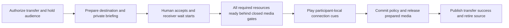

# Transfer readiness and participant wait sounds

Status: implementation in progress (2026-09-14). Definition/assets, private playback and substantial
readiness preparation are committed; no complete delivery slice below has passed acceptance yet.
Human-handoff integration now passes normal transfer, bounded recovery and cue-failure checks. All
five root gates pass with 1,300 tests and zero failures (test concurrency four); full slice
acceptance remains open.
Start with the [delivery checkpoints](#implementation-checkpoints) and
[curated implementation evidence](#implementation-evidence).
Prerequisites: [Call lifecycle and opening audio](opening-audio-and-call-lifecycle.md),
[Agent transfers](agent-transfers.md), [Live mixing and media policy](live-mixing-and-media-policy.md),
[Human web transfers](human-web-transfers.md), [Common phone transfers](telnyx-calls.md),
and [Usage observations](usage-and-billing-observations.md).
Design sources: [approved transfer contract](../../labnotes/20260905-0405-call-definition-design.md#transfer-success-and-failure--approved-g8-baseline),
[opening playback contract](../opening-audio-contract.md),
[incremental policy application](../incremental-media-policy.md), and the user's 2026-09-13
request for complete readiness, independent wait playback, and an audible connection cue.

## Runnable outcome

A caller hears a private wait sound while the call becomes ready. During a transfer, each
remaining listener hears their own wait sound. The human destination hears the private briefing,
accepts, and hears their own receiver wait sound while capabilities become ready. Once all
capabilities required by the resulting room are ready, waiting listeners hear a short connection
beep. Only after those cues finish may conversational audio open and transfer success be reported.

The same assets can be shared in memory, but playback positions are independent. Starting one
participant's nine-second loop must not seek or restart anyone else's loop. This applies to web,
phone, human destinations, agent destinations, and rooms with more than two participants.

## Current gap

The original defect was completion before destination STT/main media were ready. The committed
groundwork now supplies independent players, shared ordered output, capability readiness and
private preparation. The missing work is completing and verifying their use in ordinary calls.

| Area | Current boundary | Next required result |
| --- | --- | --- |
| Human web transfer | Normal acceptance holds the caller from authorization, prepares media, plays waits/cues, adopts and releases. Destination, phase and player loss recover spoken caller conversation through retained media; readiness is rechecked during cues and stale candidates trigger preparation and fresh cues. | Complete remaining failure stages, policy adoption, safe diagnostics and sample/audible acceptance. |
| Phone transfer | Incoming and outbound Telnyx/Twilio transfer checks pass, including actual incoming audio delivery to configured STT. | Complete early waiting/recovery and audible provider verification; simulated transports do not establish live phone behavior. |
| AI transfer | Existing transfer works under its earlier contract; the new wait/readiness/cue sequence is not integrated. | Reuse the completed human flow's coordination for an agent destination, including model/tools and first-message gating. |
| Initial call | Opening playback exists; early caller waiting and full initial readiness orchestration are unfinished. | Provide caller output before expensive setup, compose waiting with opening playback, then release conversation once. |
| Multiple listeners and failures | Player/resource components have focused coverage; changing audiences and complete recovery are not verified end to end. | Exercise whole-room readiness, independent listener lifetimes, repeated transfers and failure paths in running calls. |

The earlier component checkpoint `c4fea8c` passed 1,274 tests. The current human-handoff checkpoint
passes all five root gates with 1,300 tests, zero failures and 15 exclusions; `mix test --max-cases 4`
limits concurrent fixture setup on the shared host. Full milestone acceptance remains unfinished.

## Call-definition changes

Add one call-level `wait_sounds` object. Each configured value is an absolute audio-file URL or
null (`nil` in Elixir). Omission selects the built-in default for that scenario. Configuration is
per call; playback state is still independent for every participant. No second configuration layer
or participant-level settings are needed for this proposal. Keep `transfers` as the existing
allowlist and the shared attempt timeout in `transfer_policy`. Readiness is an engine invariant,
not an optional `wait_until_ready` setting.

| Slot | Listener and trigger | Built-in default |
| --- | --- | --- |
| `call_setup` | Entry caller, once its output connection can play audio, while initial room/capability setup is incomplete | `phone-ring` |
| `transfer_to_agent` | Existing audience, including the caller, when the transfer destination is an AI agent | `cafe-bossa` |
| `transfer_to_human` | Existing audience, including the caller, when the transfer destination is a human | `phone-ring` |
| `transfer_joining` | Incoming human destination, immediately after accepted transfer control, until readiness permits the connection cue | `cafe-bossa` |

The transfer defaults above reflect the user's follow-up: AI-to-AI uses café-bossa; AI-to-human
uses phone-ring for the caller/audience and café-bossa for the receiving human. The implementation authorization also accepts phone-ring for initial caller setup. The audible connection beep is a separate mandatory handoff action, not a wait
sound; setting a wait slot to null does not disable readiness gates or the beep.

Definition syntax in schema `20260914.01` (playback orchestration is still being implemented):

```json
{
  "schema_version": "20260914.01",
  "name": "Support with participant wait sounds",
  "entry_caller": "caller",
  "entry_receiver": "reception",
  "defaults": {
    "capabilities": {
      "speech_to_text": "deepgram-flux-stt",
      "model_inference": "gemini-flash-lite",
      "text_to_speech": "deepgram-flux-voice"
    }
  },
  "wait_sounds": {
    "call_setup": null,
    "transfer_to_agent": "https://media.example.com/cafe-bossa.wav",
    "transfer_to_human": "https://media.example.com/phone-ring.wav",
    "transfer_joining": "https://media.example.com/receiver-wait.wav"
  },
  "participants": {
    "caller": {
      "type": "human",
      "connection": {"service": "web", "mode": "receive", "admission": "start_call"}
    },
    "reception": {
      "type": "agent",
      "prompt": "Help the caller and transfer to human support when requested.",
      "first_message": {"mode": "wait_for_input"},
      "transfers": ["human-support"]
    },
    "human-support": {
      "type": "human",
      "description": "Human support specialist",
      "connection": {"service": "web", "mode": "receive", "admission": "transfer"}
    }
  },
  "transfer_policy": {"attempt_timeout_ms": 30000}
}
```

This example deliberately silences initial caller waiting and uses fetched files for transfers.
Omit `wait_sounds` entirely to use the defaults; URLs above are illustrative, not built-in asset IDs.

### Resolution and validation

| Authored value | Meaning |
| --- | --- |
| No `wait_sounds`, or `{}` | Use every built-in default |
| A slot is omitted | Use only that slot's built-in default |
| A slot is a valid supported HTTP(S) file URL | Fetch, validate, prepare and play that file for that scenario |
| A slot is null / `nil` | Play no wait sound for that scenario; other slots still use their values/defaults |
| `wait_sounds` itself is null / `nil` | Disable all four wait sounds |

- Preserve missing versus explicitly null during parsing/serialization; use presence-aware
  resolution rather than treating both as the same absent value. Reject booleans, bare asset
  names, local/file/data URLs, unknown slots, objects in place of a URL, and malformed values at
  their exact definition paths. There is no public asset registry to configure for a URL.
- The built-in defaults resolve privately to the packaged local WAVs, with no HTTP request.
  Configured URLs use the existing bounded audio fetch/address policy, response limits and cache
  primitives. Support the existing PCM WAV format plus the supplied stereo PCM16/48 kHz format;
  normalize stereo once into the canonical mono playback format. A valid URL with an unreadable,
  unsupported or oversized file is an explicit asset-preparation failure, not fallback to a default.
- Fetch and prepare all configured wait assets during call preparation, before dependent runtime
  setup/transfer phases need immediate playback. Keep network/decode work out of RoomAuthority,
  Gateway receive loops and the pure definition compiler. Reuse cached bytes for all listeners;
  do not refetch on every loop or participant start. Cold preparation may delay admission, but must
  never claim a custom sound is available or silently play a different sound.
- Pin URL/source selection in the compiled plan and pin content digest, format, duration and
  normalization settings when preparing that call's assets. Active calls keep those prepared bytes
  even if the remote file changes; a later call may fetch a new version under cache revalidation.
  Keep URLs with private query parameters out of public events/logs; use safe asset handles there.
- Wait/cue playback is for connected human listeners, never an agent's STT/model. Agent transfers
  still wait for all agent capabilities and play audience sounds/cues to the humans being reconnected.
  An authorized receive-only monitor never gains microphone permission from this feature.
- The mandatory built-in connection cue is finite and validated for audibility. Failed cue playback
  cannot silently open the bridge. Cue customization is not part of `wait_sounds`.
- Introduce a new schema revision and explicit compatibility parsing for current `20260913.01`
  definitions. Old JSON still rejects unknown fields; new calls resolve its omitted sounds to the
  approved defaults. Existing saved revisions/history remain immutable, and running calls retain
  their pinned plan. Cover stored-definition loading and plan serialization in the migration.

## Readiness contract

Build the required resource set from the **prospective post-transfer plan and effective policy**:
every remaining participant, the incoming destination, and enabled room-level resources. Do not
require departing-source capabilities to exist after handoff, unselected providers to start, or
policy-forbidden processing to become ready. Retain the source for bounded recovery until commit.

Each resource reports `preparing`, `ready`, or `failed`, with its room incarnation, participant or
room scope, attempt, instance generation, effective configuration signature, and relevant policy
interval. A process PID or successful `start_child` alone is not readiness. Disabled/not-demanded
resources are explicitly absent from the required set. An enabled capability without a readiness
adapter is unsupported and must not be silently treated as ready.

| Resource | Required readiness evidence |
| --- | --- |
| Any selected STT provider | Configured session/transport initialized, provider's supported connection acknowledgement received, correct codec and ingress bound; microphone input still gated |
| Any selected TTS provider | Voice/model/configuration resolved, provider initialization complete, output route prepared; no greeting or generated speech admitted yet |
| Model inference / agent runtime | Correct activation and context installed, client initialized, dependencies and tool bindings ready, runtime can accept its next request |
| Local/remote tools and MCP | Local bindings validated; enabled remote integrations initialized with required discovery/capability negotiation complete; no dummy tool invocation |
| Participant media | Negotiated live connection and prepared input/output codec/pacing paths, bound to the exact participant and generation |
| Room mixer, transcript router, Variables and other enabled room services | Owning processes acknowledge operational readiness and the candidate configuration/policy; required subscriptions/queues are bound |
| Recording, archive and observation paths | Enabled local producer/consumer interfaces are initialized and can accept bounded work under the candidate policy; preserve existing asynchronous storage contracts |
| Wait/cue playback | Selected assets validated/cached and the listener's private output path is usable |

Readiness means operational readiness according to each adapter's contract, not a guarantee that
its next external request cannot fail. Stateless HTTP providers acknowledge validated initialization
and usable clients; do not invent a provider handshake or generate a billable utterance to claim
readiness. Remote recording persistence is not a synchronous admission dependency: a locally ready
bounded asynchronous writer retains its existing outage/gap contract. A known failed required
local resource cannot pass the barrier.

Compare desired resources/configuration to running instances. Keep unchanged STT/TTS/model/tool
sessions, codecs, room services and their ready generations. Prepare only additions/replacements;
remove only resources no longer required. A wait/hold transition changes delivery gates, not the
media privacy policy and not every service generation. Real permission changes still invalidate
the affected intervals and queues, as required by incremental policy enforcement.

## Participant-local playback and isolation

- Call Engine owns lifecycle and per-listener playback. Gateway owns negotiated codecs, transport
  delivery and playback acknowledgements. Use engine application `priv` assets so embedded,
  WebRTC and phone clients share the same feature; it is not a Phoenix static-file feature.
- One supervised player/cursor per participant and wait episode. The episode is scoped to the
  incarnation, participant, connection generation, phase and transfer attempt. Each starts at zero,
  loops independently and owns bounded queued frames. Re-entry/new attempts start a new episode;
  a replacement connection restarts only that participant's playback. Multiple authorized output
  sinks for one participant follow that participant's cursor.
- Share decoded asset bytes, never timers, cursor state or a room broadcast of the wait waveform.
  For a ten-second configured fixture, one participant can be at seven seconds while another is
  at three. The supplied default files happen to be nine seconds long.
- Introduce a participant output arbiter before encoding/pacing: select opening/briefing, wait,
  cue, or permitted room audio. Keep one ordered output timeline across these sources. Changing
  source must not restart the codec or RTP clock. Bound queued audio and acknowledge clear/drain;
  never enqueue an infinite loop or race separate private/room writers on one transport track.
- Local sounds and private briefing bypass room mixing, STT/model input, other listeners,
  monitoring and call recordings. Trace only safe phase/asset IDs and durations. A listener may
  acoustically feed its speaker into its microphone; use normal endpoint echo cancellation and
  keep its input gate closed throughout waiting/cue playback.
- Holding gates microphone delivery, conversational room output and model turn admission without
  stopping healthy capabilities. Discard blocked audio; never replay it after release. Previously
  admitted, permitted transcripts may finish, but cannot trigger new held conversation output.
- For a five-participant room where participant 5 initiates transfer, participants 1–4 each enter
  their own audience wait. Do not hard-code `caller_participant_id` as the only audience. Exclude
  the departing source and incoming destination from this audience set. Membership changes update
  only affected listeners; joining mid-attempt starts that listener's own loop.
- Existing listeners are privately held during the transfer, including with respect to one another.
  Source responsibility remains available for recovery, but the old spoken blocking-hold response
  and late source acknowledgements must not compete with wait playback.

## Initial call sequence

1. Pin the definition and establish the minimal room/participant identity plus caller output path.
   Refactor startup so expensive capability initialization does not precede all usable caller media.
   In the browser, this begins after the caller grants media access/connects; a page that has not
   established audio cannot yet hear a server sound. Phone legs follow the same early output gate.
2. Start that caller's `call_setup` wait at zero and initialize required room/participant resources
   asynchronously. Preserve exactly-once admission and the existing start/readiness/duration clocks.
3. If configured opening audio is ready, suspend waiting, clear its queued tail, and play the opening
   announcement privately to completion. If capabilities are still preparing afterwards, resume the
   caller's own suspended wait cursor. Never overlap wait sound with the announcement or greeting.
4. Once opening playback and all initial readiness requirements finish, clear waiting and release
   normal conversation/first-message behavior. The transfer connection cue is not an extra initial
   greeting or substitute for opening audio. Startup failure ends the attempt and its player.

## Transfer sequence and completion barrier



1. Authorize the existing catalog-bound request and start its one total attempt timer. Gate the
   audience's conversational input/output and start each audience wait immediately, selecting
   `transfer_to_agent` or `transfer_to_human` from the destination's type. Rejecting an
   unauthorized request does not put anyone on hold. Prepare destination configuration/resources
   asynchronously under supervision; keep room authority and Gateway message loops responsive.
2. A human destination connects privately and hears its briefing/notice. **Approved acceptance
   change:** expose acceptance only after required briefing playback completes. Authenticate that
   acceptance window server-side for web and phone. Premature controls do not accept or end the
   attempt; they do not reset the deadline. This replaces today's permitted early-accept latch and
   ensures receiver waiting begins immediately after acceptance without masking a required notice.
3. On accepted control, start `transfer_joining` at that listener's zero position. Complete
   preparation of its configured capabilities and held media paths. Preparing STT before main
   admission requires a narrowly authorized attempt-bound binding; it grants no microphone input,
   room audio, transcripts, recording, or unrestricted history during preparation.
4. Prepare the final resource/policy configuration behind closed gates. Reuse unchanged ready
   instances; prepare actual replacements separately. Enforcer preparation must support installing
   those ready instances at commit instead of performing fresh network startup in the commit call.
   Keep current privacy restrictions on any existing admitted traffic until authoritative commit;
   candidate readiness never grants candidate media permissions.
5. Wait for the complete required resource set, including still-participating listeners and room
   capabilities. No tool success, `transfer.completed`, `transfer.active`, or mutual audio yet.
   Agent destinations skip human briefing/acceptance/receiver playback but use the same readiness
   and audience wait barrier, with no destination greeting/model output before release.
6. Stop/clear each listener's wait frames and play the mandatory connection cue once per listener.
   The approved cue audience is every held human listener, including the incoming human, even when
   their wait slot is null. Use the generated 250 ms, 1 kHz beep with 5 ms edge ramps and a -6 dBFS
   peak, above the supplied wait assets' level. Each output path
   must acknowledge ordered completion, not merely successful enqueue. Wait for all applicable
   listener cues before releasing any conversational output.
7. Revalidate the exact attempt, deadline, membership, resource generations and readiness. Commit
   participant/control/privacy changes and install the prepared media configuration while gates
   remain closed. Verify the resulting policy still matches the ready resource set. Any readiness
   loss or relevant policy change invalidates the pending release; prepare again within the same
   deadline and replay the cue before a later release. Unrelated revisions preserve ready instances.
8. Issue the fenced media-release command. Drop old output generations, open only policy-permitted
   paths, and await acknowledgements. Then publish one engine completion/tool result and one
   consistent adapter `transfer.active` projection, retire the old source subtree, and stop players.
   A terminal failure during partial gate release closes the affected conversation fail-closed;
   it must not report a clean successful or recoverable handoff after uncertain media admission.

For WebRTC, keep cue packets ahead of room packets on the same ordered output timeline, through
the output arbiter and final playout/drain acknowledgement. Where a phone adapter supplies playback
marks, use its exact mapped acknowledgement. A timer for the asset's nominal length is insufficient.
Server acknowledgement proves ordered delivery/drain, not physical loudspeaker volume; rendered
browser and phone acceptance checks must also confirm the cue is audible and precedes speech.

The existing 30-second default total transfer budget includes acceptance, preparation, readiness,
cues and bridge acknowledgement; loops and retries never extend it. Keep its existing 1–120-second
configuration range. All waiting time counts toward whole-call duration and suspends caller-idle
nags. On rejection/failure/expiry, cancel only the exact attempt, discard destination preparation,
clear wait/cue tails and restore the source when permitted using the existing single restoration
budget. Restoration must also satisfy readiness and ordered local cue completion before opening
held conversation. End when no valid conversation can be recovered. Never redial automatically.

## Implementation checkpoints

Deliver the following runnable slices in order. Each checkpoint contains its own behavior,
failure handling, diagnostics, verification and coherent commit. Reuse the committed groundwork;
change a resource adapter only when a required behavior or reproduced failure in the current
slice demands it. There is no separate infrastructure-completion phase.

| Delivery checkpoint | Runnable result | Depends on | Status |
| --- | --- | --- | --- |
| [Human web handoff](#checkpoint-human-web-handoff) | Desktop caller transfers to the mobile transfer desk, hears waits/cues, then exchanges audio and transcripts; failure restores or ends the call correctly. | Existing committed preparation/playback | Normal flow and recovery implemented; full acceptance open |
| [AI handoff](#checkpoint-ai-handoff) | Caller hears the AI-transfer wait and cue, then talks to the ready destination agent. | Human handoff coordination | Not integrated |
| [Initial caller waiting](#checkpoint-initial-caller-waiting) | Caller hears setup waiting, optional opening audio and exactly one correctly ordered first-message action. | Established hold/readiness/output lifecycle | Not integrated |
| [Phone handoff parity](#checkpoint-phone-handoff-parity) | Web/phone and phone/phone callers complete the same waits, briefing, acceptance, cues and human conversation. | Human handoff and initial-call coordination | Local incoming/outbound handoff checks pass; full acceptance open |
| [Changing and multiple listeners](#checkpoint-changing-and-multiple-listeners) | Five-participant calls and repeated transfers retain independent waits and correct media/privacy as connections change. | Completed transfer paths | Component coverage only |

A checkpoint stays open until its runnable acceptance and applicable
[common gates](index.md#common-implementation-and-verification-gates) pass. Fix regressions in
existing supported paths within the checkpoint that introduces them. The user requested continuing
coherent implementation commits as progress is verified; a delivery checkpoint may contain several
such commits and remains open until its complete acceptance passes. Keep Console edits limited to
the existing transfer controls and status; `vxpipe-docs` belongs to another agent. Record unavailable
external verification explicitly; do not label a local simulation as
live-provider proof. Continue independent work if an external check is blocked, preserving the
unfinished checkbox and exact missing evidence.

### Checkpoint: human web handoff

**Runnable outcome:** start a call in `/pipecat-console`, request human support, connect `/transfer`
on a second device, hear its private briefing, accept, hear the local waits/cues, then talk in both
directions with permitted transcripts. A delayed or failed capability produces a useful preparing
or recovery state rather than a false completion or unexplained return to the create-room screen.

Carry forward the existing `HumanMediaHandoff`/`HandoffGate` integration. The normal-handoff check
uses default waits and rejects caller text before the destination connects. Recovery checks exercise
destination and phase loss, retained media and a fresh caller turn; complete checkpoint acceptance
still requires the remaining failure, privacy, sample and audible verification below.

Implementation tasks:

- [x] Gate all existing audience input/output/model turns at authorized transfer start and begin
  `transfer_to_human` immediately. Suspend caller-idle handling while preserving the whole-call
  clock; suppress competing source speech and discard held microphone frames without replay.
- [x] Enforce briefing completion before authenticated acceptance on both server control paths.
  Keep early/duplicate controls harmless and start `transfer_joining` immediately upon valid
  acceptance. The original total attempt deadline covers every stage.
- [x] Finish ordinary acceptance through whole-room preparation, ordered wait clearing, every
  listener's cue, exact policy adoption, acknowledged release and one consistent completion.
  Retain source resources until completion and retain unaffected capability/codec instances.
- [ ] Finish rejection, expiry, disconnect and preparation/cue failure cleanup. Recover the source
  within the existing restoration budget, with readiness and cue before release; close when
  recovery is impossible or partial release leaves uncertain media admission. Never redial.
- [x] Resolve existing engine connection-fixture failures and the configured phone
  `unsupported_audio` failure without a production readiness bypass or deadline increase.
- [ ] Remove prepared private resources that the resulting policy does not demand.
  Initial and repeated private STT allocation now check the prospective policy. If demand disappears
  before acceptance or while readiness collection is pending, the private speech pair is removed
  while Gateway retains its connection and room-media actors; the WebRTC handoff completes. An
  unrelated membership revision retains the original STT transport. Reconciliation reuses the same
  collector, preparation owner, media generation and deadline. A stale candidate during cue playback
  now drains privately, re-prepares and plays a fresh cue before release. Changed bindings or a
  stale-candidate rejection at the coordinator's final commit check also retry under the same phase
  and deadline. Initial preparation changes, changes after policy application, changed still-required
  resources and the complete changing audience remain open.
- [x] Connect the existing Console status and ledger to actual preparation blockers and cue/release
  progress. Keep briefing/acceptance/active ordering and the readable button. Publish only closed
  capability categories and elapsed time; reject stale attempts and late updates after activation.
  The existing diagnostics reporter aggregates returned audience/prepare/release/recover worker
  durations without call identity or provider payloads.
- [ ] Complete caller/destination failure and recovery detail, separate briefing/acceptance/cue
  timings, forced-worker termination observations, and remaining queue/drop diagnostics. The
  destination may already be closed during source recovery; its progress UI alone is insufficient.

Acceptance and commit tasks:

- [x] Exercise defaults, a fetched URL, per-slot nil and whole-object nil through ordinary WebRTC
  transfer acceptance. Decode distinct wait/cue/conversation signals on the peers, retain readiness
  gating with nil waits, and receive partial/final support transcripts in the caller. Private audio
  and held support microphone input produce no STT input or individual-track recording chunks;
  post-release conversation produces both. The custom fetch is controlled at the fetcher boundary.
- [ ] Complete the same cases through the rendered caller/desk sample with audible two-device
  evidence, including live URL retrieval, ordered wait-tail clearing and model-history isolation.
- [x] Hold human transfer completion until mandatory cue drain, including with nil wait sounds.
  Cue-player loss and prepared destination STT loss during drain recover the retained source;
  an output that also cannot finish the recovery cue closes the call within the existing budgets.
- [ ] Delay required destination, remaining-participant and room capabilities independently, then
  inject loss across the remaining preparation/adoption/release stages. Observe no premature success and
  unchanged healthy instances; verify held text/audio cannot interrupt or replay after release.
- [x] Run the owning engine/Gateway/Console checks, including the existing web/phone transfer
  regressions, and all five root gates. Record exact results for the implementation being committed.
- [x] Exercise the actual rendered desktop caller and mobile-sized desk with live model/Deepgram
  services and default waits. Observe preparation/cue/activation, browser-decoded audio in both
  directions and partial/final support transcripts. Disconnect before acceptance and verify spoken
  source recovery plus another spoken caller turn on the same WebRTC connection.
- [ ] Complete controlled independent readiness delays, custom/nil configurations and physical
  two-device audibility in the rendered sample.
- [x] Release failed private destination admissions without deleting history or permitting token
  replay/concurrent admission. A fresh rendered desk completes another transfer in the same call,
  retaining the original caller peer and exchanging audio and final transcripts.
- [ ] Commit the usable human-web slice with its implementation, focused tests, sample behavior,
  milestone status and labnote evidence. Then begin the AI slice.

### Checkpoint: AI handoff

**Runnable outcome:** the caller requests an allowlisted AI destination, hears `transfer_to_agent`
(default café-bossa), hears the cue, then converses with that agent using the retained call context.
A destination that cannot become ready returns control through bounded source recovery.

Implementation tasks:

- [ ] Reuse the human slice's hold/readiness/cue/adopt/release sequence, skipping human briefing,
  acceptance and joining playback. Keep the existing allowlist, Variables, history modes and
  total transfer deadline; introduce no alternate transfer configuration.
- [ ] Prepare the destination activation, model/tool/MCP bindings and demanded STT/TTS/output
  before release. Prevent destination greeting, model requests and late source speech from
  crossing the held interval. Preserve every unaffected participant and room capability.
- [ ] Apply first-message behavior once after release/completion. Discard failed destination
  preparation and recover or end under the same failure contract as human transfers.
- [ ] Expose the destination and actual preparing/failure phase through the existing sample and
  diagnostics so the transition is reproducible from an ordinary caller session.

Acceptance and commit tasks:

- [ ] Run success and failed-preparation scenarios from the caller sample, including independent
  delays for model/tools and TTS, default/URL/nil waiting, exactly-once greeting/completion and
  source continuity after recovery. Verify audio/transcript privacy and resource reuse.
- [ ] Inspect affected sample states in rendered Chrome; verify audible wait/cue/greeting order.
  Pass focused agent-transfer checks and all five root gates, update evidence and commit the slice.

### Checkpoint: initial caller waiting

**Runnable outcome:** on a deliberately slow new call, a connected caller hears `call_setup`
(default phone-ring), hears any configured opening announcement privately, and enters conversation
only when opening playback and all required initial capabilities are ready.

Implementation tasks:

- [ ] Establish the minimal caller identity and usable web/phone output before expensive resource
  initialization. Start the caller's independent wait and initialize required resources
  asynchronously using the existing readiness contracts and owning supervisors.
- [ ] Give file and text opening playback priority: pause waiting, clear its tail, finish opening,
  then resume the same cursor only if setup still needs time. Preserve the opening's own TTS
  profile, pre-recording isolation and existing supported initial receiver types.
- [ ] Release microphone/model/first-message behavior only after complete initial readiness and
  opening completion. Preserve exactly-once admission and all startup, idle and whole-call clocks.
  Initial setup does not add the transfer connection cue.
- [ ] End failed/disconnected/timed-out startup cleanly, including its player and preparation
  workers. Report safe setup timing and the real readiness blocker through existing diagnostics.

Acceptance and commit tasks:

- [ ] Demonstrate delayed room and participant setup with and without file/text openings, using
  defaults, a URL and nil. Verify cursor resume, no overlapping audio, no recording/transcription
  of private audio, no early microphone admission and exactly-once first-message behavior.
- [ ] Verify startup failure/clock behavior in web and deterministic phone paths. Inspect the
  caller sample in rendered Chrome and confirm audible opening/wait ordering. Pass focused and
  all five root gates, document the runnable result and commit the slice.

### Checkpoint: phone handoff parity

**Runnable outcome:** incoming Telnyx/Twilio and web callers transfer to a phone human, who hears
the private briefing and presses 1 after it completes. Each listener hears its own wait/cue;
conversation and permitted transcripts follow only after all required media is ready.

This expands acceptance of the common flow. It does not postpone repairing phone regressions
introduced by earlier checkpoints or create a second provider-specific handoff coordinator.

Implementation tasks:

- [ ] Exercise the real common telephony session/codec/STT boundary for configured supported
  formats in both providers. Reuse the same private preparation and adoption protocol as web;
  retain native timelines and unaffected providers across holding and release.
- [ ] Complete phone acceptance-window, clear, fresh playback-mark and drain integration under
  the single deadline. Duplicate/out-of-order marks must not complete a new cue or release speech.
- [ ] Carry the same failure, disconnect, bounded recovery, privacy and diagnostic behavior through
  web/phone and phone/phone calls; retain the existing signed-event and admission boundaries.

Acceptance and commit tasks:

- [ ] Run deterministic incoming/outgoing Telnyx/Twilio flows with selected STT, delayed readiness,
  default/URL/nil waits, finite cue backpressure, invalid early acceptance and provider disconnect.
  Assert actual audio/transcripts after release and no private audio in recordings.
- [ ] In the tagged, explicitly authorized provider lane, verify audible cue-before-conversation,
  clearing and recovered conversation. Record the provider/path and evidence, or the exact external
  blocker; playback marks alone do not prove physical audibility.
- [ ] Pass relevant phone/engine checks and all five root gates, update evidence and commit the
  runnable slice. Keep any unavailable live-provider acceptance visibly open.

### Checkpoint: changing and multiple listeners

**Runnable outcome:** a five-participant call transfers its active agent while every remaining
human hears an independent wait. A listener joining, leaving or replacing a connection affects
only that listener's episode; subsequent transfers and allowed conversation continue correctly.

Implementation tasks:

- [ ] Reconcile the actual whole-room audience and all required resources on membership or
  connection changes. Support receive-only monitors and multiple authorized sinks per human
  without creating microphone permission or sharing another participant's cursor.
- [ ] Fence each episode by incarnation, attempt, participant and connection generation. Preserve
  unaffected resources/cursors; refresh relevant preparation and replay cues when required by
  readiness loss or a changed candidate, within the original deadline.
- [ ] Complete repeated transfer, receiver re-entry, disconnect and partial-release cleanup across
  the established human and AI paths. Retain bounded queues and exact-attempt cancellation.

Acceptance and commit tasks:

- [ ] Demonstrate the five-participant hold and two listeners at seven/three seconds of one shared
  ten-second fixture in a running call. Replace a connection and add/remove a listener during
  waiting/cue; verify independent playback, multiple-sink ordering and unchanged service identities.
- [ ] Exercise stale readiness, relevant/unrelated policy revisions and repeated human/AI transfers
  with audio/transcript/recording assertions. Include a controlled partial-release failure and
  safe phase/queue diagnostics. Inspect any changed sample UI in rendered Chrome.
- [ ] Pass focused and all five root gates, update evidence and commit the runnable slice.

### Final milestone audit

- [ ] Reconcile every item in [automated and manual acceptance](#automated-and-manual-acceptance)
  with evidence from its owning slice; execute only missing checks or checks invalidated by later
  changes. Diagnostics, recovery and browser verification belong to each slice, not this final audit.
- [ ] Confirm all checkpoint commits, current root gates and required audible/provider evidence.
  Update the milestone and its index together only when the full approved outcome is verified.

Expected ownership remains unchanged: `CallDefinition`/`DefinitionCompiler`/`ResolvedCallPlan` own
schema; `PlanStartup` and participant-transfer modules own orchestration; readiness and playback
components own their respective state; Gateway owns media ordering and transport acknowledgements;
Calls owns prepared admission/persistence; Console owns human-facing phases. Provider startup and
media pacing stay outside RoomAuthority. No new generic orchestration framework is required by
this delivery plan.

## Automated and manual acceptance

- [ ] JSON/Elixir parity, omitted defaults versus explicit null, destination-type defaults and
  per-slot independence pass. Reject non-URL configured values. Cover URL fetch/format/size failure,
  bounded preparation, cache reuse, immutable active-call bytes, tenant scoping, schema compatibility
  and digest resolution at their owning boundaries. Null disables only the selected waiting sound,
  never readiness gates or the mandatory cue; whole-object null disables all waits.
- [ ] Two listeners share one immutable ten-second fixture but are at seven and three seconds;
  stopping/restarting/reconnecting one does not alter the other. Default nine-second assets loop
  continuously with bounded queues and no repeat-boundary fade/silence introduced by the player.
- [ ] A five-participant transfer holds all four audience listeners with independent cursors using
  the call's configured URL or default selected for the destination type.
  Joins/leaves, receive-only monitors, receiver re-entry and exact-attempt cleanup are covered.
- [ ] Before acceptance, destination microphone/room/transcript access is denied. After acceptance,
  delay each enabled capability in turn: receiver wait continues, no human hears room conversation,
  source remains recoverable and no success event is emitted. Cover a remaining participant and
  a room-level resource, not only destination STT or one provider.
- [ ] A capability child exists but provider readiness is delayed: the barrier remains closed.
  Missing/failed/old-generation/foreign-attempt acknowledgements cannot satisfy it. A policy-denied
  unselected resource is not started just to pass readiness.
- [ ] Unrelated membership/policy revisions and hold phases retain the exact STT/TTS/model/tool,
  codec and room-service instances. Relevant changes affect only their required resources/queues.
- [ ] Wait sounds, cues and briefing never enter STT, model history, other listeners or recordings.
  Held microphone frames are discarded and never replayed. Old source output cannot cross release.
- [ ] Delay cue completion: no room audio or success. Verify final cue frame precedes first room
  frame on every released sink, including under backpressure, and no wait tail follows the cue.
  Failure/readiness loss during the cue prevents release and exercises bounded recovery.
- [ ] Initial slow room setup produces caller wait audio; opening playback takes priority; wait
  resumes only if still necessary; first greeting occurs once after all startup gates finish.
- [ ] Deadline at every phase, duplicate/early acceptance, stale readiness, disconnect, asset/player
  failure, policy rejection and partial release leave no false completion, leaked media or orphan
  player/connector. Idle and whole-call duration clocks retain their defined behavior.
- [ ] Safe telemetry exposes phase durations, readiness blockers by capability kind, timeout/failure,
  and player queue pressure without transcript/audio bytes, secrets or provider error payloads.
- [ ] In rendered Chrome, use `/pipecat-console` plus mobile-sized `/transfer`: hear distinct local
  waits, accept only after briefing, observe preparing, hear the cue, then exchange audio and
  transcripts. Delay actual readiness deliberately so fast providers cannot hide missing states.
- [ ] Repeat through deterministic web/phone and phone/phone adapter fixtures. Verify real phone
  cue-before-conversation and audio clearing in the tagged, explicitly authorized provider lane;
  record any external blocker rather than claiming phone playout from a WebRTC-only result.

## Alternatives and implications

- A room-mixed wait track shares a playhead and leaks to other listeners/recording; reject it.
- Browser-only playback cannot cover phone/embedded participants or authoritative cue completion;
  use server-owned participant playback and transport-specific evidence.
- Reporting success at acceptance or checking only Deepgram's PID leaves the original readiness
  gap. Require all enabled resources and the final media-release acknowledgement.
- Restarting everything on hold or policy revision violates incremental capability lifetime;
  keep delivery gates separate and retain unchanged instances.
- Increasing phase deadlines hides incomplete ordering and extends calls unpredictably; keep one
  bounded attempt clock and expose which required stage is still preparing.
- This extends the current contracts; it does not mark historical implemented milestones incomplete.
  The user authorized this runtime and the revised acceptance window on 2026-09-14. No new
  named-transfer graph, arbitrary dialing, provider-specific definition format or indefinite hold
  behavior is needed.

## Planning evidence and design review

- [x] Inspect current definition/compiler, startup readiness, human commit/promotion, private player,
  output completion and the linked policy/lifecycle/transfer contracts.
- [x] Copy the two requested assets to the engine's `priv/audio/wait_sounds/` directory. Exact
  source/destination equality and WAV metadata are verified in the [asset README](../../apps/vxpipe_call_engine/priv/audio/wait_sounds/README.md).
- [x] Locally review coverage of all resource scopes, multi-participant audience, independent
  cursors, pre-room output, opening/briefing ordering, early acceptance, policy races, output
  ordering, rollback, deadlines, schema migration and prerequisite order. Record this design
  review separately from runtime progress in the [planning labnote](../../labnotes/20260913-2307-transfer-readiness-sounds.md).
- [x] User authorizes implementation of this milestone, including schema/defaults, acceptance window and cue audience (2026-09-14).
- [ ] Runtime acceptance and common implementation gates pass.

The original planning checks covered documents and copied assets only. Implementation evidence
is recorded below; no complete runtime/browser/provider acceptance is claimed yet.

### Vertical delivery review

- [x] Replace component-first delivery with runnable checkpoints and explicit dependencies, tasks,
  failure cases, verification and commits. Review performed locally on 2026-09-14; this is a
  delivery-plan review, not an independent runtime acceptance review.
- [x] Reconcile existing work against commits, source and retained test logs. Separate committed
  preparation from uncommitted lifecycle integration and replace stale chronological status with
  the current evidence ledger. Keep historical details in the implementation labnote.
- [x] Map configuration, isolation, complete readiness, unchanged-resource retention, cue ordering,
  clocks, recovery and diagnostics into each applicable slice. Assign initial opening integration,
  phone playout and changing audiences explicit runnable checkpoints. Retain the full acceptance
  checklist and the packaging/retention hold in the index.
- [x] Reject another prerequisite-only sequence and a final testing-only phase. Existing phone
  regressions must be fixed in the first slice; broader phone acceptance remains separately visible.
  A blocked external check does not become a passed checkbox or prevent independent progress.

No new runtime contract or configuration field is introduced by this restructuring. The acceptance
window and cue audience were already authorized; their wording now reflects that approval.
Detailed review and verification are recorded in the
[checkpoint labnote](../../labnotes/20260914-0032-transfer-readiness-implementation.md#phone-diagnosis-and-vertical-delivery-review).

## Implementation evidence

This is a current, grouped account as of the 2026-09-14 documentation checkpoint. Commit references
identify completed components; they do not imply that an ordinary call invokes the whole sequence.
The [implementation labnote](../../labnotes/20260914-0032-transfer-readiness-implementation.md)
retains the chronological red/green results, failed approaches and intermediate worktree snapshots.

### Committed components available to the slices

| Work delivered | Representative commits | Evidence and practical limit |
| --- | --- | --- |
| Typed call-level sound slots; missing/default/URL/nil semantics; `transfer_joining`; schema `20260914.01` with explicit `20260913.01` compatibility; immutable normalized assets and generated cue | `6dd801f`, `66b6033` | Compiler, asset, admission and stored-plan reconstruction checks passed. A manifest deduplicates payloads by digest; new preparation reuses URL cache entries for up to 60 seconds, while active calls retain pinned bytes. This supplies sounds but does not start waits during a call. |
| Independent private players and shared recipient output; pause/resume, ordered clear/drain, cue completion, isolation from recording | `b9ddac9`, `f8bd969`, `0e8efc6` | Focused checks cover independent seven/three-second cursors, one participant's multiple sinks and private/room ordering while preserving native codecs. Normal lifecycle acceptance remains separate. |
| Phone clear/mark completion and pacing after idle | `840090e`, `1e36913` | Controlled native/socket checks cover fresh marks, final cue drain and paced resumption. They do not establish a physical phone's audible result. |
| Readiness descriptions and bounded collection across speech, model/tools/MCP, recording, room services and negotiated media | `c0bd41f`, `52e3047`, `d3d6532`, `2e02e6a`, `71d3a06`, `0bc649e`, `cde2f91` | Exact identity/configuration/generation and provider acknowledgements replace PID-only assumptions. Required unsupported resources fail; unchanged instances remain reusable. The common collector exists, but each ordinary lifecycle still has to use it. |
| Prospective membership, affected speech/decoder/output/mixer preparation and full candidate collection | `b02a2d2`, `fb567d0`, `43aafa2`, `b079dbf`, `97119f8`, `9fc4b83`, `02ab65e` | Real media checks cover prepare/discard/retry/adopt without prematurely replacing live routes. The room graph includes remaining participants and room resources; candidate readiness grants no early permission. |
| Candidate recording tracks/taps and exact membership adoption | `4b14530`, `666ca37`, `69b5ad6` | Local recording paths prepare under future policy without changing current permissions; an exact collected membership commits in one revision under the original deadline. Remote persistence remains asynchronous. |
| Attempt-owned private speech and actual Gateway preparation | `a8106d4`, `c005511`, `4801597`, `5ab8c17`, `c4fea8c` | Private actors are bound to the authorized connection and persistent phase. WebRTC preparation waits for destination STT while retaining caller/source resources. Phone component checks select no STT, while later worktree checks exercise configured incoming phone STT. |

The normal human flow and bounded recovery are committed as `1546ab2`; operational readiness
during active model/tool requests is committed as `01a2469`. Policy-aware initial private STT
allocation is committed as `b047624`. These are implementation progress
within the first delivery checkpoint, whose complete acceptance remains open.

The durable [readiness resource contract](../readiness-resource-contract.md) records ownership,
identity, preparation/adoption and cleanup rules. The
[incremental policy contract](../incremental-media-policy.md) remains authoritative: readiness or
waiting must not restart any unaffected participant or room capability.

### Human handoff integration

Transfer authorization holds connected audience input/output/model turns and starts their private
wait players before destination preparation. Human acceptance is enabled after the private briefing
finishes. Acceptance prepares the prospective graph, waits for all demanded resources, clears waits,
drains cues, commits the exact membership and adopts/releases the prepared media. Source resources
remain retained until completion; normal handoff does not replace unchanged codec/media instances.

Destination, phase and audience-player loss enter bounded source recovery. The caller retains its
connection, input/output routes and initialized source resources, hears the recovery cue and can
continue its conversation. Recovery uses the existing 750 ms budget and completes the failed tool
result only after release. Model/tool readiness now describes operational initialization; ordinary
request admission continues to enforce occupancy and capacity limits.

The cue worker now monitors its joining-wait and cue players and rechecks collected readiness every
100 ms while waiting for cue drain. Prepared STT transport failure can leave its capability process
alive; rechecking catches the failed resource without waiting for a PID exit or the attempt deadline.
The same check applies during recovery. The original attempt and recovery budgets remain unchanged.
If a cue finishes during a readiness recheck, its queued completion acknowledgement survives the
player's normal exit. The recheck no longer mistakes that completed player for playback loss; a
player exit without completion still fails the handoff.
This completion/recheck race is fixed in `1829ab7`.

A stale policy candidate during cue playback now causes re-preparation under the same attempt,
media generation and deadline. The current private cues drain while conversation remains held;
waiting resumes, requirements are refreshed, and new cues must drain before release. Each playback
episode has a fresh correlation identifier. Controlled engine cases prove this with default waits
when STT becomes unnecessary and with silent waits when an existing STT session remains unaffected.

A changed binding or stale candidate detected at the final coordinator commit boundary also retries
preparation, waiting and fresh cues. The prepared participant, phase and deadline remain unchanged.
Only the policy authority's rejection before application is retryable; failures after enforcement
begins retain their fail-closed behavior. Controlled phase-stop cases verify both the policy-only
race and a refresh that removes the old private STT binding before the ready result is consumed.

Before accepted handoff preparation, private speech is reconciled against the latest prospective
policy even when an earlier private binding exists. Removing transcription demand stops only that
capability/ingress pair, removes its monitors and updates the attachments of the retained Gateway
input/output actors. This is verified with an existing participant's policy contribution changing
after private allocation and while accepted handoff readiness is pending. The latter also verifies
that an unrelated membership revision retains the original STT transport and that caller/support
conversation works afterward. The worker reuses existing candidate preparation and collector
reconciliation under the original deadline; queued reports cannot substitute for the current
required resource set. Unrelated connection admission during a pending transfer remains unfinished.

The ordinary WebRTC acceptance flow now verifies default waits, a shared custom URL, a nil caller
wait and whole-object nil. Both peers decode the mandatory cue and distinct subsequent conversation
tones; queued private audio cannot satisfy the conversation checks. Held support microphone input
does not reach the caller or STT and does not replay after release. Private playback produces no
individual-track recording chunks; live conversation subsequently produces chunks for both humans,
and partial/final support transcripts reach the caller. The custom file is fetched once through a
controlled fetcher and decoded on both peers. Physical-device audio, browser sample interaction and
live remote URL retrieval remain separate acceptance evidence.

Rendered Chrome now exercises the real sample with live model and Deepgram services, without
admission or provider mocks. Two accepted default-wait handoffs retained the desktop caller. In the
instrumented call, both peers decoded the connection cue and exchanged controlled microphone speech. Support partial/final
transcription appeared in the caller chat. The desktop and mobile-sized ready/active states were
visually inspected. This is browser/provider evidence with synthesized test microphone speech;
physical phone audibility and the custom/nil sample configurations remain open.

The same inspection exposed a recovery defect hidden by text-only automated responses: resumed TTS
still stamped generation zero after the output advanced during holding. The coordinator now stores
the acknowledged release generation on affected connections and each new speech request captures
it. Old requests keep their old generation. Three WebRTC recovery cases now synthesize actual speech,
require decoded audio and completion, then accept another caller turn. A live browser disconnect
before acceptance now recovers spoken responses and retains the original peer beyond the former
failure point. See the [recovery audio labnote](../../labnotes/20260914-1915-human-recovery-audio.md).

The subsequent [admission lifecycle fix](../transfer-admission-lifecycle.md) releases the exact
private destination reservation on unused-session expiry, claimant loss or connection termination.
History and consumed tokens remain intact; a partial unique index excludes concurrent active
admissions, and a late release cannot affect a newer token. The existing destination-loss WebRTC
case now completes a second briefing, acceptance and conversation after recovery. A rendered retry
also completed in the original call with live model/Deepgram services, both cues, bidirectional
audio and final support/caller transcripts. Earlier attempts included rejected text submissions
and a briefing that timed out without audio; their cause remains unestablished and full failure
acceptance remains open. The [readmission labnote](../../labnotes/20260914-1929-transfer-desk-readmission.md)
records both the failed attempts and the successful retry.

Known remaining work in the first slice:

- Reproduce and explain the intermittent rendered briefing failure observed before a later retry
  completed. Admission release and a subsequent accepted transfer now pass.
- Complete readiness-loss, partial-release and expiry coverage across the remaining stages.
- Reconcile changes during initial graph preparation, changes after policy application and changes
  to still-required resources; complete changing-listener lifetimes. Pending collection, cue playback
  and stale rejection at the final commit check now retry before policy application.
- Finish failure, stage-timing and queue diagnostics beyond the implemented preparation status and
  returned-worker durations.
- Complete default/custom/nil playback and private-audio/model-history isolation through the
  rendered sample path, building on the passing native WebRTC cases.
- Complete physical two-device and live phone recovery verification. Rendered Chrome now uses live
  model/Deepgram services with synthesized microphone speech; this does not establish physical audibility.
- Changing membership/connections and multiple listeners retain their later dedicated checkpoint.

### Verification ledger

| Evidence boundary | Result | What it establishes |
| --- | --- | --- |
| Earlier component checkpoint, `c4fea8c` | 46 engine and 46 Gateway focused checks; all five root gates; 1,274 tests, zero failures, 15 integration exclusions | Committed component preparation and its existing regressions pass. It does not prove completed waits/transfers. |
| Human handoff and recovery | Sixteen WebRTC transfer checks pass within the 332-check Gateway suite with simulated providers | Default audience waiting starts before destination connection; delayed STT gates handoff, pending readiness reconciles removed STT demand and retains an unaffected STT transport, and destination/phase/player loss restores a fresh caller conversation through retained media. |
| Current human-handoff checkpoint | All five root gates pass; 1,300 tests, zero failures, 15 exclusions; seed 306911 at concurrency four | Existing regressions, wait configurations, bidirectional conversation/transcripts, private-audio isolation, policy reconciliation during pending readiness, cue playback and the final pre-application commit check, cue/recheck ordering, progress and spoken recovery pass. Destination reservations release on connection loss/expiry; the rendered retry completes in the same call. Full slice acceptance stays open. |
| Cue barrier and failure recovery | Nine focused engine cases pass | Completion requires cue drain, including completion during a deferred readiness recheck. Stale policy candidates during cues or at the final commit check cause preparation and fresh cues under the original deadline, retaining unaffected STT; default and silent waits are covered. Cue-player or prepared STT failure recovers the source; unusable recovery output closes the room. This is controlled output/provider evidence, not physical audible proof. |
| Rendered sample and spoken recovery | Real desktop/mobile-sized Chrome sessions with live model/Deepgram and synthesized microphone speech | Accepted default-wait handoffs preserve the caller and deliver support transcripts. Both peers decode cues and conversation; failed destination connection recovers two spoken assistant responses on the same peer. A fresh desk admission now completes a later transfer on the same caller peer, with audio and final transcripts. Custom/nil, independent readiness delays and physical audibility remain open. |
| Destination readmission | Five Session lifetime cases, extended persistence admission case and repeated WebRTC recovery flow | Exact release preserves history, rejects stale release/token replay and retains active exclusion. Failed persistence release retries while unavailable; bound connections outlive credential TTL. |
| Wait configurations and conversational audio | Four ordinary WebRTC handoffs pass for default/custom/per-slot-nil/whole-nil waits | Peer-decoded tones distinguish custom waiting, mandatory cues and bidirectional conversation. Held microphone/private playback produces no STT input or recording chunks; subsequent conversation is recorded and support transcripts reach the caller. The custom fetch and providers are controlled fixtures. |
| Earlier targeted engine and phone checks | 20 engine checks (15 human-transfer and five tool-registry); 17 Gateway checks (nine WebRTC, six outbound phone and two incoming harnesses) passed before the latest additions | Owning connections, post-briefing acceptance and actual incoming STT audio are exercised with simulated providers; these checks remain in the passing root suite. |
| Preparation progress and diagnostics | Real WebRTC check observes STT blockers, cue and releasing before activation; telemetry/reporter checks pass | Progress contains only attempt ID, closed phase/blocker categories and elapsed time. The existing reporter aggregates returned worker durations without call identity or provider payloads. |
| Console and rendered browser | TypeScript and three focused UI checks pass; desktop/mobile Chrome inspection uses simulated admission/media events | Acceptance, capability/cue/release status, late-update rejection, five-entry ledger and readable controls are verified at 390 px and 1440 px. Physical two-device audio and live phone provider checks remain open. |

Retained command/log details are in the labnote's
[normal acceptance integration](../../labnotes/20260914-0032-transfer-readiness-implementation.md#wire-normal-acceptance-through-prepared-media)
and [phone diagnosis and delivery review](../../labnotes/20260914-0032-transfer-readiness-implementation.md#phone-diagnosis-and-vertical-delivery-review).
Do not apply an earlier green result to later changes or check off the milestone before complete
slice acceptance.

### Detours and lessons applied to delivery

- **Asset and output defects:** bundled WAV header lengths needed correction without changing
  waveform samples; private audio could reach recording taps; separate output paths and phone
  interruption recreated codecs. The shared output, isolation and pacing work addresses those
  concrete media boundaries.
- **Preparation ordering:** decoders/writers/providers previously initialized on first media or
  policy application. Preparing them beforehand required exact candidate bindings and adoption,
  with current permissions retained. Cancellation also had to reach nested preparation workers.
- **Fixture corrections:** tighter readiness exposed simulated sockets missing playback marks,
  providers lacking connection acknowledgements and embedded connections unable to answer the
  protocol. Some fixture deadlines needed scheduling headroom; production deadlines did not change.
  Fixture defects are recorded separately from production failures.
- **Integration mistake:** an initial handoff check appeared green while completion crashed the
  room. A surviving-room assertion exposed it; correcting alias scope fixed that specific defect.
  Phone formats and ordinary recovery are corrected; full failure-path acceptance remains open.
- **Sequencing mistake:** implementation repeatedly expanded the next component prerequisite and
  reran component/root checks before proving a complete user flow. No dependency version or lockfile
  upgrades explain that expansion, and no reliable per-activity timing record exists. The checkpoint
  plan now requires a runnable flow with its failures and verification before expanding the next one.

The [earlier detour audit](../../labnotes/20260914-0032-transfer-readiness-implementation.md#dependency-and-integration-detours)
retains individual findings and commit evidence. Its historical open items are superseded by the
current grouped status above; it is not a second current task list.
