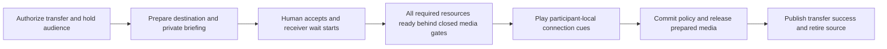

# Transfer readiness and participant wait sounds

Status: implementation in progress (2026-09-14); definition/asset checkpoint complete.
Playback, readiness and coordinated transfer acceptance remain incomplete.
Prerequisites: [Call lifecycle and opening audio](opening-audio-and-call-lifecycle.md),
[Agent transfers](agent-transfers.md), [Live mixing and media policy](live-mixing-and-media-policy.md),
[Human web transfers](human-web-transfers.md), [Common phone transfers](telnyx-calls.md),
and [Usage observations](usage-and-billing-observations.md).
Design sources: [approved transfer contract](../../labnotes/20260905-0405-call-definition-design.md#transfer-success-and-failure--approved-g8-baseline),
[opening playback contract](../opening-audio-contract.md),
[incremental policy application](../incremental-media-policy.md), and the user's 2026-09-13
request for complete readiness, independent wait playback, and an audible connection cue.

## Runnable outcome

A caller hears a private wait sound while the call becomes ready. During a transfer, each
remaining listener hears their own wait sound. The human destination hears the private briefing,
accepts, and hears their own receiver wait sound while capabilities become ready. Once all
capabilities required by the resulting room are ready, waiting listeners hear a short connection
beep. Only after those cues finish may conversational audio open and transfer success be reported.

The same assets can be shared in memory, but playback positions are independent. Starting one
participant's nine-second loop must not seek or restart anyone else's loop. This applies to web,
phone, human destinations, agent destinations, and rooms with more than two participants.

## Current gap

- `HumanHandoff.progress/2` commits when acceptance and briefing are complete.
  `HumanCommitter` promotes the connection and publishes completion before Gateway receives the
  promotion and starts destination STT and main media. `transfer.active` is later than the engine's
  success. These must become one coordinated lifecycle with a truthful final completion point.
- The latest transcription fix correctly resolves destination STT and forwards other participants'
  transcripts, but its post-promotion STT startup must move into gated preparation.
- Startup readiness is currently concentrated around caller attachment/STT. There is no common
  readiness report covering every enabled room and participant capability.
- The opening player enqueues a finite asset and awaits output completion. It is not an independent,
  paced looping player. Private and room output also need one ordered recipient output path.
- The supplied WAVs are stereo; the existing opening WAV decoder requires 48 kHz mono PCM16.

## Call-definition changes

Add one call-level `wait_sounds` object. Each configured value is an absolute audio-file URL or
null (`nil` in Elixir). Omission selects the built-in default for that scenario. Configuration is
per call; playback state is still independent for every participant. No second configuration layer
or participant-level settings are needed for this proposal. Keep `transfers` as the existing
allowlist and the shared attempt timeout in `transfer_policy`. Readiness is an engine invariant,
not an optional `wait_until_ready` setting.

| Slot | Listener and trigger | Built-in default |
| --- | --- | --- |
| `call_setup` | Entry caller, once its output connection can play audio, while initial room/capability setup is incomplete | `phone-ring` |
| `transfer_to_agent` | Existing audience, including the caller, when the transfer destination is an AI agent | `cafe-bossa` |
| `transfer_to_human` | Existing audience, including the caller, when the transfer destination is a human | `phone-ring` |
| `transfer_joining` | Incoming human destination, immediately after accepted transfer control, until readiness permits the connection cue | `cafe-bossa` |

The transfer defaults above reflect the user's follow-up: AI-to-AI uses café-bossa; AI-to-human
uses phone-ring for the caller/audience and café-bossa for the receiving human. The implementation authorization also accepts phone-ring for initial caller setup. The audible connection beep is a separate mandatory handoff action, not a wait
sound; setting a wait slot to null does not disable readiness gates or the beep.

Definition syntax in schema `20260914.01` (playback orchestration is still being implemented):

```json
{
  "schema_version": "20260914.01",
  "name": "Support with participant wait sounds",
  "entry_caller": "caller",
  "entry_receiver": "reception",
  "defaults": {
    "capabilities": {
      "speech_to_text": "deepgram-flux-stt",
      "model_inference": "gemini-flash-lite",
      "text_to_speech": "deepgram-flux-voice"
    }
  },
  "wait_sounds": {
    "call_setup": null,
    "transfer_to_agent": "https://media.example.com/cafe-bossa.wav",
    "transfer_to_human": "https://media.example.com/phone-ring.wav",
    "transfer_joining": "https://media.example.com/receiver-wait.wav"
  },
  "participants": {
    "caller": {
      "type": "human",
      "connection": {"service": "web", "mode": "receive", "admission": "start_call"}
    },
    "reception": {
      "type": "agent",
      "prompt": "Help the caller and transfer to human support when requested.",
      "first_message": {"mode": "wait_for_input"},
      "transfers": ["human-support"]
    },
    "human-support": {
      "type": "human",
      "description": "Human support specialist",
      "connection": {"service": "web", "mode": "receive", "admission": "transfer"}
    }
  },
  "transfer_policy": {"attempt_timeout_ms": 30000}
}
```

This example deliberately silences initial caller waiting and uses fetched files for transfers.
Omit `wait_sounds` entirely to use the defaults; URLs above are illustrative, not built-in asset IDs.

### Resolution and validation

| Authored value | Meaning |
| --- | --- |
| No `wait_sounds`, or `{}` | Use every built-in default |
| A slot is omitted | Use only that slot's built-in default |
| A slot is a valid supported HTTP(S) file URL | Fetch, validate, prepare and play that file for that scenario |
| A slot is null / `nil` | Play no wait sound for that scenario; other slots still use their values/defaults |
| `wait_sounds` itself is null / `nil` | Disable all four wait sounds |

- Preserve missing versus explicitly null during parsing/serialization; use presence-aware
  resolution rather than treating both as the same absent value. Reject booleans, bare asset
  names, local/file/data URLs, unknown slots, objects in place of a URL, and malformed values at
  their exact definition paths. There is no public asset registry to configure for a URL.
- The built-in defaults resolve privately to the packaged local WAVs, with no HTTP request.
  Configured URLs use the existing bounded audio fetch/address policy, response limits and cache
  primitives. Support the existing PCM WAV format plus the supplied stereo PCM16/48 kHz format;
  normalize stereo once into the canonical mono playback format. A valid URL with an unreadable,
  unsupported or oversized file is an explicit asset-preparation failure, not fallback to a default.
- Fetch and prepare all configured wait assets during call preparation, before dependent runtime
  setup/transfer phases need immediate playback. Keep network/decode work out of RoomAuthority,
  Gateway receive loops and the pure definition compiler. Reuse cached bytes for all listeners;
  do not refetch on every loop or participant start. Cold preparation may delay admission, but must
  never claim a custom sound is available or silently play a different sound.
- Pin URL/source selection in the compiled plan and pin content digest, format, duration and
  normalization settings when preparing that call's assets. Active calls keep those prepared bytes
  even if the remote file changes; a later call may fetch a new version under cache revalidation.
  Keep URLs with private query parameters out of public events/logs; use safe asset handles there.
- Wait/cue playback is for connected human listeners, never an agent's STT/model. Agent transfers
  still wait for all agent capabilities and play audience sounds/cues to the humans being reconnected.
  An authorized receive-only monitor never gains microphone permission from this feature.
- The mandatory built-in connection cue is finite and validated for audibility. Failed cue playback
  cannot silently open the bridge. Cue customization is not part of `wait_sounds`.
- Introduce a new schema revision and explicit compatibility parsing for current `20260913.01`
  definitions. Old JSON still rejects unknown fields; new calls resolve its omitted sounds to the
  approved defaults. Existing saved revisions/history remain immutable, and running calls retain
  their pinned plan. Cover stored-definition loading and plan serialization in the migration.

## Readiness contract

Build the required resource set from the **prospective post-transfer plan and effective policy**:
every remaining participant, the incoming destination, and enabled room-level resources. Do not
require departing-source capabilities to exist after handoff, unselected providers to start, or
policy-forbidden processing to become ready. Retain the source for bounded recovery until commit.

Each resource reports `preparing`, `ready`, or `failed`, with its room incarnation, participant or
room scope, attempt, instance generation, effective configuration signature, and relevant policy
interval. A process PID or successful `start_child` alone is not readiness. Disabled/not-demanded
resources are explicitly absent from the required set. An enabled capability without a readiness
adapter is unsupported and must not be silently treated as ready.

| Resource | Required readiness evidence |
| --- | --- |
| Any selected STT provider | Configured session/transport initialized, provider's supported connection acknowledgement received, correct codec and ingress bound; microphone input still gated |
| Any selected TTS provider | Voice/model/configuration resolved, provider initialization complete, output route prepared; no greeting or generated speech admitted yet |
| Model inference / agent runtime | Correct activation and context installed, client initialized, dependencies and tool bindings ready, runtime can accept its next request |
| Local/remote tools and MCP | Local bindings validated; enabled remote integrations initialized with required discovery/capability negotiation complete; no dummy tool invocation |
| Participant media | Negotiated live connection and prepared input/output codec/pacing paths, bound to the exact participant and generation |
| Room mixer, transcript router, Variables and other enabled room services | Owning processes acknowledge operational readiness and the candidate configuration/policy; required subscriptions/queues are bound |
| Recording, archive and observation paths | Enabled local producer/consumer interfaces are initialized and can accept bounded work under the candidate policy; preserve existing asynchronous storage contracts |
| Wait/cue playback | Selected assets validated/cached and the listener's private output path is usable |

Readiness means operational readiness according to each adapter's contract, not a guarantee that
its next external request cannot fail. Stateless HTTP providers acknowledge validated initialization
and usable clients; do not invent a provider handshake or generate a billable utterance to claim
readiness. Remote recording persistence is not a synchronous admission dependency: a locally ready
bounded asynchronous writer retains its existing outage/gap contract. A known failed required
local resource cannot pass the barrier.

Compare desired resources/configuration to running instances. Keep unchanged STT/TTS/model/tool
sessions, codecs, room services and their ready generations. Prepare only additions/replacements;
remove only resources no longer required. A wait/hold transition changes delivery gates, not the
media privacy policy and not every service generation. Real permission changes still invalidate
the affected intervals and queues, as required by incremental policy enforcement.

## Participant-local playback and isolation

- Call Engine owns lifecycle and per-listener playback. Gateway owns negotiated codecs, transport
  delivery and playback acknowledgements. Use engine application `priv` assets so embedded,
  WebRTC and phone clients share the same feature; it is not a Phoenix static-file feature.
- One supervised player/cursor per participant and wait episode. The episode is scoped to the
  incarnation, participant, connection generation, phase and transfer attempt. Each starts at zero,
  loops independently and owns bounded queued frames. Re-entry/new attempts start a new episode;
  a replacement connection restarts only that participant's playback. Multiple authorized output
  sinks for one participant follow that participant's cursor.
- Share decoded asset bytes, never timers, cursor state or a room broadcast of the wait waveform.
  For a ten-second configured fixture, one participant can be at seven seconds while another is
  at three. The supplied default files happen to be nine seconds long.
- Introduce a participant output arbiter before encoding/pacing: select opening/briefing, wait,
  cue, or permitted room audio. Keep one ordered output timeline across these sources. Changing
  source must not restart the codec or RTP clock. Bound queued audio and acknowledge clear/drain;
  never enqueue an infinite loop or race separate private/room writers on one transport track.
- Local sounds and private briefing bypass room mixing, STT/model input, other listeners,
  monitoring and call recordings. Trace only safe phase/asset IDs and durations. A listener may
  acoustically feed its speaker into its microphone; use normal endpoint echo cancellation and
  keep its input gate closed throughout waiting/cue playback.
- Holding gates microphone delivery, conversational room output and model turn admission without
  stopping healthy capabilities. Discard blocked audio; never replay it after release. Previously
  admitted, permitted transcripts may finish, but cannot trigger new held conversation output.
- For a five-participant room where participant 5 initiates transfer, participants 1–4 each enter
  their own audience wait. Do not hard-code `caller_participant_id` as the only audience. Exclude
  the departing source and incoming destination from this audience set. Membership changes update
  only affected listeners; joining mid-attempt starts that listener's own loop.
- Existing listeners are privately held during the transfer, including with respect to one another.
  Source responsibility remains available for recovery, but the old spoken blocking-hold response
  and late source acknowledgements must not compete with wait playback.

## Initial call sequence

1. Pin the definition and establish the minimal room/participant identity plus caller output path.
   Refactor startup so expensive capability initialization does not precede all usable caller media.
   In the browser, this begins after the caller grants media access/connects; a page that has not
   established audio cannot yet hear a server sound. Phone legs follow the same early output gate.
2. Start that caller's `call_setup` wait at zero and initialize required room/participant resources
   asynchronously. Preserve exactly-once admission and the existing start/readiness/duration clocks.
3. If configured opening audio is ready, suspend waiting, clear its queued tail, and play the opening
   announcement privately to completion. If capabilities are still preparing afterwards, resume the
   caller's own suspended wait cursor. Never overlap wait sound with the announcement or greeting.
4. Once opening playback and all initial readiness requirements finish, clear waiting and release
   normal conversation/first-message behavior. The transfer connection cue is not an extra initial
   greeting or substitute for opening audio. Startup failure ends the attempt and its player.

## Transfer sequence and completion barrier



1. Authorize the existing catalog-bound request and start its one total attempt timer. Gate the
   audience's conversational input/output and start each audience wait immediately, selecting
   `transfer_to_agent` or `transfer_to_human` from the destination's type. Rejecting an
   unauthorized request does not put anyone on hold. Prepare destination configuration/resources
   asynchronously under supervision; keep room authority and Gateway message loops responsive.
2. A human destination connects privately and hears its briefing/notice. **Proposed acceptance
   change:** expose acceptance only after required briefing playback completes. Authenticate that
   acceptance window server-side for web and phone. Premature controls do not accept or end the
   attempt; they do not reset the deadline. This replaces today's permitted early-accept latch and
   ensures receiver waiting begins immediately after acceptance without masking a required notice.
3. On accepted control, start `transfer_joining` at that listener's zero position. Complete
   preparation of its configured capabilities and held media paths. Preparing STT before main
   admission requires a narrowly authorized attempt-bound binding; it grants no microphone input,
   room audio, transcripts, recording, or unrestricted history during preparation.
4. Prepare the final resource/policy configuration behind closed gates. Reuse unchanged ready
   instances; prepare actual replacements separately. Enforcer preparation must support installing
   those ready instances at commit instead of performing fresh network startup in the commit call.
   Keep current privacy restrictions on any existing admitted traffic until authoritative commit;
   candidate readiness never grants candidate media permissions.
5. Wait for the complete required resource set, including still-participating listeners and room
   capabilities. No tool success, `transfer.completed`, `transfer.active`, or mutual audio yet.
   Agent destinations skip human briefing/acceptance/receiver playback but use the same readiness
   and audience wait barrier, with no destination greeting/model output before release.
6. Stop/clear each listener's wait frames and play the mandatory connection cue once per listener.
   Proposed cue audience: every held human listener, including the incoming human, even when their
   wait slot is null. Recommend a
   short, distinct 1 kHz beep, about 250 ms, with brief edge ramps and a -6 dBFS peak, above the
   supplied wait assets' level. Generate/package this cue during implementation. Each output path
   must acknowledge ordered completion, not merely successful enqueue. Wait for all applicable
   listener cues before releasing any conversational output.
7. Revalidate the exact attempt, deadline, membership, resource generations and readiness. Commit
   participant/control/privacy changes and install the prepared media configuration while gates
   remain closed. Verify the resulting policy still matches the ready resource set. Any readiness
   loss or relevant policy change invalidates the pending release; prepare again within the same
   deadline and replay the cue before a later release. Unrelated revisions preserve ready instances.
8. Issue the fenced media-release command. Drop old output generations, open only policy-permitted
   paths, and await acknowledgements. Then publish one engine completion/tool result and one
   consistent adapter `transfer.active` projection, retire the old source subtree, and stop players.
   A terminal failure during partial gate release closes the affected conversation fail-closed;
   it must not report a clean successful or recoverable handoff after uncertain media admission.

For WebRTC, keep cue packets ahead of room packets on the same ordered output timeline, through
the output arbiter and final playout/drain acknowledgement. Where a phone adapter supplies playback
marks, use its exact mapped acknowledgement. A timer for the asset's nominal length is insufficient.
Server acknowledgement proves ordered delivery/drain, not physical loudspeaker volume; rendered
browser and phone acceptance checks must also confirm the cue is audible and precedes speech.

The existing 30-second default total transfer budget includes acceptance, preparation, readiness,
cues and bridge acknowledgement; loops and retries never extend it. Keep its existing 1–120-second
configuration range. All waiting time counts toward whole-call duration and suspends caller-idle
nags. On rejection/failure/expiry, cancel only the exact attempt, discard destination preparation,
clear wait/cue tails and restore the source when permitted using the existing single restoration
budget. Restoration must also satisfy readiness and ordered local cue completion before opening
held conversation. End when no valid conversation can be recovered. Never redial automatically.

## Implementation checkpoints

Each checkpoint includes its own failing contract check first, implementation, focused verification,
documentation and labnotes; preserve a runnable umbrella between commits.

- [x] **Definition and asset resolution:** add typed call-level wait slots, presence-aware
  URL/null/default resolution, strict validation, bounded URL fetching, pinned plan/asset resolution,
  compatibility parsing and the development sample configuration.
  Normalize bundled stereo PCM16 to canonical 48 kHz mono once per cached asset; generate the
  connection beep. Reject invalid/oversized assets before starting the dependent call/transfer.
- [ ] **Private paced playback:** implement supervised independent looping players and the shared
  per-recipient output arbiter, including pause/resume, clear/drain, cue playback and generation
  fencing. Integrate web and common phone output without recreating their pipelines per phase.
- [ ] **Common readiness:** define resource descriptors/reports and prepared bindings for all selected
  STT/TTS/model/tool resources, both participant and room services. Reuse unchanged generations and
  prepare only the actual diff. Cover provider-ready acknowledgements beyond child startup.
- [ ] **Initial caller waiting:** expose usable caller output during asynchronous room setup, compose
  waiting with opening audio/first messages, and preserve admission and lifecycle timing semantics.
- [ ] **Coordinated transfers:** hold every audience listener, expose the correct acceptance window,
  prepare destination capabilities before media, await readiness/cues/policy/release acknowledgements,
  then publish completion and retire source. Apply the same barrier to agent and human destinations.
- [ ] **Failure and sample verification:** exercise restoration, disconnects, saturation and races;
  update `/transfer` and `/pipecat-console` states and safe diagnostics. Add phone adapter parity
  fixtures and run authorized provider checks in the existing integration lane.
- [ ] Complete the [common gates](index.md#common-implementation-and-verification-gates), record
  implementation evidence here, and check the milestone/index only after acceptance passes.

Expected ownership: `CallDefinition`/`DefinitionCompiler`/`ResolvedCallPlan` own the schema;
`PlanStartup`, startup readiness and participant-transfer modules own orchestration; small dedicated
readiness and local-playback components own their respective state. Gateway's main/private media
adapters own output ordering and acknowledgements. Calls owns prepared admission/plan persistence;
Console owns human-facing phases. Keep provider startup and media pacing outside RoomAuthority.

## Automated and manual acceptance

- [ ] JSON/Elixir parity, omitted defaults versus explicit null, destination-type defaults and
  per-slot independence pass. Reject non-URL configured values. Cover URL fetch/format/size failure,
  bounded preparation, cache reuse, immutable active-call bytes, tenant scoping, schema compatibility
  and digest resolution at their owning boundaries. Null disables only the selected waiting sound,
  never readiness gates or the mandatory cue; whole-object null disables all waits.
- [ ] Two listeners share one immutable ten-second fixture but are at seven and three seconds;
  stopping/restarting/reconnecting one does not alter the other. Default nine-second assets loop
  continuously with bounded queues and no repeat-boundary fade/silence introduced by the player.
- [ ] A five-participant transfer holds all four audience listeners with independent cursors using
  the call's configured URL or default selected for the destination type.
  Joins/leaves, receive-only monitors, receiver re-entry and exact-attempt cleanup are covered.
- [ ] Before acceptance, destination microphone/room/transcript access is denied. After acceptance,
  delay each enabled capability in turn: receiver wait continues, no human hears room conversation,
  source remains recoverable and no success event is emitted. Cover a remaining participant and
  a room-level resource, not only destination STT or one provider.
- [ ] A capability child exists but provider readiness is delayed: the barrier remains closed.
  Missing/failed/old-generation/foreign-attempt acknowledgements cannot satisfy it. A policy-denied
  unselected resource is not started just to pass readiness.
- [ ] Unrelated membership/policy revisions and hold phases retain the exact STT/TTS/model/tool,
  codec and room-service instances. Relevant changes affect only their required resources/queues.
- [ ] Wait sounds, cues and briefing never enter STT, model history, other listeners or recordings.
  Held microphone frames are discarded and never replayed. Old source output cannot cross release.
- [ ] Delay cue completion: no room audio or success. Verify final cue frame precedes first room
  frame on every released sink, including under backpressure, and no wait tail follows the cue.
  Failure/readiness loss during the cue prevents release and exercises bounded recovery.
- [ ] Initial slow room setup produces caller wait audio; opening playback takes priority; wait
  resumes only if still necessary; first greeting occurs once after all startup gates finish.
- [ ] Deadline at every phase, duplicate/early acceptance, stale readiness, disconnect, asset/player
  failure, policy rejection and partial release leave no false completion, leaked media or orphan
  player/connector. Idle and whole-call duration clocks retain their defined behavior.
- [ ] Safe telemetry exposes phase durations, readiness blockers by capability kind, timeout/failure,
  and player queue pressure without transcript/audio bytes, secrets or provider error payloads.
- [ ] In rendered Chrome, use `/pipecat-console` plus mobile-sized `/transfer`: hear distinct local
  waits, accept only after briefing, observe preparing, hear the cue, then exchange audio and
  transcripts. Delay actual readiness deliberately so fast providers cannot hide missing states.
- [ ] Repeat through deterministic web/phone and phone/phone adapter fixtures. Verify real phone
  cue-before-conversation and audio clearing in the tagged, explicitly authorized provider lane;
  record any external blocker rather than claiming phone playout from a WebRTC-only result.

## Alternatives and implications

- A room-mixed wait track shares a playhead and leaks to other listeners/recording; reject it.
- Browser-only playback cannot cover phone/embedded participants or authoritative cue completion;
  use server-owned participant playback and transport-specific evidence.
- Reporting success at acceptance or checking only Deepgram's PID leaves the original readiness
  gap. Require all enabled resources and the final media-release acknowledgement.
- Restarting everything on hold or policy revision violates incremental capability lifetime;
  keep delivery gates separate and retain unchanged instances.
- Increasing phase deadlines hides incomplete ordering and extends calls unpredictably; keep one
  bounded attempt clock and expose which required stage is still preparing.
- This extends the current contracts; it does not mark historical implemented milestones incomplete.
  The user authorized this runtime and the revised acceptance window on 2026-09-14. No new
  named-transfer graph, arbitrary dialing, provider-specific definition format or indefinite hold
  behavior is needed.

## Planning evidence and design review

- [x] Inspect current definition/compiler, startup readiness, human commit/promotion, private player,
  output completion and the linked policy/lifecycle/transfer contracts.
- [x] Copy the two requested assets to the engine's `priv/audio/wait_sounds/` directory. Exact
  source/destination equality and WAV metadata are verified in the [asset README](../../apps/vxpipe_call_engine/priv/audio/wait_sounds/README.md).
- [x] Locally review coverage of all resource scopes, multi-participant audience, independent
  cursors, pre-room output, opening/briefing ordering, early acceptance, policy races, output
  ordering, rollback, deadlines, schema migration and prerequisite order. Record this design
  review separately from runtime progress in the [planning labnote](../../labnotes/20260913-2307-transfer-readiness-sounds.md).
- [x] User authorizes implementation of this milestone, including schema/defaults, acceptance window and cue audience (2026-09-14).
- [ ] Runtime acceptance and common implementation gates pass.

The original planning checks covered documents and copied assets only. Implementation evidence
is recorded below; no new playback/browser/provider acceptance is claimed yet.

## Implementation evidence

The first checkpoint introduces the typed `wait_sounds` selection, schema `20260914.01`, explicit
compatibility for `20260913.01`, bounded URL preparation and pinned normalized audio. A prepared
manifest stores each distinct audio payload once, keyed by content digest, plus slot/cue references
and the normalization profile. New call preparation reuses URL cache entries for up to 60 seconds;
after that it fetches again. Active/prepared calls retain their own immutable bytes. The original
bundled WAV RIFF-size metadata required correction; waveform bytes are unchanged. The built-in
250 ms connection beep is generated, but runtime cue playback is not yet integrated.

Compiler, asset, admission and PostgreSQL reconstruction regressions have passed. Complete gate
results and subsequent checkpoints are tracked in the
[implementation labnote](../../labnotes/20260914-0032-transfer-readiness-implementation.md).

All five root gates pass for the definition/asset checkpoint: formatting, warnings-as-errors
compilation, strict Credo, 1,025 umbrella tests with zero failures, and unused-dependency checks.
Older serialized plans hydrate missing wait fields only at the explicit preparation boundary;
the original saved bytes/schema/identities remain unchanged. Already prepared audio is reused
without refetching. Playback, the common readiness barrier and the remaining acceptance items
remain incomplete.

The playback primitive checkpoint adds supervised independent cursors, one pending frame per sink,
completion-driven pacing, drain-before-pause/stop, cursor-preserving resume, and finite cue
completion. Focused checks demonstrate two listeners at seven/three seconds and one participant's
multiple sinks sharing a cursor. Private audio is explicitly excluded from native WebRTC and phone
recording handoffs. These primitives are not yet connected to call/transfer phases; the private
playback checkpoint remains unchecked until the shared recipient output arbiter is integrated.

All five root gates pass for the playback primitive checkpoint: formatting, warnings-as-errors
compilation, strict Credo, 1,032 umbrella tests with zero failures, and unused-dependency checks.
Runtime integration and rendered/provider acceptance remain pending.

The native-output clear primitive now discards queued audio and drains the in-flight frame before
acknowledging. WebRTC retains its encoder/SSRC/RTP timeline; phone retains its encoding pipeline and
sequence clock while clearing remote queued media. This enables phase changes without codec
restarts, but does not itself integrate shared output or establish remote phone playback marks.

Shared recipient arbitration is now integrated into production WebRTC and common phone output.
Room frames and private/direct frames share the same encoder and output timeline. Room frames are
discarded during private playback; replacing a room binding drains its old frame and preserves
pending private playback. Generation-fenced output holds and drain-before-release are available
for lifecycle integration. The eight focused regressions and existing web/phone attachment and
human-transfer checks pass. Wait/cue phase orchestration and phone playback marks remain pending,
so the private paced playback checkpoint and milestone acceptance remain unchecked.

Finite cue completion now includes explicit final drain on every sink. Phone output maps drain
and clear to exact provider playback marks on the bound stream; clear cancels older marks before
issuing its own acknowledgement marker. WebRTC drain requires completion of the final paced
packet. Shared output rejects conversation/release while drain is pending and phone acknowledgement
failure closes the output. Deterministic socket/native/arbiter/player checks cover these boundaries;
this does not yet establish audible live-provider acceptance or integrate the transfer barrier.
Phone socket call-event dispatch is now asynchronous and bounded so call processing cannot block
the same socket's playback acknowledgements. Both provider checks pass with the leg dispatcher
deliberately suspended while a mark is processed.

All five root gates pass for the playback-marks checkpoint, including 1,053 umbrella tests with
zero failures (15 integrations excluded). Initial waits, common
readiness, coordinated transfer release, and rendered/live-provider acceptance remain incomplete.

Native phone output now also enforces a local 20 ms pacing boundary after idle gaps, preventing
overdue pipeline timestamps from producing a catch-up burst. Small encoding delays are absorbed
without accumulating drift; the codec and output sequence remain intact. Controlled-clock and
phone integration fixtures pass, followed by all five root gates with 1,054 tests and zero failures
(15 integrations excluded). This proves local queue pacing, not audible live-provider acceptance.
