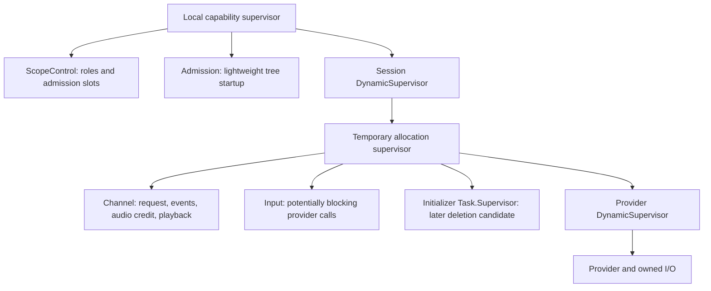

# Speech complexity audit

Status: design review, 2026-09-20. R/A remain accepted; D remains unaccepted and
implementation is paused after the proved admission/cancellation regression.
This audit changes the proposed implementation, not the running speech path.
The user accepts implementing the complete request workflow together and prefers
simple ownership and OTP shutdown over custom recovery. No runtime code changed
during this audit.

## Recommendation

Make one process own an allocation's live request, event ordering, audio credit
and playback state. Keep blocking provider calls in the existing Input worker.
Use the existing temporary supervision tree to discard a failed allocation;
replacement remains an explicit caller decision with a fresh identity. Implement
admission, cancellation, settlement and usage evidence as one verified workflow.

The current code already avoids automatic reconnect/replay. The excess complexity
is coordination between processes that maintain parts of the same request, plus
proposed accounting machinery that has not yet earned its representation.

## Findings and concrete changes

| Priority | Finding in current source | Proposed change | Required proof |
| --- | --- | --- | --- |
| First | `speech/output.ex` owns no sink/network I/O. It validates bounded PCM, tracks credit/playback, sends credit, and changes request state. `channel.ex` synchronously coordinates that state through begin/submitted/completed/rejected/fence/played/cancelled/settle operations, plus configuration and consumer authorization. | Merge Output's process state into Channel. Keep a pure audio/playback helper if it makes the code easier to read. Remove the Output child, registered address, monitor, consumer copy and synchronous handoff protocol. Keep provider calls in Input. | Existing order, adoption, deadline, final-credit, cancellation and playback cases; sustained held-credit load with responsive cancellation and sibling STT. |
| First | Channel and Output both retain request identity and submission/terminal/fence state. Channel's `request.handle` and `request.submitted?` have no runtime readers. Output's `last` is written but never read; `generated_bytes` is accumulated but never consumed. | Keep one authoritative request record. Remove unread copies. Preserve required generated-byte observation through the chosen usage path; removing an unread field is not permission to drop that fact. | Repeated cancellation returns the same result without applying playback twice; submitted and generated evidence survives failure; stale generations cannot mutate a replacement. |
| First | The admission proposal selects a consumer-retained atomics receipt before testing whether existing usage ownership can retain the facts. | Withdraw that representation choice. First test bounded historical usage facts delivered to the existing consumer/usage owner outside the whole speech scope's failure domain. Reuse `Usage.TextToSpeechAttempt` where appropriate. No new receipt process, global table, packed metadata protocol or general journal by default. | Hold the consumer, commit submission, kill the allocation and whole speech scope separately, then consume retained evidence including provider ID/provenance. Admission alone must not become submission. |
| First | An early Request exposes a valid cancel while Input still holds the speak command; current cancel returns busy after fencing. | Retain exactly one pending cancellation for the matching request in Channel. On speak resolution, dispatch it through the same Input worker or settle a definite pre-submission rejection locally. Keep the original deadlines. | The existing paired regression becomes green; cover cancel before submission, submission after fence, clean rejection, submitted failure, both terminal/callback orders and replacement completion. |
| Later, separately verified | `SessionTree.commands/1` names a Task.Supervisor used only once by `Admission.admit/2` to start initialization; it remains after initialization ends. | Evaluate a temporary initializer Task child of the allocation's existing DynamicSupervisor. Delete the otherwise idle Task.Supervisor only if its start and teardown tests pass. Do not execute initialization in shared Admission or ScopeControl. | Slow configure, blocked provider init, owner loss before bind, cancellation during start and initializer failure remain bounded and isolated. |
| Later, narrowly scoped | Session, Channel and ScopeControl each contain explicit provider-kill paths. Some overlap with supervision, but blocked provider startup explains part of this code. | Remove only demonstrated lifetime duplication. Prefer stopping the significant controller and letting its supervisor close ordinary descendants. Retain the exact pre-bind revocation mechanism until its replacement passes the startup races. | Held init, suspended controller, original deadline expiry, exact-generation close and unrelated-scope progress. Merely extracting all kills into another module is not simplification. |

These are source-backed simplification candidates, not newly proved stability
defects. The existing regression below is the tested failure. Merging Output in
production has not been implemented or benchmarked, so this report claims neither a speedup nor
a measured reliability improvement.

## Proposed process boundary

The immediate change removes the Output process from each native TTS allocation.
The initializer topology stays as implemented until its separate validation.



This diagram shows supervision, not message flow. The actual audio sink stays
outside Channel. In room integration, a worker that makes blocking sink calls
still needs independent ownership; the current `Speech.Output` process is not
that worker. Do not move sink pushes, provider callbacks, credential lookup or
socket operations into Channel while removing it. Keep bounded PCM and event
queues; a single owner is not permission for an unbounded mailbox protocol.

Process separation should correspond to independent execution or failure needs,
not simply to module organization. This is consistent with the
[Elixir GenServer guidance](https://hexdocs.pm/elixir/GenServer.html#module-when-not-to-use-a-genserver).
The Output merge is an inference from this project's current call graph, not a
general claim that audio workers are unnecessary.

## One complete request workflow

1. Channel admits E and returns its request identity. Input calls the provider;
   Channel remains available. Admission is not submission evidence.
2. The consumer cancels while acceptance is pending. Channel fences E immediately
   in its own state. The consumer interrupts the sink and reports actual playback.
   Channel retains one pending cancel under the original deadlines.
3. A genuine E submission arriving after the fence is recorded as historical usage,
   but cannot reopen E audio. When the speak callback finishes, the same Input
   worker executes cancellation. A definite unsubmitted rejection settles locally.
4. Only after provider isolation and callback resolution can T be admitted. Its
   PCM must drain completely and produce its own terminal result. Late E audio,
   credit and terminal messages cannot affect it.
5. If a real deadline or worker failure prevents isolation, revoke the allocation
   and let the local tree shut down. Preserve observed usage. Notify the caller;
   never reconstruct or replay the half-finished request automatically.

Generation completion and actual playback completion remain separate facts in
the single owner. A completed provider request may still be playing when the
consumer interrupts it; settlement updates playback without a second generation
terminal. Avoid replacing these independent facts with an overloaded status enum.

The public Request should identify the allocation and request. Existing immutable
descriptor metadata can be held once by its consumer. Decide any additional
failure-evidence fields from the complete workflow tests; immutable snapshots are
not themselves competing live authority. Remove Channel's unused handle copy now
as part of the refactor, rather than creating a new metadata owner.

## What OTP already owns, and what must remain explicit

CapabilityTree and SessionTree already use temporary significant children with
`auto_shutdown: :any_significant`. That policy closes the remaining children when
a significant child exits, without restarting the speech request. Preserve it.
The relevant behavior is documented in
[Supervisor automatic shutdown](https://hexdocs.pm/elixir/Supervisor.html#module-automatic-shutdown).

This does not make every monitor redundant. The provider is a temporary child
under a DynamicSupervisor; its exit alone does not terminate that supervisor.
The controller still needs the provider-loss signal to retire the allocation.
ScopeControl's owner, lease, consumer and tree monitors enforce authority transfer,
failure notification and bounded admission slots outside a simple parent-child
lifetime relationship. Delete a monitor only when its obligation is demonstrably
covered by the chosen tree.

Keep the existing Input worker: provider callbacks can synchronously emit events
back into Channel. Calling those callbacks from Channel would create a call cycle
and block cancellation. Keep local asynchronous startup: OTP supervisors wait for
child startup, so slow initialization in a shared ancestor recreates the rejected
cross-call coupling. Keep the provider registration/revocation gate for blocked
initialization. The callback and startup blocking semantics are described in
[GenServer callbacks](https://hexdocs.pm/elixir/GenServer.html#callbacks).

Also retain request/allocation identities, authority checks, original deadlines,
one-chunk credit, actual-playback reporting and bounded successful-cancel replay.
OTP does not decide whether speech is permitted, belongs to the current turn,
was submitted upstream or was played. A call timeout alone is not a project-level
cancellation protocol. The existing small command/allocation atomics guards are
distinct from the unimplemented general receipt design; do not delete them as
part of rejecting that new machinery.

Historical usage must not depend on a successful live media ACK after revocation.
The present Event contract requires ACK before use, and an invalid allocation
rejects ACK; merely leaving `input_submitted` in its queue is insufficient.
The existing usage accumulator is reusable calculation logic, not proof that
evidence survives these failures. Red-test the boundary before choosing storage.
Publish validated facts to the independently owned consumer before acknowledging
their acceptance to the provider. Require bounded retention under a held consumer
and final collection through Channel termination; an early scope-close notice
alone must not finalize the attempt while facts can still arrive.
Retain bounded provider IDs, immutable provenance, input counts and observed
generated bytes without retaining speech payloads. Distinguish uncertain upstream
work from known zero usage. Do not add synchronous persistence to the media path.

## Rejected approaches

- A general pending-command queue, second provider-command worker, retry broker or
  recovery coordinator adds ordering and timeout cases to a one-request contract.
- Converting everything to `gen_statem` or a new lifecycle framework does not by
  itself remove duplicated ownership. Use existing OTP processes and ordinary
  cohesive functions first.
- Deleting all monitors, gates or deadlines because supervisors exist loses
  authority/readiness/failure requirements that parentage does not express.
- Collapsing provider I/O, sink I/O and control into one GenServer makes blocked
  work block cancellation. Fewer processes alone is not the acceptance criterion.
- Moving receipt state into ScopeControl still loses it on whole-scope failure.
  Choosing a custom atomics publication scheme now adds a second protocol before
  the simpler owner-based alternative has been tested.

## Implementation and acceptance order

Treat this as one D workflow with small internal red/green steps, not separately
accepted early-return and cancellation features:

- [ ] Describe pending admission → fence → sink interruption → provider isolation
  → complete replacement in public-boundary tests, including failure usage facts.
- [ ] Merge Output state into Channel, remove unread state, and make the pending
  cancellation path pass without retries or another worker. Preserve separate
  generation and playback facts; keep pure helpers cohesive.
- [ ] Prove usage evidence survives allocation/scope loss with a held consumer;
  use the smallest bounded owner-based mechanism that passes. No storage
  representation is accepted by this audit.
- [ ] Run the speech/Morse/usage selection. Adapt process-specific tests and fault
  injection to the surviving boundary without deleting observable guarantees.
- [ ] Rerun cancellation and fault loads at 1/8/32 scopes with held credit and
  sibling STT. Report first-audio/text, generation/turn end, fence/cancel and
  replacement timings, failures, queues and memory. Compare like-for-like paths;
  prior Output-kill results become historical after Output ceases to be a process.
- [ ] Obtain independent review and pass all five root gates before D acceptance
  or room migration. Keep any reproduced change-caused instability paused.

Evaluate initializer-supervisor and remaining lifetime deletions as distinct
verified changes after the request workflow is green. Do not expand this repair
into a rewrite of the already accepted startup and adoption mechanisms.

## Evidence and review

Source inspection covered the speech subtree, native Morse TTS, existing TTS
capability/usage code and relevant milestone contracts. Searches established the
unused fields and the single initializer Task.Supervisor call site described above.
GPT-6 Astra xhigh independently agreed that Output has no blocking I/O and that
merging its state removes real coordination rather than merely moving code.
The review also confirmed the sole initializer-supervisor use and required
bind-before-initialize ordering, lightweight Task startup and public-only child
arguments for any later removal. It retained the pre-init abort/registration gate
and required actual historical fact delivery rather than reinterpreting queued
live events as durable accounting.
The final documentation review cleared the revised tasks, with the usage consumer
explicitly outside the whole scope's failure domain and publication/termination
barriers retained. This was design review, not implementation approval.

The existing isolated reproduction was rerun from `apps/vxpipe_call_engine`:

```sh
mix test test/vxpipe/call_engine/speech/tts_admission_cancellation_test.exs --seed 530504
```

Result: **2 tests, 1 failure, 0.8 seconds**. Input-first control passes. Cancel-first
returns `busy`, Input then completes, the fence expires, descendants terminate and
replacement returns `closed`. This reconfirms the known regression; it does not
measure the proposed simplification. See [admission findings](native-tts-request-admission.md).

The proposed production merge was not implemented or checked by full root gates.
The earlier green root/load evidence predates early admission and remains historical.
The [milestone](milestones/simpler-speech-integrations.md) retains the implementation
checklist; [audit labnotes](../labnotes/20260920-0618-audit-speech-complexity.md)
record this review.

## Isolated topology proof

The subsequent [speech topology experiment](speech-topology-experiment.md) builds
the proposal as test-only split and merged allocation trees before changing runtime
source. Review of the first prototype found an unfair extra split acknowledgement
hop, constant PCM, echo STT and missing authority/deadline/event-ACK/watchdog
contracts. The corrected comparison gives the split consumer direct Output credit
and runs the production Morse Encoder and Decoder through test adapters.

The first strengthened native-style run then exposed a weak benchmark assertion:
split passed every fixed budget at 64 scopes while merged replacement-first-audio
p99 was 19.482 ms. A first-miss-only check hid that pointwise failure. The report is
retained. The final benchmark checks every concurrency, validates exact audio,
bounds played time and carries bounded provider IDs.

Four focused cases pass. Three fresh final-source runs complete 70,416 workflows
through 256 concurrent scopes. Merged passes every concurrency where split passes;
first observed misses are split 64/32/128 and merged 128/128/128. Sampled process
peaks are lower for merged, while memory is not consistently lower.

This changes design confidence, not implementation status. These are test adapters,
not the actual native Session/provider modules; generation adoption, a complete
usage ledger, rooms, codecs, networks and hosted providers remain outside the
experiment. The current runtime still reproduces pending-Input cancellation
failure and D remains paused/unaccepted. Apply the merge under the production red
test, then repeat fixed-gate load, independent review and all five root gates.
