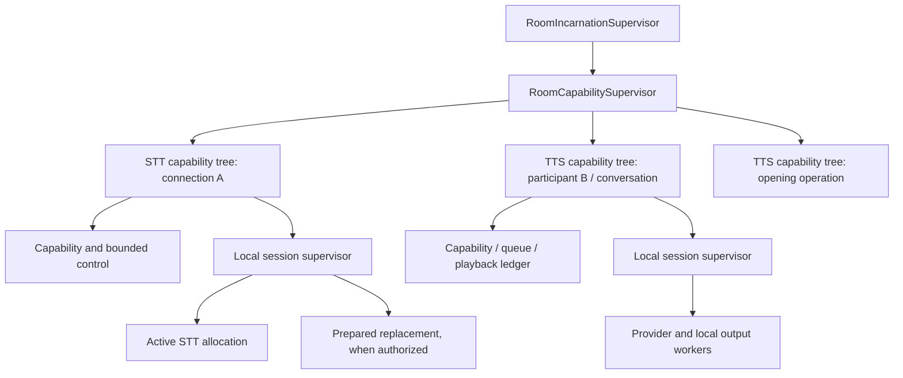

# Speech sessions owned by the call tree

Status: revised ownership design, 2026-09-19. Replaces the application-wide execution ownership
in the baseline prototype. The isolated R implementation and its [adoption repair](speech-adoption-fix.md)
are under verification; existing rooms still use their original speech path. See the
[milestone](milestones/simpler-speech-integrations.md) for acceptance checkpoints and the
[original measured failure](speech-startup-isolation.md) for baseline evidence.

## Decision

Keep each speech allocation and all of its execution workers beneath its owning room.
Retain the existing `RoomCapabilitySupervisor` and add a small, temporary speech subtree
per connection or participant/purpose. Standalone examples must receive an explicitly owned
local scope. Remove the prototype's application-wide `Speech.SessionSupervisor` and its
implicit global lookup/start path.

Moving slow initialization into a supervisor shared by a room is insufficient. Every shared
ancestor admits only a lightweight tree; blocking credential resolution, DNS, network
connection, provider initialization and audio processing execute inside the owning subtree.
Existing authorization validation and activation-time credential selection remain in force.
One slow STT must not delay another room, another participant, or an unrelated TTS allocation
in the same room. Shared CPU, OS resources and upstream account quotas still exist; the
contract removes application-level speech execution queues shared across those allocations.

## Proposed tree

`Speech.CapabilityTree` and the internal role names below are proposed. A role need not add
a process when an existing process can own it without creating a blocking dependency.



Each allocation contains its private event delivery state, provider state, deadline/failure
control and necessary input/network/output workers. No audio, text, cancellation or provider
startup is dispatched through an application-wide speech process. A slow request may consume
its own bounded slot; it cannot become a shared speech queue.

Capabilities remain under the room tree, matching current placement. Connection and
participant lifetime are additionally bound through the existing engine stop operations and
monitors. A room-authority monitor alone does not implement participant/connection teardown.
This milestone does not move every engine capability under `ParticipantSupervisor`.

Existing `RoomRegistry` may retain opaque names and allocation handles for discovery. It
does not carry speech operations. Existing shared cached assets remain data; generation and
playback belong to the requesting operation. Remove the newly introduced `Speech.Registry`
where explicit scope handles make it unnecessary. Existing global STT connection and TTS
output task supervisors remain only for unmigrated callers; migrate their speech workers into
local trees and remove their application children after the final caller has moved.

## Exact owners and identities

Three roles must be explicit: **lifetime owner**, **event consumer**, and, for prepared work,
**lease/adoption authority**. A temporary connecting task is never the lifetime owner.

| Allocation | Lifetime and parent scope | Event/adoption authority |
| --- | --- | --- |
| Connection STT | Room speech subtree keyed to participant and connection generation | STT capability; connection loss or participant departure closes the allocation. |
| Conversational TTS | Room speech subtree keyed to participant activation and `:conversation` purpose | TTS capability retains its existing queue, usage and playback authority. Activation replacement retires the old allocation. |
| Independent opening | Room speech subtree keyed to opening operation/attempt | Opening lease/control, including human-entry openings with no agent activation; cancellation or room loss closes it. |
| Private briefing / transfer preparation | Target room speech subtree keyed to preparation attempt and purpose | Existing preparation lease until adoption, then the explicitly identified connection/activation consumer. |
| STT privacy replacement | Same final capability subtree as its predecessor; separate allocation generation | Pending-policy lease until adoption. At most one prepared replacement, matching existing state. |
| Opening cache generation | Requesting opening/preparation subtree | The requesting operation owns generation; cache storage cannot keep a provider alive. |
| Standalone test/example | Caller-supplied local scope under its supervisor | Explicit caller owner and consumer; no default global fallback. |

Allocate prepared speech beneath its final room scope from the outset. Adoption changes
lease and delivery authority; it never reparents a running OTP subtree. If a final room or an
explicit owned preparation tree does not exist, do not allocate a provider. Current opening
preparation already has an incarnation, so this plan does not invent pre-room synthesis.

The allocation handle identifies a generation; copied role fields do not grant current
authority. Scope control retains the authoritative lifetime owner, pending lease and active
consumer. Adoption commits those roles synchronously before the event channel enables
delivery or returns success. The same record governs close, owner/consumer monitoring and
terminal notifications. The old lease can cancel pending work but loses that authority after
adoption. A cancellation committed first prevents adoption; an adoption committed first
rejects subsequent lease cancellation. Preserve the lifetime-owner monitor and replace the
lease monitor with a consumer monitor. This bounded lifecycle operation adds no per-audio
scope-control call and no synchronous callback from scope control to the event channel.

An opaque allocation handle binds room incarnation, participant/connection or operation,
purpose, attempt/generation, owning tree, and control identity. It contains no credentials or
speech payload. Tree identity is distinct from a capability/provider PID. Lookup and stop
must use the exact allocation generation: stopping an old conversation, opening or preparation
must not resolve a broad participant key and stop its replacement.

When room integration nests a capability, migrate speech startup, lookup, stop, monitor and
readiness binding together. Current `stop_speech_to_text/3` and `stop_text_to_speech/2` ultimately
terminate direct `RoomCapabilitySupervisor` children; they must terminate the owning speech
tree after nesting. Keep generic direct-child `stop_capability/2` semantics for non-speech
workers. Public command semantics stay unchanged; private runtime bookkeeping gains the
allocation handle needed for exact teardown.

## Admission, readiness and cancellation

The engine facade becomes explicitly scoped, for example:

```elixir
# Experimental engine-facing API; scope comes from trusted test composition until migration.
{:ok, allocation, :starting} = Speech.Session.start(scope, options)
# Readiness arrives later, bound to this allocation and its owner/lease.
```

Provider authors still implement four STT operations or five TTS operations. This changes
execution ownership, not the semantic authoring interface. Providers receive their local
handles and never choose an application-wide supervisor or queue.

1. At the API boundary, mint the attempt/generation and an absolute monotonic startup/adoption
   deadline. Include time spent waiting for local admission, readiness and adoption; never
   reset that attempt's budget at dequeue, provider start or a protocol upgrade. Settle its
   timer when activation/adoption succeeds; this deadline is not the active session's lifetime.
2. Acquire bounded local admission before returning `:starting`. Reuse existing per-capability
   request/preparation bounds; reject excess work with a safe busy/unavailable result rather
   than accumulating mailbox messages. STT allows its live allocation plus one authorized
   replacement; independent TTS purposes have separate explicitly authorized scopes.
3. Start a lightweight tree. `start_link` does local bounded setup and returns promptly;
   remote work runs asynchronously in a local worker or continuation with independent timeout
   and cancellation control. No supervisor's child-start callback waits for that remote work.
4. Release provider events only after the allocation is bound and its lease is live. A local
   `ready` means initialized; hosted readiness still requires the provider acknowledgement.
   Input while not ready is rejected or handled by the existing authorized ingress policy;
   the session does not introduce an extra hidden input queue.
5. Cancellation and owner loss invalidate the attempt immediately, including while admission
   is queued and before a provider PID exists. `close(allocation)` is bounded and idempotent.
   A waiting caller timing out or its task dying is not sufficient cancellation by itself.
6. Admission dequeue, startup-worker completion and adoption recheck owner, generation, lease
   and the startup/adoption deadline. Expired/cancelled attempts cannot allocate a late provider,
   emit readiness or become active. Cleanup of a failed attempt uses its remaining budget and
   explicit forced termination of owned work, rather than another full timeout per stage.

Subsequent `push_audio`, `speak`, `cancel` and `close` calls have their own bounded deadlines
starting at API entry. Do not reset an in-flight operation's budget at internal stages. The
five-second public call bound limits admission/control waits, not the duration of an accepted
TTS generation or playback. Existing request, lease and output-credit limits still apply.

A handle/cancellation token must be available to the lifetime owner before a queued start can
be abandoned; the implementation may use a caller-created attempt token internally. A public
API timeout must invalidate that token atomically with respect to later admission. The tests
must exercise this case, not merely kill a connector task and assume cleanup occurred.

## Failure and the audio path

Allocations are temporary. Provider, candidate worker, allocation-local control or
allocation-local worker-supervisor failure retires that allocation, invalidates its events
and reports the existing safe unavailable result once. A failed prepared replacement preserves
the active STT allocation. Loss of shared capability control or its local session supervisor
retires the whole capability tree, including its active and prepared allocations. Other
capability trees in the same room and in other rooms stay usable.

`Session.close(allocation)` closes that exact allocation; the engine's capability-stop
operation closes the entire owning capability tree. There is no silent provider restart,
reconnection or request replay into the old credential snapshot/privacy interval.
Room/participant shutdown retains its existing explicit semantics.

Use persistent, locally owned workers for repeated audio operations. Do not create a new Task
for every audio chunk by default. One bounded input slot/credit and an independently responsive
control path must survive that simplification. A worker may wait for provider I/O or output
credit while control handles cancel/close; do not form a synchronous control → worker → control
cycle. If admission returns before decoding/submission completes, preserve the existing usage
distinction between accepted input, actual provider submission and eventual failure.

STT event order, turn boundaries, privacy generations and exactly-once usage remain intact.
For TTS, first audio, generation completion and locally confirmed playback completion remain
distinct. Cancellation reaches the sink first, retires stale output and uses the actual
playback ledger. A blocked output sink in one allocation cannot delay another allocation's
input, cancellation or playback. The 15-second output-credit deadline and existing queue/byte
limits remain; lower or higher limits need measured justification.

Private credentials are resolved at existing activation boundaries, inside owned execution
when blocking is possible. Retained supervisor arguments/child specifications contain opaque
private-init handles, not secrets. The owning subtree retains private initialization until
the asynchronous provider claims it; returning `:starting` must not delete it. Remove it on
successful handoff, cancellation or expiry. Inspect/status/crash tests cover the entire tree,
including supervisors and command workers, rather than only the provider GenServer.

## Proof before integration

The existing isolated failure is the starting red test. The replacement must pass **ready and
known PCM recognition while the other startup remains held**, not simply return `:starting`
quickly. Preserve the historical failure and measured baseline; adapt the test to explicit
scope handles without weakening its behavioral assertion.

- Two independent room-equivalent trees: hold, fail or repeatedly cancel one provider while
  the other starts, reaches ready and produces exact Morse text/end events.
- Two independent speech allocations beneath the same room: repeat the test so coupling is
  not merely moved from application to room. Test STT versus TTS once TTS exists.
- Hold local admission, expire/cancel a queued attempt, then release the queue: no late
  provider, readiness or usage appears. Include owner loss before bind and before adoption.
- Close an old allocation after replacing it; the new generation remains usable. Exercise
  participant departure, connection replacement, room loss and simultaneous TTS purposes.
- Crash an allocation's provider/control/worker supervisor: its descendants terminate without
  reconstruction, and a failed prepared replacement leaves active STT usable. Separately crash
  shared capability control/session supervision: its entire tree retires while unrelated
  capability trees continue. Monitor descendants at both failure boundaries.
- Keep an activated session usable beyond its startup deadline; subsequent operation deadlines
  and TTS generation/playback limits apply independently. Verify private-init handoff and
  removal on success, queued cancellation and expiry without exposing secrets in tree status.
- Block TTS output credit; another scope still produces audio/text and end events, while
  cancellation of the blocked scope stays bounded and a clean replacement can run.

Retain `bench/speech_latency.exs` at 1/8/32 owners with paired/alternating repeats, exact PCM
and event counts, and p50/p95/p99/max. First compare the repaired isolated STT boundary, then
add TTS first-audio/generation-end and controlled sink-playout metrics. Include both paced
input and synchronized bursts as separately labelled lanes. Paced measurements separate the
known Morse gap from processing latency. Run the same comparison again at the room boundary
after integration; standalone results do not predict final call latency.

Hard stop gates are reproduced deadline violations, unbounded growth, orphan work, stale
events/audio, wrong/missing terminal events, or failure escaping its specified allocation or
capability-tree boundary.
Report latency changes with absolute values and repeat variation. The previous 68,400-turn
run is a baseline, not an invented SLO or proof that small timing variation is instability.
Investigate repeatable regressions before accepting a checkpoint; retain the user's rule to
pause and report when tests prove a stability problem.

## Alternatives and migration implications

| Alternative | Decision |
| --- | --- |
| Keep the global speech supervisor and increase timeouts | Rejected; retains the reproduced dependency and excludes queue wait. |
| One provider-start queue per room | Rejected; participants and directions in one room can still block each other. |
| Global supervisor plus owner monitors | Rejected for speech execution; lifetime monitoring does not establish tree ownership or admission isolation. |
| Move all engine capabilities under participant supervisors | Deferred; larger unrelated migration, and opening/preparation lifetimes are not always participant activations. Keep explicit room-scoped speech subtrees. |
| Reparent prepared provider trees on adoption | Rejected; keep the final parent and change lease/consumer authority. |
| Spawn a Task for every input chunk | Replace with measured persistent local execution while preserving bounds and responsive control. |
| Discard the baseline prototype now | Unnecessary for call restoration; old room paths remain in use. Retain useful decoder/event tests and evidence, replace the rejected global wiring in the first implementation checkpoint. |

The revised delivery order is **R → A → D → B → C → F → E → G → H**. R proves ownership and
admission; A and D prove real native STT/TTS in isolation before any room migration. Then
migrate one direction at a time: both providers implement the semantic contract before that
direction's consumers switch once and the old path is deleted. No compatibility bridge or
fallback path is part of the final design. Existing Call Specs, provider names, credential
selection, privacy, usage and playback behavior remain authoritative.

## Design review and implementation status

GPT-6 Astra xhigh reviewed the replan's topology and migration boundaries separately from
implementation. Its feedback required: cheap admission under every shared ancestor; distinct
owner/lease/consumer roles; queued cancellation; no reparenting; purpose/generation-scoped stop
handles; migrating lookup/stop/readiness together with nesting; explicit allocation versus
capability failure domains; startup deadline settlement; and asynchronous private-init
retention. These are incorporated above. Review of the written proposal and local
documentation checks is recorded in the
[replan labnote](../labnotes/20260919-1646-replan-speech-ownership.md).

Writing this proposal did not make an isolation gate green. Subsequent R implementation
repaired the original startup test, then exposed and repaired an adoption-authority defect
under the user's stop/fix procedure. The [repair report](speech-adoption-fix.md) records actual
tests and load evidence. The subsequent [deadline and failure-containment work](speech-deadlines-and-failure-containment.md)
adds persistent local admission/input workers, atomic handoff abandonment and truthful close
completion. Its deterministic race tests and concurrent fault diagnostic address R's remaining
contracts. R is now accepted with all five root gates green (1,868 tests, zero failures,
40 excluded). A and D remain required before room migration.

The subsequent [scoped speech experiment](scoped-speech-experiment.md) checks semantic STT/TTS
substitution through real room policy, turn and interruption paths. Its test-owned scopes and
private legacy bridge establish bounded feasibility evidence, not final room nesting or full
permission/hosted-provider acceptance. Migration remains pending its revised gates.
